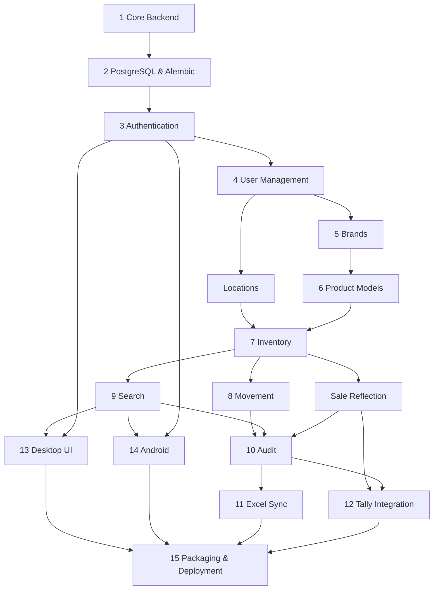

# WEBSTUDIO IMS — Implementation Guide

| Attribute | Value |
|-----------|-------|
| **Document ID** | IMPL-001 |
| **Version** | 1.3 |
| **Status** | Active — engineering handbook for Version 1 development |
| **Governing Documents** | [PROJECT_BIBLE.md](PROJECT_BIBLE.md), [PRODUCT_REQUIREMENTS.md](product/PRODUCT_REQUIREMENTS.md), [TECH_STACK.md](TECH_STACK.md), [SYSTEM_ARCHITECTURE.md](SYSTEM_ARCHITECTURE.md), [DATABASE_DESIGN.md](database/DATABASE_DESIGN.md) |
| **Purpose** | Define **how** WEBSTUDIO IMS is built — workflow, order, standards, and quality gates |
| **Audience** | Engineers, reviewers, QA, and AI assistants |

> **Authority:** This document is the official engineering handbook for Version 1 implementation. It does not redefine architecture, database design, or product requirements. When implementation questions arise, consult governing documents first, then this guide. Deviations require an ADR.

> **Scope:** This document describes process, workflow, and engineering discipline. It does **not** contain source code, SQL, API endpoint definitions, or migration scripts.

---

## Version History

| Version | Date | Author | Summary |
|---------|------|--------|---------|
| 1.3 | 2026-06-27 | WEBSTUDIO IMS Team | **Sprint 2A complete:** Inventory Core API (`/api/v1/inventory`); migration `0010_inventory_sprint_2a`; `InventoryService`; RBAC; audit integration; 11 API integration tests. |
| 1.2 | 2026-06-27 | WEBSTUDIO IMS Team | Audit-only history architecture; Sprint 1E = audit logs; Sprint 1F = `0008_users_authentication`. |
| 1.1 | 2026-06-27 | WEBSTUDIO IMS Team | Migration roadmap aligned with DATABASE_DESIGN §16.5: ownership columns deferred to `0008`. |
| 1.0 | 2026-06-27 | WEBSTUDIO IMS Team | Initial implementation handbook. Development philosophy, module build order, monorepo rules, coding standards, git workflow, testing strategy, dev environment, definition of done, AI rules, and sprint plan. |

---

## Table of Contents

1. [Development Philosophy](#1-development-philosophy)
2. [Module Build Order](#2-module-build-order)
3. [Monorepo Development Rules](#3-monorepo-development-rules)
4. [Coding Standards](#4-coding-standards)
5. [Git Workflow](#5-git-workflow)
6. [Testing Strategy](#6-testing-strategy)
7. [Development Environment](#7-development-environment)
8. [Definition of Done](#8-definition-of-done)
9. [AI Development Rules](#9-ai-development-rules)
10. [Sprint Strategy](#10-sprint-strategy)

---

## 1. Development Philosophy

WEBSTUDIO IMS is production software for daily retail operations — not a prototype. Every engineering decision should assume the system will run for ten years and be maintained by people who did not write the original code.

### 1.1 Core Principles

| Principle | Meaning | Application |
|-----------|---------|-------------|
| **Small incremental changes** | Ship working slices; avoid large unreviewable diffs | One module or feature per PR where possible; merge frequently |
| **Production quality first** | Code is written for the shop floor, not the demo | No shortcuts that skip validation, audit, or authorization |
| **Test before merge** | Business logic is verified by automated tests | Service-layer tests are mandatory; UI tests follow critical paths |
| **API-first implementation** | Contract before clients | Update OpenAPI spec → implement backend → generate or update client → build UI |
| **Database migrations before feature code** | Schema changes land before services that depend on them | Alembic migration merged and applied locally before feature PR |
| **Backend owns business logic** | Single source of truth for rules (N6) | No duplicated validation in desktop, Android, or integration workers |
| **Correctness before speed** | A slow correct answer beats a fast wrong one | Never skip audit or authorization for performance |
| **Documentation is part of the product** | Behavior changes require doc updates (N15) | Same PR as code when behavior changes |

### 1.2 Implementation Mindset

1. **Read before coding.** Governing documents are frozen. Do not redesign — implement.
2. **Spec before code.** OpenAPI, search-query spec, and integration specs must exist before implementation of that surface.
3. **One rule, one place.** Business rules live in backend services only.
4. **Fail safely.** Integration failures are logged, visible, and recoverable — never silent.
5. **Measure when optimizing.** Profile search and dashboard queries at realistic data volumes before adding complexity.

### 1.3 What This Project Is Not

| Anti-pattern | Why it is forbidden |
|--------------|---------------------|
| Direct PostgreSQL access from clients or workers | Violates N2; bypasses audit and authorization |
| Excel as authoritative input | Violates N3; export only |
| Billing in WEBSTUDIO IMS | Violates N4; Tally owns billing |
| Placeholder or stub business logic in production paths | Staff depend on correctness |
| Inventing tables, endpoints, or fields without spec | Violates N17 |

### 1.4 References

Engineering principles in [PROJECT_BIBLE.md §11](PROJECT_BIBLE.md#11-engineering-principles) and architectural conventions in [SYSTEM_ARCHITECTURE.md §22.5](SYSTEM_ARCHITECTURE.md#225-engineering-conventions) are binding and must be followed during implementation.

---

## 2. Module Build Order

Version 1 is built in dependency order. **Do not start a module until its prerequisites are complete and tested.** Each module should leave the system in a runnable, verifiable state.

### 2.1 Recommended Sequence

| # | Module | Primary Deliverables | Depends On |
|---|--------|---------------------|------------|
| 1 | **Core Backend Setup** | FastAPI app skeleton, layered structure, config loading, health endpoint, structured logging, `X-Request-ID`, exception handling, dependency injection wiring | Approved ADRs ([ADR-0010](../adr/ADR-0010-authentication-and-initialization.md) minimum) |
| 2 | **PostgreSQL & Alembic** | Migrations per [DATABASE_DESIGN.md §16.5](database/DATABASE_DESIGN.md#165-implementation-order-recommended): `0001`–`0004` (core inventory schema); `0005` audit logs (**Sprint 1E**); `0006` users + `system_settings`; `0007` ownership columns; ORM models; repositories; `pg_trgm` extension; seed script (brands, locations — `0002`; `system_initialized = false` — `0006`; **no** Main Admin seed) | Core Backend Setup |
| 3 | **Authentication** | JWT access + refresh; bcrypt passwords; login/logout/refresh; lockout; `AuthenticationService`; `packages/auth` permission constants | PostgreSQL & Alembic |
| 4 | **User Management** | `UserService`; CRUD; role assignment; RBAC enforcement on all subsequent endpoints | Authentication |
| 5 | **Brand Management** | `BrandService`; brand CRUD; deactivation rules (FR-BRD) | User Management |
| 6 | **Product Model Management** | `ProductModelService`; Active/Archived lifecycle; archive/restore; conditional permanent delete (PM-01–PM-07) | Brand Management |
| 7 | **Inventory Management** | `InventoryService`; create/update; location transfer (updates `current_location_id` + audit); mandatory **Color** per unit; lifecycle transitions (Received ↔ Available); serial uniqueness; active product model validation | Product Model Management, Locations (parallel with #5 or immediately after) |
| 8 | **Search** | `SearchService`; combined filters (Brand, Model, Serial, CPU/GPU/RAM/Storage via product model fields, Color, Location, Status); pagination; `docs/specs/search-query-spec.md` completed first | Inventory Management, Product Models, Brands, Locations |
| 9 | **Audit** | `AuditService`; immutable append-only writes; enrichment fields; audit query API; serial lifecycle endpoint (**Sprint 1E**) | Inventory Management (mutations emit audit entries) |
| 10 | **Excel Sync** | `SyncJobService`; Excel worker in `apps/server`; job queue; paginated export API; openpyxl assembly; atomic file write | Inventory, Audit, Authentication (service account) |
| 11 | **Tally Integration** | Tally worker; invoice processing status lifecycle; partial retry; crash recovery; line-level transactions per [sync-strategy.md](integrations/tally-erp9/sync-strategy.md) v1.1.0 — **architecture fully frozen**; **blocked until POC passes** | Inventory, Sale reflection, Audit (business events only) |
| 12 | **Desktop UI** | Electron shell; React renderer; IPC to main process; screens for all operational flows; Light/Dark themes | Backend modules through Search (minimum); Audit and Sync as APIs stabilize |
| 13 | **Android App** | React Native; operational subset (search, lookup, location transfer where permitted) | Stable OpenAPI + `packages/api-client`; Auth |
| 14 | **Packaging & Deployment** | Windows Services (API, Excel, Tally); installers (.msi, .dmg, .apk); internal CA; backup scripts; deployment runbook verification | All server and client modules |

### 2.2 Parallel Work Streams

After **Authentication** is stable, these streams may proceed in parallel **only if API contracts are agreed first**:

| Stream A | Stream B | Coordination |
|----------|----------|--------------|
| Brands → Product Models → Inventory | Locations (reference data) | Shared OpenAPI for reference endpoints |
| Search (backend) | Reports/Dashboard aggregates | Shared query patterns; no duplicate SQL in routers |
| Desktop UI (shell + auth) | Android (auth + search shell) | Shared `packages/api-client` |
| Excel Sync worker | Tally POC (research only) | Tally implementation blocked until POC checklist complete |

### 2.3 Dependency Diagram



### 2.4 Location Management Note

**Locations** are reference data required by Inventory. Implement location CRUD in the same phase as Brands (after User Management) even though it is not numbered separately in the high-level list. Three seed locations must exist before inventory testing: ASUS Exclusive Store, WEBSTUDIO Multi-brand Store, Warehouse/Godown.

### 2.5 Sale Reflection

Manual and Tally-driven sale reflection is implemented via `SaleService` after Inventory is stable. It is a prerequisite for Tally Integration and should be complete (with tests) before Tally worker development begins.

### 2.6 Version 1 Exclusions

Do **not** implement in Version 1:

- `purchase_date`, `purchase_cost`, `remarks` on inventory (PRD §10.5)
- Accessories, printers, warranty, service center, returns
- Offline-first sync, WebSockets, Redis, Celery
- Excel import (export only)
- Automatic client updates

---

## 3. Monorepo Development Rules

WEBSTUDIO IMS uses a single repository per [ADR-0001](../adr/records/0001-monorepo-structure.md). Boundaries are strict — violations create untestable coupling and security risk.

### 3.1 Repository Layout

| Path | Owns | Must Not Contain |
|------|------|------------------|
| `apps/backend/` | FastAPI application — routers, services, infrastructure (ORM, repositories) | Desktop UI code; direct Excel/Tally I/O in routers |
| `apps/server/` | Excel Sync and Tally Sync worker entry points (Windows Services) | Business rule duplication; direct PostgreSQL access |
| `apps/desktop/` | Electron main process, preload, React renderer | Business logic; direct database access |
| `apps/mobile/` | React Native Android application | Business logic; direct database access |
| `packages/shared-kernel/` | Domain types, value objects, enums (`LifecycleState`, `SerialNumber`, `ProductModelStatus`) | Framework imports; ORM models |
| `packages/auth/` | Permission constants; role-to-permission maps | Database access |
| `packages/api-client/` | Typed HTTP client (from OpenAPI) | Business logic |
| `packages/integrations/excel/` | openpyxl export assembly | Inventory mutation logic |
| `packages/integrations/tally/` | Tally XML client and parser (defusedxml) | Direct inventory state changes |
| `packages/ui-components/` | Shared React components (desktop-first) | API calls with embedded business rules |
| `packages/testing/` | Fixtures, factories, test helpers | Production application code |
| `database/migrations/` | Alembic migration scripts | Application business logic |
| `docs/` | Specifications, architecture, this guide | Executable code |
| `config/env/` | Environment variable templates (`.env.example`) | Secrets or committed `.env` files |
| `infra/` | Deployment scripts, Docker Compose (optional dev), service install helpers | Application source |
| `tests/` | Cross-cutting integration and E2E tests | Duplicated unit tests (prefer co-location) |

### 3.2 Dependency Rules

```
apps/*  →  packages/*  →  (stdlib / approved third-party only)
```

| Rule | Detail |
|------|--------|
| **Apps may depend on packages** | `apps/backend` imports `packages/shared-kernel`, `packages/auth` |
| **Packages must not depend on apps** | No `from apps.backend...` in any package |
| **Integration packages are leaf adapters** | `packages/integrations/*` must not import desktop or mobile |
| **No circular dependencies** | Enforced by import linting and code review |
| **Shared contracts via OpenAPI** | Clients use `packages/api-client`; workers call HTTP API |

### 3.3 Layer Boundaries (Backend)

Mandatory call chain per [SYSTEM_ARCHITECTURE.md §7](SYSTEM_ARCHITECTURE.md#7-backend-architecture) and §22.5:

```
Router  →  Service  →  Repository  →  ORM / PostgreSQL
   ↓
 Pydantic DTOs          Domain types
```

| Layer | May Import | Must Not Import |
|-------|------------|-----------------|
| **Router** (`api/routers/`) | Services, Pydantic schemas, FastAPI deps | Repositories, ORM models, SQLAlchemy Session |
| **Service** (`services/`) | Domain types, repositories (via interface), other services | ORM models, UI packages, integration adapters |
| **Repository** (`infrastructure/repositories/`) | ORM models, domain types | Routers, FastAPI |
| **Domain** (`packages/shared-kernel/`) | Standard library, domain-only utilities | SQLAlchemy, FastAPI, HTTP clients |

**Integration workers** (`apps/server`) call the Backend API over HTTPS. They **never** import repositories or ORM modules.

### 3.4 Client Boundaries

| Client | Network Access | Token Storage |
|--------|----------------|---------------|
| **Desktop renderer** | None — all API calls via IPC to main process | Main process OS keychain |
| **Desktop main process** | HTTPS to Backend API | Keychain via `safeStorage` / `keytar` |
| **Android** | HTTPS to Backend API | Android Keystore |

Clients perform **UX validation only** (Zod). Server-side Pydantic + service rules are authoritative.

### 3.5 Shared Package Versioning

All packages in the monorepo move together at Version 1 — no independent package publishing. Internal imports use workspace paths, not PyPI/npm package names for first-party code.

---

## 4. Coding Standards

Standards apply to all contributors and AI assistants. When in doubt, match existing code in the same module.

### 4.1 Naming Conventions

Aligned with [SYSTEM_ARCHITECTURE.md §22.5](SYSTEM_ARCHITECTURE.md#225-engineering-conventions) and [DATABASE_DESIGN.md §11](database/DATABASE_DESIGN.md#11-naming-conventions):

| Artifact | Convention | Example |
|----------|------------|---------|
| **Services** | `{Domain}Service` in `apps/backend/services/` | `InventoryService`, `ProductModelService` |
| **Repositories** | `{Entity}Repository` in `infrastructure/repositories/` | `InventoryRepository` |
| **Routers** | `{domain}.py`; URL `/api/v1/{plural_snake}` | `product_models.py` → `/api/v1/product_models` |
| **API DTOs** | `{Action}{Entity}Request` / `Response` | `CreateInventoryRequest` |
| **Domain types** | PascalCase in `packages/shared-kernel/domain/` | `InventoryItem`, `ProductModelStatus` |
| **Database** | `snake_case` plural tables | `inventory_items`, `product_models` |
| **Enums** | `snake_case` values in DB; PascalCase enum class in domain | `active`, `archived` |
| **TypeScript** | PascalCase components; camelCase functions/variables | `InventoryList.tsx`, `fetchInventory()` |
| **Constants** | `SCREAMING_SNAKE_CASE` | `PERMISSION_INVENTORY_CREATE` |

### 4.2 Error Handling

| Layer | Approach |
|-------|----------|
| **Services** | Raise domain-specific exceptions (`SerialNumberDuplicateError`, `ArchivedProductModelError`); never return error strings |
| **Routers** | Map domain exceptions to HTTP status codes; use consistent error envelope |
| **Clients** | Display user-friendly messages; log technical detail; never expose stack traces |
| **Integrations** | Catch, log with correlation ID, record outcome event; continue batch on single voucher failure (Tally) |
| **Transactions** | Roll back full transaction on any failure — inventory mutation and audit are atomic |

**HTTP status guidance:**

| Situation | Status |
|-----------|--------|
| Validation failure | 422 |
| Unauthorized | 401 |
| Forbidden (RBAC) | 403 |
| Not found | 404 |
| Conflict (duplicate serial, idempotent replay) | 409 |
| Business rule violation | 409 or 422 (document per endpoint in OpenAPI) |
| Server error | 500 — generic message to client; detail in logs only |

### 4.3 Logging

| Environment | Format | Level |
|-------------|--------|-------|
| **Development** | Human-readable (Loguru default) | DEBUG for backend; INFO default |
| **Production** | JSON structured logs | INFO default; WARNING for recoverable integration failures |

**Every log line for request handling must include `request_id`** (from `X-Request-ID`). Mutations log: actor, entity type, entity identifier, action.

**Never log:** passwords, JWT tokens, refresh tokens, connection strings, or full voucher payloads containing PII.

### 4.4 Validation

| Layer | Tool | Authority |
|-------|------|-----------|
| **API input** | Pydantic v2 on all request bodies and query params | Yes — rejects malformed input |
| **Business rules** | Service methods | Yes — authoritative |
| **Client forms** | Zod + React Hook Form | UX only — duplicate server rules for feedback, not enforcement |
| **Integration input** | defusedxml + schema validation (Tally); API response validation (workers) | Untrusted external input |

### 4.5 DTO Usage

| Direction | Type |
|-----------|------|
| **HTTP request** | Pydantic `{Action}Request` |
| **HTTP response** | Pydantic `{Entity}Response` or paginated wrapper |
| **Service boundary** | Domain types from `packages/shared-kernel` |
| **Persistence boundary** | ORM models — translated in repositories only |

**Mapping flow:** `Request DTO → domain (in router or thin mapper) → service → domain → repository → ORM → domain → Response DTO`.

### 4.6 Dependency Injection

- FastAPI `Depends()` provides: database session (Unit of Work), current user, permission checks.
- Services are constructed via factory functions or a lightweight container — inject repositories, not sessions into routers.
- Tests override dependencies with in-memory or test-database implementations.

### 4.7 Service Design

| Rule | Detail |
|------|--------|
| **Single responsibility** | One service per domain aggregate area — see SYSTEM_ARCHITECTURE §7.4 |
| **No HTTP awareness** | Services accept domain types; no `Request` or `Response` objects |
| **Testable in isolation** | Unit tests call service methods with mocked repositories |
| **Audit on mutation** | Services call `AuditService` within the same transaction |
| **Idempotency** | `SaleService` and `SyncJobService` enforce idempotency keys per SYSTEM_ARCHITECTURE §7.12 |

### 4.8 Language-Specific Tooling

| Stack | Linter | Formatter | Type Check |
|-------|--------|-----------|------------|
| **Python** | Ruff | Ruff | mypy or pyright (project choice — record in ADR when adopted) |
| **TypeScript** | ESLint | Prettier | `tsc --noEmit` |

Run linters locally before every PR. CI enforces when configured.

---

## 5. Git Workflow

### 5.1 Branch Strategy

| Branch | Purpose |
|--------|---------|
| `main` | Production-ready; always deployable; protected |
| `develop` | Optional integration branch — use if team grows; solo developer may commit via PRs to `main` directly |
| `feature/{ticket}-{short-description}` | New features |
| `fix/{ticket}-{short-description}` | Bug fixes |
| `chore/{description}` | Tooling, deps, non-functional changes |
| `docs/{description}` | Documentation-only changes |

**Rules:**

- Short-lived branches — merge within days, not weeks.
- Rebase or merge from `main` frequently to avoid drift.
- One logical change per branch where possible.

### 5.2 Commit Message Convention

Use [Conventional Commits](https://www.conventionalcommits.org/):

```
<type>(<scope>): <short summary>

[optional body]

[optional footer: Refs PRD-xxx, ADR-xxx, FR-INV-01]
```

| Type | Use |
|------|-----|
| `feat` | New feature |
| `fix` | Bug fix |
| `docs` | Documentation only |
| `test` | Tests only |
| `refactor` | Code change without behavior change |
| `chore` | Tooling, dependencies |
| `db` | Migrations and schema |

**Examples:**

```
feat(inventory): add mandatory color field on create (FR-INV-01)
db(migrations): add product_model status enum (DB-001)
fix(search): apply color filter in combined query (FR-SRH-13)
```

### 5.3 Pull Request Expectations

Every PR must include:

| Item | Required |
|------|----------|
| Description of what and why | Yes |
| Reference to PRD FR IDs or spec IDs | Yes, when applicable |
| Screenshots or recording for UI changes | Yes |
| Migration note if schema changed | Yes |
| OpenAPI update if API changed | Yes |
| Test evidence (`pytest`, `pnpm test`, manual steps) | Yes |
| Definition of Done checklist (§8) | Yes |

**Review focus:** architecture boundaries, business rule placement, security, audit coverage, test quality.

**Merge requirements:** At least one human approval (self-review acceptable for solo developer with checklist discipline); CI green when configured.

### 5.4 Versioning

| Artifact | Scheme |
|----------|--------|
| **Application** | Semantic Versioning — `MAJOR.MINOR.PATCH` |
| **API** | URL prefix `/api/v1/` — breaking changes require `/api/v2/` |
| **Database** | Alembic revision chain — forward migrations in production |
| **Clients** | Declare `X-Client-Version`; API returns minimum supported version in `/health` |

Pre-1.0 development uses `0.x.y` until first production release to the business.

---

## 6. Testing Strategy

Inventory correctness is the product. Tests prove business rules — not just that code runs.

### 6.1 Test Pyramid

```
        ┌─────────────┐
        │  E2E / UAT  │  Few — critical retail journeys
        ├─────────────┤
        │ API / Integ │  Moderate — HTTP + real test DB
        ├─────────────┤
        │   Service   │  Many — all business rules
        ├─────────────┤
        │ Unit / Pure │  Domain types, parsers, mappers
        └─────────────┘
```

### 6.2 Unit Tests

| Target | Framework | Location |
|--------|-----------|----------|
| **Domain types and value objects** | pytest | `packages/shared-kernel/tests/` |
| **Service business rules** | pytest with mocked repositories | `apps/backend/tests/services/` |
| **Tally XML parser** | pytest with fixtures | `packages/integrations/tally/tests/` |
| **Excel assembly** | pytest | `packages/integrations/excel/tests/` |
| **Permission maps** | pytest | `packages/auth/tests/` |

**Mandatory service test coverage:**

- Serial number uniqueness (BR-01)
- Product model Active/Archived lifecycle (BR-24, PM-01–PM-07)
- Color required on inventory create (BR-22)
- Lifecycle transitions (Received → Available → Sold; invalid paths rejected)
- Movement only when Available (LC-04)
- Sale idempotency (Tally voucher + serial)
- RBAC denial returns forbidden

### 6.3 Integration Tests

| Target | Approach |
|--------|----------|
| **Repositories** | pytest against ephemeral PostgreSQL (test database or Docker) |
| **Migrations** | Apply all migrations on empty DB; verify constraints |
| **Transactions** | Assert rollback on audit failure |

Use `packages/testing/` factories to create brands, product models, locations, and inventory items consistently.

### 6.4 API Tests

| Target | Approach |
|--------|----------|
| **HTTP endpoints** | pytest + FastAPI `TestClient` or httpx ASGI transport |
| **Auth flows** | Login, refresh, expired token, lockout |
| **RBAC** | Each role tested against permission matrix from PRD |
| **Contract** | OpenAPI spec matches actual responses — schemathesis or manual contract tests |

Test database is isolated per test run or rolled back per test module.

### 6.5 Desktop Tests

| Type | Tool | Scope |
|------|------|-------|
| **Component unit** | Vitest + React Testing Library | Forms, lists, state stores |
| **IPC contract** | Unit tests on preload whitelist | Channel validation |
| **E2E smoke** | Playwright (when configured) | Login → search → view inventory |

Desktop E2E runs against local backend with seed data.

### 6.6 Android Tests

| Type | Tool | Scope |
|------|------|-------|
| **Component unit** | Jest / React Native Testing Library | Critical screens |
| **Integration** | Detox or Maestro (when configured) | Login, serial search |

### 6.7 Manual Acceptance Tests

Performed by engineer or business stakeholder before each sprint demo and before production release:

| Journey | Verify |
|---------|--------|
| Add inventory with Color | Unit appears in search and grouped view |
| Move Available unit | Movement history recorded; audit entry exists |
| Archive product model | Hidden from creation; historical items visible |
| Combined search | Brand + Color + Status filters return correct set |
| Excel sync trigger | Job completes; file contains Color column; no import path exists |
| Tally sale (when POC complete) | Sold status; idempotent on duplicate voucher |
| Role restriction | Salesperson cannot access admin functions |

Record results in sprint notes or `docs/testing/acceptance/` when created.

### 6.8 Test Data

- Use factories — never production data in tests.
- Tally XML fixtures live in `packages/testing/fixtures/tally/` after POC.
- Seed script provides development and demo data — not used in CI unit tests.

---

## 7. Development Environment

### 7.1 Platform Roles

| Platform | Role |
|----------|------|
| **macOS** | Primary development — backend, desktop UI, Android emulator |
| **Windows 11** | Production server target; Windows installer testing; Tally integration testing |
| **Android device/emulator** | Mobile testing on LAN |

### 7.2 Prerequisites

| Tool | Version | Notes |
|------|---------|-------|
| Python | 3.12.x | pyenv or official installer |
| Node.js | 20.x LTS | fnm or nvm |
| pnpm | 9.x | JavaScript monorepo |
| PostgreSQL | 16.x | Postgres.app, native install, or Docker |
| Git | 2.x | |
| Android Studio | Latest stable | SDK, emulator — for mobile only |
| Cursor / VS Code | Latest | Python, ESLint, Prettier, Ruff extensions |

Optional: Docker Compose in `infra/docker/` for PostgreSQL when created.

### 7.3 macOS Developer Setup

1. Clone repository.
2. Install prerequisites above.
3. Copy `config/env/.env.example` to `config/env/.env.local` (or project-root `.env` per backend convention — **never commit**).
4. Create local PostgreSQL database and role matching `DATABASE_URL`.
5. Python: create venv in `apps/backend/`; install dependencies from requirements/poetry/uv lockfile when created.
6. Run `alembic upgrade head` from `database/migrations/` (through `0009` minimum for auth, setup, and recovery key).
7. Verify reference seed data (brands, locations) and `GET /api/v1/setup/status` returns `system_initialized: false`.
8. Start backend: Uvicorn with reload on `localhost` (HTTP acceptable for local dev per SYSTEM_ARCHITECTURE).
9. JavaScript: `pnpm install` at monorepo root; start desktop Vite dev server and Electron.
10. Complete the **First-Time Setup Wizard**: call `POST /api/v1/setup/initialize`, store the displayed Recovery Key securely, then `POST /api/v1/setup/confirm-recovery-key`.
11. Verify: `GET /health` returns 200; `GET /api/v1/setup/status` returns `system_initialized: true`; login succeeds with the wizard credentials.

### 7.4 Windows Deployment Target

Production matches [SYSTEM_ARCHITECTURE.md §20.8](SYSTEM_ARCHITECTURE.md#208-installation--deployment-workflow):

- Windows 11 Pro dedicated server PC
- PostgreSQL 16 as Windows Service
- WEBSTUDIO API, Excel Sync, Tally Sync as Windows Services (NSSM or equivalent)
- HTTPS on port 8443 with internal CA in production
- Firewall: API port from store subnet only

Engineers validate deployment using the checklist in `docs/deployment/server/` before go-live.

### 7.5 Local PostgreSQL

| Setting | Development |
|---------|-------------|
| Database name | `webstudio_dev` (or per `.env`) |
| App role | Least privilege — mirrors `webstudio_app` production pattern |
| Extensions | `pg_trgm` enabled in migration `0001` |
| Data | Seed data only — no production dumps in dev machines |

### 7.6 Environment Variables

Template: `config/env/.env.example`. Required categories:

| Category | Examples | Storage |
|----------|----------|---------|
| Application | `APP_ENV`, `APP_VERSION` | `.env` file |
| Database | `DATABASE_URL` | `.env` file |
| API | `API_HOST`, `API_PORT`, TLS cert paths (production) | `.env` file |
| Auth | `JWT_SECRET`, token TTLs | `.env` file — rotate in production |
| Tally | `TALLY_HOST`, `TALLY_PORT` | `.env` file on server only |
| Excel | Export directory path | `.env` or `system_settings` table |

**Never commit** `.env`, secrets, or production certificates.

### 7.7 Running the Backend

| Mode | Command pattern | Notes |
|------|-----------------|-------|
| **Development** | Uvicorn with `--reload` on `127.0.0.1` | HTTP; Swagger UI at `/docs` |
| **Production** | Uvicorn behind TLS flags or reverse proxy per architecture | HTTPS mandatory |

Backend listens for LAN clients in production; localhost only in dev unless testing LAN from another device.

### 7.8 Running the Desktop App

| Mode | Flow |
|------|------|
| **Development** | `pnpm dev` (or equivalent) starts Vite + Electron; main process reads API URL from env |
| **Production build** | Electron Builder → `.msi` / `.dmg` |

Renderer has **no direct network access** — all API traffic through main process IPC.

### 7.9 Running Android

| Mode | Flow |
|------|------|
| **Development** | Metro bundler; emulator or physical device on same Wi-Fi as dev machine |
| **API URL** | Dev machine LAN IP — not `localhost` on device |
| **Production** | Release APK with network security config trusting internal CA |

### 7.10 Development vs Production Differences

| Concern | Development | Production |
|---------|-------------|------------|
| Transport | HTTP on localhost | HTTPS with internal CA |
| Logging | Human-readable | JSON |
| Secrets | Local `.env` | Server `.env` outside Git |
| Excel path | Local temp directory | `D:\WEBSTUDIO-IMS\exports\` |
| Services | Manual terminal processes | Windows Services auto-start |

---

## 8. Definition of Done

A feature, bug fix, or module is **done** only when **all** applicable criteria below are satisfied. This extends [PROJECT_BIBLE.md §32](PROJECT_BIBLE.md#32-definition-of-done) with implementation-specific gates.

### 8.1 Universal Checklist

| # | Criterion | Verify |
|---|-----------|--------|
| 1 | **Compiles** | Backend starts; clients build without errors |
| 2 | **Tested** | Automated tests added/updated; all pass locally |
| 3 | **Logged** | Mutations and integration outcomes emit structured logs with `request_id` |
| 4 | **Audited** | Inventory and admin mutations create `audit_log` entries in same transaction |
| 5 | **Documented** | OpenAPI, specs, or user-facing docs updated if behavior changed |
| 6 | **Secure** | RBAC enforced; input validated; no secrets in code |
| 7 | **No lint errors** | Ruff, ESLint pass |
| 8 | **No type errors** | mypy/pyright and `tsc` pass when configured |
| 9 | **Business rules in backend only** | No duplicated enforcement in clients or workers |
| 10 | **Architecture preserved** | Routers → services → repositories; no ORM in services |
| 11 | **PRD requirements traced** | FR IDs referenced in PR or commit |
| 12 | **CI passing** | When CI is configured |

### 8.2 Module-Specific Additions

| Module | Additional Done Criteria |
|--------|-------------------------|
| **Database change** | Alembic migration; DATABASE_DESIGN.md updated if logical model changes; downgrade tested |
| **API change** | OpenAPI updated in `docs/api/openapi/`; `packages/api-client` regenerated |
| **UI change** | Light and Dark theme verified; keyboard navigation on desktop |
| **Search change** | `search-query-spec.md` updated; performance spot-checked at 1K+ seed rows |
| **Integration** | Failure modes logged; idempotency tested; no direct DB access |
| **Tally** | POC checklist complete; fixtures in `packages/testing/fixtures/tally/` |

### 8.3 Not Done

- "Works on my machine" without tests
- UI-only validation of business rules
- Feature behind unfinished migration
- Undocumented API endpoints
- Placeholder `TODO` in production code paths

---

## 9. AI Development Rules

AI assistants (Cursor, ChatGPT, Antigravity, and others) are expected contributors. These rules are **mandatory** and supplement [AGENTS.md](../AGENTS.md).

### 9.1 Before Writing Code

1. Read [PROJECT_BIBLE.md](PROJECT_BIBLE.md), [PRODUCT_REQUIREMENTS.md](product/PRODUCT_REQUIREMENTS.md), [SYSTEM_ARCHITECTURE.md](SYSTEM_ARCHITECTURE.md), and [DATABASE_DESIGN.md](database/DATABASE_DESIGN.md).
2. Identify applicable FR IDs, ADRs, and the module build order phase (§2).
3. Confirm the requested change does not contradict frozen architecture.

### 9.2 Code Generation Rules

| Rule | Detail |
|------|--------|
| **Never generate placeholder code** | No `pass`, `TODO`, `NotImplementedError` in production paths — implement or defer the module |
| **Never bypass services** | Routers delegate to services; workers call API endpoints |
| **Never duplicate business logic** | If a rule exists in a service, clients show outcomes only |
| **Never access PostgreSQL from UI** | Desktop, Android, Excel worker, Tally worker — API only |
| **Never invent endpoints or tables** | Extend OpenAPI and DATABASE_DESIGN first |
| **Always update tests with features** | Service tests required for every business rule added |
| **Always preserve architecture** | Layer boundaries §3.3 are non-negotiable |
| **Always use approved stack** | [TECH_STACK.md](TECH_STACK.md) — no new frameworks without ADR |
| **Always match naming conventions** | §4.1 — do not introduce alternate patterns |
| **Always update docs in the same change** | When behavior changes |

### 9.3 AI-Safe Task Decomposition

When asking AI to implement a feature, scope tasks as:

1. Migration (if needed)
2. Domain type / enum (if needed)
3. Repository method
4. Service method with tests
5. Router endpoint
6. OpenAPI update
7. Client/UI (if applicable)

One PR per vertical slice is preferred over horizontal "implement all repositories" batches.

### 9.4 AI Must Refuse or Escalate

AI must **stop and ask** rather than guess when:

- Business rule is marked **TBD** in PRD or DATABASE_DESIGN §15
- Tally field mapping is unspecified (blocked on POC)
- A request requires direct database access from a client
- A request adds Purchase Date, Purchase Cost, or Remarks (excluded V1)
- A request changes architecture, entity relationships, or sync design

### 9.5 Review Expectations for AI-Generated Code

Human reviewer (or self-review with discipline) verifies:

- [ ] No architecture boundary violations
- [ ] Tests assert business rules, not implementation details
- [ ] No secrets or hardcoded production values
- [ ] Audit and logging present on mutations
- [ ] PRD FR IDs cited

---

## 10. Sprint Strategy

Version 1 is delivered in **working increments** — each sprint ends with a demoable, testable system. Durations assume a small team (1–2 engineers + AI); adjust calendar length to capacity.

### 10.1 Sprint Overview

| Sprint | Focus | Working Outcome | Depends On |
|--------|-------|-----------------|------------|
| **S0** | Foundation | Repo scaffold, CI skeleton, health endpoint, dev setup documented | — |
| **S1** | Database (core) | Migrations `0001`–`0004` applied; reference seed; repository layer | S0 |
| **S2** | Audit log foundation (**Sprint 1E**) | Migrations `0005_audit_logs`, `0006_audit_log_description`; `AuditRecorder`; `AuditLogRepository`; serial lifecycle query API | S1 |
| **S3** | Auth & Users (**Sprint 1F**) | Migration `0008_users_authentication`; Argon2id + JWT; setup, login, refresh, logout; RBAC; user CRUD | S2 |
| **S4** | Reference Data APIs | Brands, Locations, Product Models with Active/Archived lifecycle (tables from S1) | S3 |
| **S5** | Inventory Core (**Sprint 2A** — complete) | Migration `0010_inventory_sprint_2a`; `InventoryService`; `/api/v1/inventory` CRUD, archive/restore, search, filters, pagination, serial lookup; RBAC; audit on mutations | S4 |
| **S6** | Sales | Manual sale reflection (`0008` sales when required); location transfer in `InventoryService` (audit-only history) | S5, S2 |
| **S7** | Search | Combined filters; serial exact/prefix; product-spec search; color filter | S5 |
| **S8** | Audit UI & Reports | Audit viewer; dashboard aggregates; settings API | S2, S7 |
| **S9** | Excel Sync | Sync jobs; worker export; manual trigger; atomic file write | S8 |
| **S10** | Tally POC + Integration | POC checklist; Tally worker; idempotent sale API — **gated** | S6, S9 |
| **S11** | Desktop MVP | Auth, dashboard, search, inventory list/detail, add inventory, location transfer | S7, S8 |
| **S12** | Desktop Complete | Admin screens, product model management, audit viewer, sync status, themes | S9, S11 |
| **S13** | Android MVP | Auth, search, serial lookup, serial lifecycle, permitted location transfers | S7, S3 |
| **S14** | Packaging & Go-Live | Windows Services, installers, HTTPS CA, backup/restore verified, acceptance tests | S10–S13 |

### 10.2 Sprint Ceremonies (Lightweight)

| Ceremony | Purpose |
|----------|---------|
| **Sprint planning** | Select FR IDs from PRD; confirm dependencies; define demo script |
| **Daily check-in** | Blockers, integration failures, open decisions |
| **Sprint demo** | Run manual acceptance journeys (§6.7) against sprint outcome |
| **Retrospective** | Capture friction for guide/runbook updates |

### 10.3 Sprint Exit Criteria

Each sprint is complete when:

1. All planned FR IDs for the sprint meet §8 Definition of Done.
2. Demo script runs end-to-end without manual database fixes.
3. No P0 bugs open against sprint scope.
4. `main` branch is green (tests + lint when CI exists).

### 10.4 Critical Path

The longest dependency chain for go-live:

```
S0 → S1 → S2 → S3 → S4 → S5 → S9 → S14 (server operational with Excel)
S5 → S7 → S11 → S12 → S14 (desktop operational)
S9 (Tally) can slip if manual sale fallback (S6) is verified — but S5 billing accuracy requires Tally before full go-live
```

**Tally risk mitigation:** Complete POC during S4–S5 parallel window. Manual sale path (FR-SLS-04) allows partial operation if Tally slips. **Synchronization architecture is fully frozen** in [sync-strategy.md](integrations/tally-erp9/sync-strategy.md) v1.1.0 — **no further architectural changes required before Sprint 2**.

### 10.5 Post-V1

After Sprint 14 production deployment, enter **Maintenance** lifecycle stage per Project Bible. Enhancements require new PRD items, specs, and ADRs — not ad hoc implementation.

---

## References

| Document | Path |
|----------|------|
| Project Bible | [docs/PROJECT_BIBLE.md](PROJECT_BIBLE.md) |
| Product Requirements | [docs/product/PRODUCT_REQUIREMENTS.md](product/PRODUCT_REQUIREMENTS.md) |
| Technology Stack | [docs/TECH_STACK.md](TECH_STACK.md) |
| System Architecture | [docs/SYSTEM_ARCHITECTURE.md](SYSTEM_ARCHITECTURE.md) |
| Database Design | [docs/database/DATABASE_DESIGN.md](database/DATABASE_DESIGN.md) |
| Agent Instructions | [AGENTS.md](../AGENTS.md) |
| ADR Index | [adr/README.md](../adr/README.md) |
| OpenAPI Specification | [docs/api/openapi/](api/openapi/) |
| Deployment Runbooks | [docs/deployment/](deployment/) |

---

> **Document Authority:** This guide is binding for WEBSTUDIO IMS Version 1 implementation workflow. Updates require version increment and review. Implementation code that contradicts governing documents must be fixed — not the frozen architecture.

*WEBSTUDIO IMS Team — 2026*
