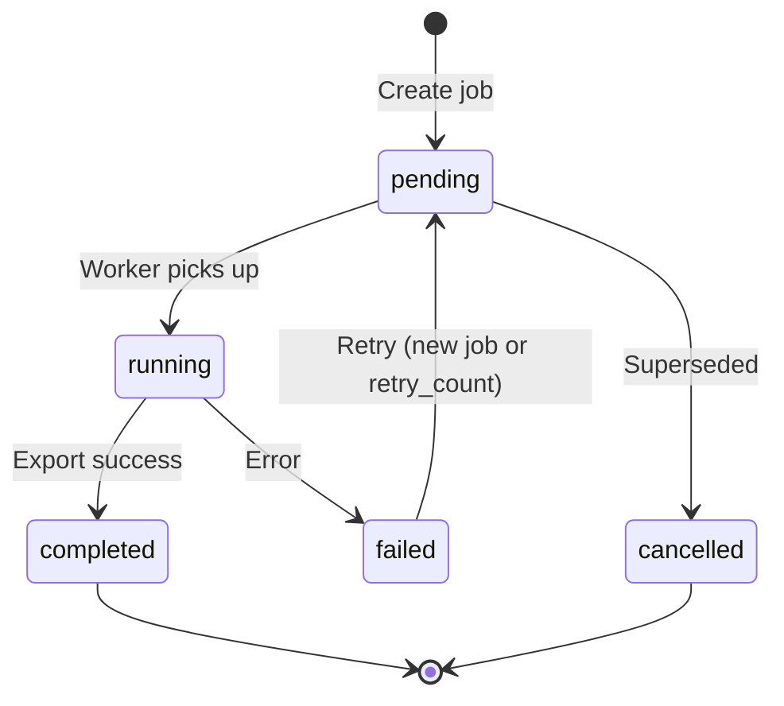
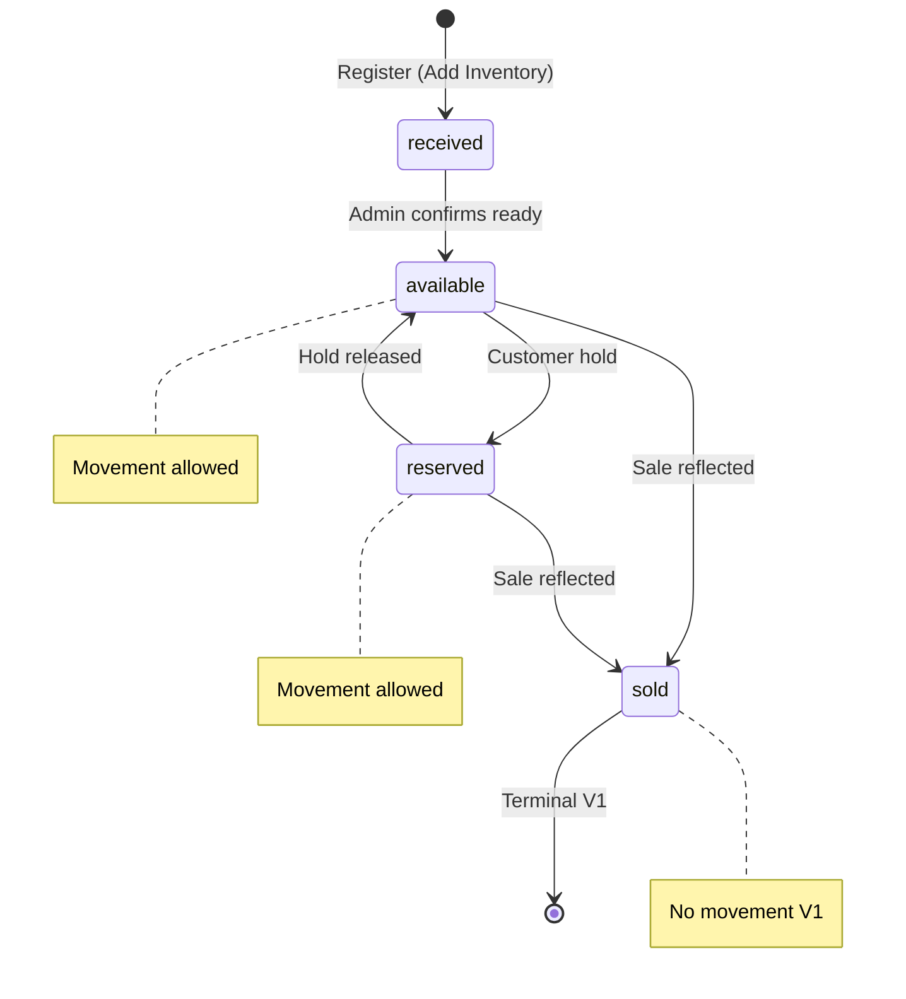

# WEBSTUDIO IMS — Database Design

| Attribute | Value |
|-----------|-------|
| **Document ID** | DB-001 |
| **Version** | 1.9 |
| **Status** | Active — logical model frozen for Version 1 implementation |
| **Governing Documents** | [PROJECT_BIBLE.md](../PROJECT_BIBLE.md), [PRODUCT_REQUIREMENTS.md](../product/PRODUCT_REQUIREMENTS.md), [TECH_STACK.md](../TECH_STACK.md), [SYSTEM_ARCHITECTURE.md](../SYSTEM_ARCHITECTURE.md) |
| **Purpose** | Authoritative logical data model for PostgreSQL implementation |
| **Scope** | Version 1 — laptop inventory only |

> **Authority:** This document defines the logical database design for WEBSTUDIO IMS. SQLAlchemy models, Alembic migrations, and repository implementations must conform to this design. Deviations require an ADR amendment.
>
> **This document does not contain SQL, ORM code, or migration scripts.**

---

## Version History

| Version | Date | Author | Summary |
|---------|------|--------|---------|
| 1.7 | 2026-06-27 | WEBSTUDIO IMS Team | **Audit-only history:** removed `InventoryMovement` entity and `inventory_movements` table; location changes update `current_location_id` only; complete traceability via `audit_log`. Migration `0005` is `audit_logs`. |
| 1.9 | 2026-06-27 | WEBSTUDIO IMS Team | **Tally matching strategy:** `product_model_mismatch` notification type; serial-authoritative sale reflection documented. |
| 1.8 | 2026-06-27 | WEBSTUDIO IMS Team | **Final freeze:** invoice processing status lifecycle; partial retry; crash recovery; line-level transactions; `tally_processed_invoice_lines`. |
| 1.7 | 2026-06-27 | WEBSTUDIO IMS Team | **Frozen** Tally sync: `tally_sync_log`, `tally_processed_invoice`; notification types; invoice idempotency. |
| 1.6 | 2026-06-27 | WEBSTUDIO IMS Team | Tally synchronization: multi-company sync state; notifications; sale invoice/payment fields; invoice line matching persistence. |
| 1.5 | 2026-06-27 | WEBSTUDIO IMS Team | Server initialization: `system_initialized` and `company_name` system settings; Main Admin created by setup wizard — not migration seed. |
| 1.4 | 2026-06-27 | WEBSTUDIO IMS Team | Migration roadmap: `0005` inventory movement; `0006` audit logs; `0007` users & authentication; `0008` ownership columns (deferred until `users` exists). |
| 1.3 | 2026-06-27 | WEBSTUDIO IMS Team | Authentication & audit strategy: `created_by_user_id` / `updated_by_user_id` on business entities; enriched audit log actor snapshots; movement audit fields; excluded action-specific user columns. |
| 1.2 | 2026-06-27 | WEBSTUDIO IMS Team | Synchronized with Sprint 1D implementation: `current_location_id`; structured ProductModel specs; `reserved` inventory status; removed `configuration`, `row_version` from `inventory_item`; UUID keys on `product_model` and `inventory_item`; conditional delete rules. |
| 1.1 | 2026-06-27 | WEBSTUDIO IMS Team | Product Model Active/Archived lifecycle; mandatory `color` on inventory_item; expanded search indexes; excluded Purchase Date/Cost/Remarks from V1. |
| 1.0 | 2026-06-27 | WEBSTUDIO IMS Team | Initial logical data model. |

---

## Table of Contents

1. [Database Philosophy](#1-database-philosophy)
2. [Core Domain Model](#2-core-domain-model)
3. [Entity Relationships](#3-entity-relationships)
4. [Entity Definitions](#4-entity-definitions)
5. [Business Constraints](#5-business-constraints)
6. [Enumerations](#6-enumerations)
7. [Search & Indexing Strategy](#7-search--indexing-strategy)
8. [Transaction Design](#8-transaction-design)
9. [Audit Model](#9-audit-model)
10. [Synchronization Model](#10-synchronization-model)
11. [Naming Conventions](#11-naming-conventions)
12. [Data Lifecycle](#12-data-lifecycle)
13. [Performance Design](#13-performance-design)
14. [Future Expansion](#14-future-expansion)
15. [Open Decisions](#15-open-decisions)
16. [Database Readiness Assessment](#16-database-readiness-assessment)

---

## 1. Database Philosophy

### 1.1 Why PostgreSQL

PostgreSQL is mandated by the Project Bible as the **single authoritative datastore** for all inventory, users, audit, and configuration data (N1, BR-06). It provides:

- **ACID transactions** — inventory mutations and audit records commit atomically
- **Referential integrity** — foreign keys enforce location, brand, and model relationships
- **Advanced indexing** — B-tree for serial lookup; indexed ProductModel specification fields for product-specification search (FR-SRH-05/06)
- **Long-term viability** — 10+ year maintainability requirement (N14)
- **Operational maturity** — backup, restore, and on-premise Windows deployment are well understood

### 1.2 Why Normalized Design

Version 1 uses **Third Normal Form (3NF)** for core entities:

| Principle | Application |
|-----------|-------------|
| **No redundant master data** | Brand name stored once in `brand`; referenced by `product_model` and derived in queries |
| **One fact per place** | Current location on `inventory_item` only; complete history in `audit_log` |
| **Derived data is computed** | Available unit counts per model group are query aggregates — not stored quantity columns |
| **Controlled denormalization** | None in V1; dashboard aggregates computed at query time |

Normalization prevents inventory drift when brands or locations are renamed and keeps audit semantics clear.

### 1.3 Why Serial Number Is the Primary Business Identity

Per PRD Section 10 and BR-01:

- **One `inventory_item` row = one physical laptop**
- **Serial number** is the globally unique business identifier for operations targeting a single machine (sale, movement, lookup)
- **Model number** identifies a product line shared by many machines — it is not unique

The database enforces serial uniqueness at the constraint level. All sale and movement records ultimately resolve to an `inventory_item` via serial number or internal ID.

### 1.4 Why Product Model Is a Separate Entity

`product_model` is a distinct entity — not merely a text field on `inventory_item`:

| Reason | Explanation |
|--------|-------------|
| **Grouping** | PRD PR-01–PR-08 require presentation grouped by Brand → Model Number |
| **Integrity** | Model numbers repeat across units; the repeatability rule (BR-02) applies to the model entity, not serial |
| **Referential stability** | Renaming display metadata affects one row, not thousands of inventory rows |
| **Future expansion** | Accessories may later use quantity-based models; laptops remain serial-linked to `product_model` |
| **Search performance** | Composite indexes on `(brand_id, model_number)` support model-first browsing |

Each `inventory_item` references exactly one `product_model`. **Hardware specifications** (CPU, GPU, RAM, storage) are stored on `product_model`. **Color** is stored on the **unit** because two laptops of the same model may differ in finish color.

### 1.5 Why the Database Is the Single Source of Truth

| System | Authority |
|--------|-----------|
| **PostgreSQL** | Authoritative for inventory state, users, audit, settings |
| **Tally ERP 9** | Authoritative for billing only — IMS stores references, not invoices |
| **Excel** | Non-authoritative synchronized export — never imported |

Only the Backend API writes to PostgreSQL (N2). The logical model reflects **one write path** and **complete auditability** for every mutation (N8, BR-09).

---

## 2. Core Domain Model

The Version 1 logical model comprises **four bounded areas**:

```
┌─────────────────────────────────────────────────────────────────┐
│  IDENTITY & ACCESS          │  REFERENCE DATA                   │
│  • User                     │  • Brand                          │
│  • RefreshToken             │  • ProductModel                   │
│  (Permission — app-level)   │  • Location                       │
├─────────────────────────────┼───────────────────────────────────┤
│  INVENTORY CORE             │  OPERATIONS & INTEGRATION         │
│  • InventoryItem            │  • AuditLog (complete history)    │
│  • Sale                     │  • AuditLog                       │
│                             │  • SyncJob                        │
│                             │  • TallyIntegrationEvent          │
│                             │  • TallyCompanySync               │
│                             │  • Notification                   │
│                             │  • SystemSetting                  │
└─────────────────────────────────────────────────────────────────┘
```

### 2.1 Entity Responsibilities

| Entity | Responsibility |
|--------|----------------|
| **User** | Authenticated actor; role assignment; account lockout; session invalidation |
| **RefreshToken** | Server-side refresh token storage (hashed); rotation and revocation |
| **Permission** | *(Conceptual V1)* — mapped from role in application code; not persisted as table |
| **Brand** | Configurable laptop brand master data |
| **ProductModel** | Product SKU (model number) within a brand; **Active/Archived** lifecycle |
| **Location** | Physical store or warehouse area; current location of each unit |
| **InventoryItem** | One physical laptop; serial identity; current status and location |
| **AuditLog** | Append-only system-wide history — **single source of truth** for inventory lifecycle, location changes, and integrations |
| **Sale** | Immutable record when a unit becomes Sold; links to Tally invoice reference |
| **AuditLog** | Append-only record of all material system actions |
| **SyncJob** | Excel export job queue and execution status |
| **TallyIntegrationEvent** | Log of every Tally poll and invoice line processing attempt |
| **TallyCompanySync** | Per–Tally-company synchronization cursor and status |
| **Notification** | Operator-facing Tally integration alerts (Notification Center) |
| **SystemSetting** | Admin-configurable key-value settings |

---

## 3. Entity Relationships

### 3.1 High-Level ER Diagram

```mermaid
erDiagram
    BRAND ||--o{ PRODUCT_MODEL : has
    PRODUCT_MODEL ||--o{ INVENTORY_ITEM : instances
    LOCATION ||--o{ INVENTORY_ITEM : holds
    INVENTORY_ITEM ||--o{ AUDIT_LOG : history
    INVENTORY_ITEM ||--o| SALE : sold_as
    USER ||--o{ SALE : recorded
    USER ||--o{ AUDIT_LOG : actor
    USER ||--o{ SYNC_JOB : triggered
    USER ||--o{ REFRESH_TOKEN : owns
    SYNC_JOB ||--o{ TALLY_INTEGRATION_EVENT : may_include

    BRAND {
        bigint id PK
        string name UK
        boolean is_active
    }

    PRODUCT_MODEL {
        uuid id PK
        bigint brand_id FK
        string model_number
        string model_name
        string cpu
        string gpu
        int ram_gb
        numeric storage_value
        enum storage_unit
        enum storage_type
        enum status
    }

    LOCATION {
        bigint id PK
        string name UK
        boolean is_active
    }

    INVENTORY_ITEM {
        uuid id PK
        string serial_number UK
        uuid product_model_id FK
        string color
        bigint current_location_id FK
        enum status
    }

    SALE {
        bigint id PK
        bigint inventory_item_id FK UK
        enum sale_source
        string tally_voucher_number
    }

    USER {
        bigint id PK
        string username UK
        enum role
        enum status
    }

    AUDIT_LOG {
        bigint id PK
        bigint actor_user_id FK
        string entity_type
        bigint entity_id
    }

    SYNC_JOB {
        bigint id PK
        enum job_type
        enum status
    }
```

### 3.2 Relationship Summary

| Relationship | Cardinality | Ownership | Notes |
|--------------|-------------|-----------|-------|
| Brand → ProductModel | 1:N | Brand owns models | Archive/delete rules per §12.7 |
| ProductModel → InventoryItem | 1:N | Model classifies units | **Archived** models hidden from new inventory; historical links retained |
| Location → InventoryItem | 1:N | Location holds units | Exactly one current location per item (`current_location_id`) |
| InventoryItem → AuditLog | 1:N | Item is audited entity | Complete lifecycle history — location, status, field changes |
| InventoryItem → Sale | 1:0..1 | Item has at most one sale V1 | Sold is terminal; sale row created once |
| User → AuditLog | 1:N | User is actor | Nullable for system/service accounts |
| User → RefreshToken | 1:N | User owns tokens | Revocable |
| SyncJob → TallyIntegrationEvent | 1:N | Optional link | Tally events may occur outside excel jobs |

### 3.3 Many-to-Many Assessment

**No many-to-many tables are required in Version 1.**

- User–Role: single `role` enum on `user` (three roles V1)
- Inventory–Location history: resolved via `audit_log` (`inventory.move` and `inventory.update` with location change) — not M:N on current state
- Permission–Role: application-level mapping in `packages/auth/`

Future multi-role per user would introduce `user_role` junction table via ADR.

---

## 4. Entity Definitions

### 4.1 User

| Aspect | Definition |
|--------|------------|
| **Purpose** | Represents a person or service account that interacts with the system |
| **Business description** | Store staff and automated sync workers authenticate as users. Human users have roles (Main Admin, Admin, Salesperson). Service accounts (`svc-excel-sync`, `svc-tally-sync`) are users with restricted roles for API access. |

**Important attributes:**

| Attribute | Required | Mutable | Notes |
|-----------|----------|---------|-------|
| `id` | Yes (surrogate) | Immutable | Internal primary key |
| `username` | Yes | Immutable after create | Unique; login identifier |
| `password_hash` | Yes (human users) | Yes | Argon2id; null for service accounts |
| `recovery_key_hash` | Optional (Main Admin only) | Yes | Argon2id hash of Recovery Key; never plain text |
| `recovery_key_created_at` | Optional | Yes | When current Recovery Key was issued |
| `recovery_key_last_used_at` | Optional | Yes | Set when Recovery Key consumed; nullable until first use |
| `role` | Yes | Yes (Main Admin only) | Enum: `main_admin`, `admin`, `salesperson`, `service_account` |
| `status` | Yes | Yes | `active`, `disabled` |
| `display_name` | Optional | Yes | Friendly name for UI |
| `must_change_password` | Yes | Yes | Force change on first login |
| `failed_login_count` | Yes | Yes | Lockout tracking |
| `locked_until` | Optional | Yes | Account lockout expiry |
| `token_version` | Yes | Yes | Increment to invalidate all sessions |
| `theme_preference` | Optional | Yes | `light`, `dark`, `system` |
| `created_at` | Yes | Immutable | |
| `updated_at` | Yes | Auto-updated | |

**Validation rules (business):**

- Username: unique; length 3–64; alphanumeric + underscore
- Password: minimum 10 characters (policy TBD); hashed never stored plain
- Main Admin Recovery Key: cryptographically random; stored as Argon2id hash only; single-use; regenerated after password recovery
- Disabled users cannot authenticate
- Service accounts cannot use password login from UI

**Lifecycle:** Created → Active → Disabled (soft; never hard-deleted if audit references exist)

---

### 4.2 RefreshToken

| Aspect | Definition |
|--------|------------|
| **Purpose** | Persist refresh tokens for JWT rotation and revocation |
| **Business description** | Each issued refresh token is stored hashed. Rotation creates new row; reuse detection revokes family. |

| Attribute | Required | Notes |
|-----------|----------|-------|
| `id` | Yes | Surrogate PK |
| `user_id` | Yes | FK → user |
| `token_hash` | Yes | Hashed refresh token — never plain text |
| `expires_at` | Yes | |
| `revoked_at` | Optional | Set on logout or admin invalidation |
| `replaced_by_id` | Optional | Rotation chain |
| `created_at` | Yes | |

---

### 4.3 Brand

| Aspect | Definition |
|--------|------------|
| **Purpose** | Master list of laptop brands |
| **Business description** | Configurable by Admin/Main Admin (FR-BRD-01). Required on every inventory item. |

| Attribute | Required | Mutable | Notes |
|-----------|----------|---------|-------|
| `id` | Yes | Immutable | |
| `name` | Yes | Yes | Unique; e.g., "ASUS", "Lenovo" |
| `short_name` | No | Yes | Short code / abbreviation (max 64 chars) |
| `logo_filename` | No | Yes | Filename of brand logo asset (max 256 chars) |
| `display_order` | Yes | Yes | Order in lists (default 0) |
| `is_active` | Yes | Yes | Cannot deactivate if active inventory references exist (FR-BRD-03) |
| `created_by_user_id` | Yes | Immutable | FK → user; set by backend on create (FR-AUD-09) |
| `updated_by_user_id` | Yes | Yes | FK → user; set by backend on every update |
| `created_at` | Yes | Immutable | |
| `updated_at` | Yes | Auto | |

---

### 4.4 ProductModel

| Aspect | Definition |
|--------|------------|
| **Purpose** | Product SKU — model number within a brand |
| **Business description** | Groups inventory items for presentation and search. Model number may repeat across many `inventory_item` rows (BR-02). Lifecycle: **Active** or **Archived** (PRD §12.2). |

| Attribute | Required | Mutable | Notes |
|-----------|----------|---------|-------|
| `id` | Yes | Immutable | UUID primary key |
| `brand_id` | Yes | No* | FK → brand; *immutable after inventory linked |
| `model_number` | Yes | Yes | Unique per brand (composite uniqueness) |
| `model_name` | Yes | Yes | Display name — e.g., Vivobook 15 |
| `cpu` | Yes | Yes | Processor specification |
| `gpu` | No | Yes | Optional GPU specification |
| `ram_gb` | Yes | Yes | RAM in gigabytes; must be > 0 |
| `storage_value` | Yes | Yes | Storage capacity numeric value; must be > 0 |
| `storage_unit` | Yes | Yes | Enum: `GB`, `TB` |
| `storage_type` | Yes | Yes | Enum: `SSD`, `HDD` |
| `status` | Yes | Yes | Enum: `active`, `archived` — see §6.10 |
| `display` | No | Yes | Screen size/specs (max 128 chars) |
| `color_options` | No | Yes | Available color variants (max 256 chars) |
| `warranty` | No | Yes | Warranty term information (max 128 chars) |
| `product_image_url` | No | Yes | URL path to product image (max 512 chars) |
| `search_aliases` | No | Yes | Search matches for Tally integration (max 1024 chars) |
| `notes` | No | Yes | Additional notes/details (max 2000 chars) |
| `created_by_user_id` | Yes | Immutable | FK → user; set by backend on create |
| `updated_by_user_id` | Yes | Yes | FK → user; set by backend on every update |
| `created_at` | Yes | Immutable | |
| `updated_at` | Yes | Auto | |

**Composite uniqueness:** `(brand_id, model_number)` must be unique.

**Lifecycle rules:**

| Action | Condition |
|--------|-----------|
| **Archive** | Main Admin; sets `status = archived` |
| **Restore** | Main Admin; sets `status = active` |
| **Permanent delete** | Only if **no** `inventory_item`, **no** `sale`, and **no** `audit_log` references ever existed for this model |
| **New inventory** | Rejected when `status = archived` |

**Not stored on ProductModel:** Color (per-unit on `inventory_item`); Purchase Date, Purchase Cost, Remarks (excluded V1).

---

### 4.5 Location

| Aspect | Definition |
|--------|------------|
| **Purpose** | Physical inventory location within the building |
| **Business description** | Preconfigured: ASUS Exclusive Store, WEBSTUDIO Multi-brand Store, Warehouse/Godown (FR-LOC-01). Main Admin may add more. |

| Attribute | Required | Mutable | Notes |
|-----------|----------|---------|-------|
| `id` | Yes | Immutable | |
| `name` | Yes | Yes | Unique |
| `location_type` | Yes | Yes | Enum: `retail_floor`, `warehouse`, `other` |
| `is_active` | Yes | Yes | Cannot deactivate if inventory present (FR-LOC-03) |
| `sort_order` | Optional | Yes | Display ordering |
| `branch_id` | Optional | Future | Null V1; reserved for multi-branch |
| `created_by_user_id` | Yes | Immutable | FK → user; set by backend on create |
| `updated_by_user_id` | Yes | Yes | FK → user; set by backend on every update |
| `created_at` | Yes | Immutable | |
| `updated_at` | Yes | Auto | |

---

### 4.6 InventoryItem

| Aspect | Definition |
|--------|------------|
| **Purpose** | **Core entity** — one physical laptop |
| **Business description** | The authoritative record of a single machine. Identified globally by `serial_number`. Tracks current lifecycle status and location. |

| Attribute | Required | Mutable | Notes |
|-----------|----------|---------|-------|
| `id` | Yes | Immutable | UUID primary key |
| `serial_number` | Yes | Yes* | Globally unique (BR-01); *mutable by authorized users; uniqueness always enforced |
| `product_model_id` | Yes | Yes* | FK → product_model; must reference **active** model on create |
| `color` | Yes | Yes | **Mandatory** per-unit color — e.g., Black, Silver, Blue; not on product_model |
| `current_location_id` | Yes | Yes | FK → location; **only** location field on inventory — history in `audit_log` |
| `status` | Yes | Yes | Enum: `received`, `available`, `reserved`, `sold` — see §6.1 |
| `created_by_user_id` | Yes | Immutable | FK → user; set by backend on create (FR-AUD-09) |
| `updated_by_user_id` | Yes | Yes | FK → user; set by backend on every update |
| `created_at` | Yes | Immutable | |
| `updated_at` | Yes | Auto | Status/location change timestamp |

**Immutable fields after create:** `created_at`, `created_by_user_id`

**Validation rules:**

- Serial number: globally unique; trimmed; non-empty; may be corrected by authorized users with duplicate rejection
- Color: required; non-empty; searchable (trimmed)
- Product model: must be `active` on create; location must be `is_active = true`
- Status transitions: only allowed paths per §12.1
- Movement: only when `status = available` or `reserved` (LC-04 for sold)
- **Conditional delete:** permitted only when `status != sold` and no `sale` or `audit_log` references exist; no cascade delete

**Excluded Version 1 fields (not columns):** `purchase_date`, `purchase_cost`, `remarks`, `configuration`, `row_version`, `sold_by_user_id`, `reserved_by_user_id`, `approved_by_user_id` — see §12.8.

---

### 4.7 Sale

| Aspect | Definition |
|--------|------------|
| **Purpose** | Immutable sales history record when inventory becomes Sold |
| **Business description** | Created when Tally invoice line matches (FR-TLY-06) or Admin/Main Admin manually marks sold (FR-SLS-04). Stores invoice **references** — Tally remains billing authority (BR-05, BR-15). |

| Attribute | Required | Notes |
|-----------|----------|-------|
| `id` | Yes | Surrogate PK |
| `inventory_item_id` | Yes | FK → inventory_item; **unique** (one sale per unit V1) |
| `sale_source` | Yes | Enum: `tally`, `manual` |
| `sold_at` | Yes | Sale date/time |
| `invoice_number` | Yes | Tally voucher/invoice number — required for manual; set from Tally for sync |
| `recorded_by_user_id` | Optional | FK → user; required for manual; null for automated Tally |
| `customer_name` | Optional | Reference copy — not authoritative billing |
| `payment_mode` | Optional | Manual sales — e.g., Cash, UPI, Card |
| `tally_company_name` | Optional | Tally company identifier when `sale_source = tally` |
| `tally_voucher_number` | Optional | Duplicate of invoice identifier for Tally idempotency queries |
| `notes` | Optional | Manual sale notes |
| `idempotency_key` | Optional | Client-provided key for manual sales |
| `created_at` | Yes | Immutable |

**Idempotency keys:**

| Source | Unique constraint |
|--------|-------------------|
| Tally | `(tally_company_name, tally_voucher_number, inventory_item_id)` where `sale_source = tally` |
| Manual | `(invoice_number, inventory_item_id)` where `sale_source = manual` |
| Cross-source | Same `invoice_number` + `inventory_item_id` — manual and Tally treated as one transaction (FR-TLY-14) |

**Immutable:** entire row after insert — no updates or deletes (FR-SLS, sale immutability).

---

### 4.8 AuditLog

| Aspect | Definition |
|--------|------------|
| **Purpose** | System-wide append-only audit trail |
| **Business description** | Records every inventory mutation, auth event, user management action, and settings change (FR-AUD-01–07). |

See [Section 9](#9-audit-model) for complete attribute list.

---

### 4.9 SyncJob

| Aspect | Definition |
|--------|------------|
| **Purpose** | Queue and track Excel export synchronization jobs |
| **Business description** | Created by scheduler or manual Main Admin trigger. Excel Sync worker picks up pending jobs. API never writes Excel — only creates and updates job records. |

| Attribute | Required | Notes |
|-----------|----------|-------|
| `id` | Yes | Surrogate PK |
| `job_type` | Yes | Enum: `excel_export` (V1) |
| `status` | Yes | Enum: see §6 |
| `triggered_by_user_id` | Optional | Null for scheduled jobs |
| `idempotency_key` | Optional | Unique if provided |
| `scheduled_at` | Optional | When job should run |
| `started_at` | Optional | |
| `completed_at` | Optional | |
| `record_count` | Optional | Rows exported |
| `output_file_path` | Optional | Path written by worker |
| `error_message` | Optional | Failure detail |
| `correlation_id` | Yes | Request/trace ID |
| `retry_count` | Yes | Default 0 |
| `created_at` | Yes | |
| `updated_at` | Yes | |

---

### 4.10 TallySyncLog

| Aspect | Definition |
|--------|------------|
| **Purpose** | Synchronization **execution history** — diagnostics and reconciliation only |
| **Business description** | One row per invoice processing **attempt**. Does **not** drive idempotency — see `tally_processed_invoice`. Never replaces Audit Log. |

| Attribute | Required | Notes |
|-----------|----------|-------|
| `id` | Yes | Surrogate PK |
| `sync_run_id` | Yes | UUID — unique per execution attempt |
| `tally_processed_invoice_id` | Optional | FK → tally_processed_invoice |
| `tally_company_sync_id` | Yes | FK → tally_company_sync |
| `tally_voucher_guid` | Yes | Stable Tally identifier |
| `tally_voucher_number` | Yes | Display invoice/voucher number |
| `voucher_type` | Optional | Tally voucher type |
| `sync_started_at` | Yes | Start time |
| `sync_completed_at` | Optional | End time |
| `processing_duration_ms` | Optional | Elapsed milliseconds |
| `processing_status` | Yes | Enum: `success`, `partial_success`, `failed`, `skipped` — **this run's outcome** |
| `inventory_item_count` | Yes | Inventory-related lines evaluated |
| `successfully_updated` | Yes | Items marked sold |
| `already_sold` | Yes | Duplicate-sale lines |
| `missing_serial` | Yes | Serial Number Missing lines |
| `missing_model` | Yes | Product Model Missing lines |
| `ignored_items` | Yes | Non-inventory lines skipped |
| `retry_count` | Yes | Attempt number — default 0 |
| `error_details` | Optional | When run `failed` |
| `customer_name` | Optional | From invoice |
| `correlation_id` | Yes | Trace ID |
| `created_at` | Yes | Immutable |

**Append-only** — sync logs are never updated or deleted V1.

---

### 4.10.1 TallyProcessedInvoice

| Aspect | Definition |
|--------|------------|
| **Purpose** | Invoice-level **processing state** and **idempotency** |
| **Business description** | Authoritative record of whether a Tally invoice is fully processed, partially processed, failed, or eligible for skip. Updated as processing progresses; promoted to `success` only when all inventory-related lines complete. |

| Attribute | Required | Notes |
|-----------|----------|-------|
| `id` | Yes | Surrogate PK |
| `tally_company_sync_id` | Yes | FK → tally_company_sync |
| `tally_voucher_guid` | Yes | Stable Tally identifier |
| `tally_voucher_number` | Yes | Display reference |
| `processing_status` | Yes | Enum: `success`, `partial_success`, `failed` — **never `skipped`** (skipped is log-only) |
| `first_attempt_at` | Yes | First processing attempt |
| `last_attempt_at` | Yes | Most recent attempt |
| `completed_at` | Optional | Set when `processing_status = success` |
| `created_at` | Yes | |
| `updated_at` | Yes | |

**Unique constraint:** `UNIQUE (tally_company_sync_id, tally_voucher_guid)`

**Status semantics:**

| `processing_status` | Meaning |
|---------------------|---------|
| `success` | Fully processed — future syncs skip (log records `skipped`) |
| `partial_success` | Some lines completed; failed lines eligible for retry |
| `failed` | Zero inventory updates — full invoice retry |

---

### 4.10.2 TallyProcessedInvoiceLine

| Aspect | Definition |
|--------|------------|
| **Purpose** | Per-line processing state for partial retry and crash recovery |
| **Business description** | Tracks each inventory-related invoice line. Completed lines are never reprocessed. Failed lines retried on subsequent sync when invoice is `partial_success`. |

| Attribute | Required | Notes |
|-----------|----------|-------|
| `id` | Yes | Surrogate PK |
| `tally_processed_invoice_id` | Yes | FK → tally_processed_invoice |
| `line_index` | Yes | Stable line position within invoice |
| `serial_number` | Optional | From Tally line |
| `product_model_number` | Optional | From Tally line |
| `line_status` | Yes | Enum: `pending`, `completed`, `failed` |
| `line_outcome` | Optional | Enum: `sale_applied`, `duplicate_sale`, `serial_number_missing`, `product_model_missing`, `product_model_mismatch`, `ignored`, `error` |
| `inventory_item_id` | Optional | FK when sold |
| `error_message` | Optional | When `line_status = failed` |
| `completed_at` | Optional | When line marked completed |
| `created_at` | Yes | |
| `updated_at` | Yes | |

**Unique constraint:** `UNIQUE (tally_processed_invoice_id, line_index)`

**Partial retry rule:** On `partial_success`, only rows with `line_status = failed` are reprocessed. `completed` rows are immutable.

---

### 4.11 TallyIntegrationEvent

| Aspect | Definition |
|--------|------------|
| **Purpose** | Log every Tally poll and voucher processing attempt |
| **Business description** | Supports reconciliation, failure surfacing (FR-TLY-09), and operational diagnostics. Does not replace `sale` or `notification` — successful line match also creates sale + inventory update via API. |

| Attribute | Required | Notes |
|-----------|----------|-------|
| `id` | Yes | |
| `tally_company_sync_id` | Yes | FK → tally_company_sync |
| `event_type` | Yes | Enum: see §6.9 |
| `tally_voucher_number` | Optional | Invoice/voucher identifier |
| `serial_number` | Optional | As extracted from invoice line |
| `product_model_number` | Optional | As extracted from invoice line |
| `inventory_item_id` | Optional | FK if matched |
| `outcome` | Yes | Enum: `success`, `skipped`, `ignored`, `failed` |
| `skip_reason` | Optional | e.g., `serial_number_missing`, `product_model_missing`, `product_model_mismatch`, `already_sold`, `accessory_ignored`, `invoice_skipped` |
| `error_code` | Optional | |
| `error_message` | Optional | |
| `correlation_id` | Yes | |
| `payload_hash` | Optional | SHA-256 of raw XML — not full payload |
| `created_at` | Yes | Immutable |

---

### 4.12 TallyCompanySync

| Aspect | Definition |
|--------|------------|
| **Purpose** | Per–Tally-company synchronization state (FR-TLY-02, FR-TLY-03) |
| **Business description** | Each configured Tally company (e.g., WEBSTUDIO, ASUS Exclusive Store) maintains independent sync cursor. Failure in one row does not affect others. |

| Attribute | Required | Notes |
|-----------|----------|-------|
| `id` | Yes | Surrogate PK |
| `company_name` | Yes | Unique — Tally company name as configured |
| `is_enabled` | Yes | Default `true` |
| `last_successful_sync_time` | Optional | Last completed successful sync for this company |
| `last_processed_voucher_identifier` | Optional | Cursor for incremental invoice read |
| `last_error_message` | Optional | Most recent error for this company |
| `last_error_at` | Optional | |
| `consecutive_failures` | Yes | Default 0 — reset on success |
| `created_at` | Yes | |
| `updated_at` | Yes | |

**Seed (migration):** WEBSTUDIO; ASUS Exclusive Store — enabled with null cursors.

---

### 4.13 Notification

| Aspect | Definition |
|--------|------------|
| **Purpose** | Operator-facing alerts for Tally integration issues (FR-NOT-01–06) |
| **Business description** | Surfaced in Notification Center and Tally Sync Dashboard pending count. Not created for ignored accessory lines. |

| Attribute | Required | Notes |
|-----------|----------|-------|
| `id` | Yes | Surrogate PK |
| `notification_type` | Yes | Enum: see §6.11 |
| `severity` | Yes | Enum: `info`, `warning`, `error` |
| `title` | Yes | Short display title |
| `message` | Yes | Detail text — e.g., Duplicate Sale description |
| `tally_company_sync_id` | Optional | FK when company-specific |
| `tally_voucher_number` | Optional | Related invoice |
| `voucher_type` | Optional | Tally voucher type |
| `customer_name` | Optional | From Tally invoice |
| `serial_number` | Optional | |
| `product_model_number` | Optional | |
| `inventory_item_id` | Optional | FK when applicable |
| `is_read` | Yes | Default `false` — Unread/Read lifecycle |
| `is_resolved` | Yes | Default `false` — Resolved lifecycle |
| `created_at` | Yes | Immutable — detection time |
| `resolved_at` | Optional | |
| `resolved_by_user_id` | Optional | FK → user |

**Append-only creation** — notifications are not deleted V1; mark resolved.

---

### 4.14 SystemSetting

| Aspect | Definition |
|--------|------------|
| **Purpose** | Admin-configurable application settings and system lifecycle flags |
| **Business description** | Key-value store for sync schedules, session timeout, lockout thresholds, barcode behaviour, display name (FR-SET-01–07), and **server initialization state** (FR-INIT-01–05). |

| Attribute | Required | Notes |
|-----------|----------|-------|
| `id` | Yes | |
| `setting_key` | Yes | Unique; snake_case |
| `setting_value` | Yes | Text or JSON string |
| `value_type` | Yes | Enum: `string`, `integer`, `boolean`, `json`, `cron` |
| `description` | Optional | Admin UI help text |
| `updated_by_user_id` | Optional | Last modifier — null during first-time setup |
| `updated_at` | Yes | |

**Known keys (non-exhaustive):**

| Key | Type | Initial value | Notes |
|-----|------|---------------|-------|
| `system_initialized` | `boolean` | `false` | **Authoritative** initialization flag — setup wizard when `false`; **do not** infer from Main Admin user existence (BR-28) |
| `company_name` | `string` | — | Set during First-Time Setup Wizard |
| `excel_sync_cron` | `cron` | Default schedule | Main Admin configurable |
| `tally_sync_interval_seconds` | `integer` | **1800** (30 minutes) | Main Admin configurable — FR-TLY-01 |
| `tally_host` | `string` | — | Tally ERP 9 connection |
| `tally_port` | `integer` | — | Tally ERP 9 connection |
| `tally_enabled` | `boolean` | `true` | Master enable |
| `session_timeout_minutes` | `integer` | Default timeout | Main Admin configurable |
| `lockout_threshold` | `integer` | Default threshold | Main Admin configurable |
| `lockout_duration_minutes` | `integer` | Default duration | Main Admin configurable |
| `barcode_auto_submit` | `boolean` | Default behaviour | Main Admin configurable |
| `business_display_name` | `string` | — | Main Admin configurable; may mirror `company_name` |

**Initialization rule:** Migrations and seed scripts set `system_initialized = false`. The Main Admin user is created only by `POST /api/v1/setup/initialize` — never by seed data.

---

### 4.15 Permission (Conceptual — Not Persisted V1)

| Aspect | Definition |
|--------|------------|
| **Purpose** | Authorization capability check |
| **V1 implementation** | Defined as constants in `packages/auth/permissions.py`; mapped from `user.role` in application code |
| **Future** | `permission` and `role_permission` tables if fine-grained RBAC required |

---

## 5. Business Constraints

### 5.1 Constraint Matrix

| Rule | Business Constraint | Database Constraint |
|------|---------------------|-------------------|
| **BR-01** Serial globally unique | Service rejects duplicate | `UNIQUE (serial_number)` on `inventory_item` |
| **BR-02** Model number repeats | Many items per product_model | Unique `(brand_id, model_number)` on product_model |
| **BR-22** Color per unit | Mandatory on inventory_item | `NOT NULL color` |
| **BR-24** Product Model lifecycle | Archive vs delete rules | `status` enum; service-layer delete guard |
| **BR-25** Excluded V1 fields | No purchase_date, purchase_cost, remarks | Not in schema |
| **BR-03** One location per item | Service enforces | `NOT NULL current_location_id` on inventory_item |
| **BR-04** Location changes logged | Service updates `current_location_id` + `audit_log` | `audit_log` insert with `inventory.move` |
| **BR-07** Excel not authoritative | No import path | No table reads from Excel |
| **BR-11** Sold cannot sell again | Service idempotency | `status = sold` terminal; unique sale per item |
| **BR-18** Lifecycle transitions | SaleService/InventoryService | Optional CHECK or service-only |
| **LC-04** Sold cannot move | InventoryService | Service rejects; status check |
| **FR-INV-07** Conditional delete | Repository enforces | Delete only when not `sold` and no sale/audit references |
| **FR-AUD-06** Audit immutable | Append-only | INSERT only on audit_log |
| **BR-28** Initialization flag | SetupService | `system_initialized` in `system_settings` — not user table probe |
| **BR-36** Duplicate sale protection | SaleService | `(invoice_number, inventory_item_id)` across manual and Tally |
| **BR-38** Invoice processing state | TallySyncService | `tally_processed_invoice.processing_status`; SUCCESS only when all lines complete |
| **BR-39** Tally sync stats not in audit | TallySyncService | Statistics in `tally_sync_log` only |
| **BR-40** Partial retry | TallySyncService | Retry failed lines only via `tally_processed_invoice_lines` |
| **BR-41** Line-level transactions | TallySyncService | Each line commits independently — no invoice-wide rollback |

### 5.2 Business-Only Constraints (Not DB-Enforced)

| Constraint | Enforced By |
|------------|-------------|
| Received → Sold blocked | InventoryService |
| Only Available/Reserved may change location | InventoryService |
| Archived product model on create | InventoryService |
| Product model permanent delete | ProductModelService |
| Role permission matrix | API RBAC |
| Tally voucher validation | SaleService + defusedxml |
| Excel one-way sync | Architecture — no import endpoint |
| Configuration search semantics | SearchService + pg_trgm |

### 5.3 User Constraints

| Constraint | Layer |
|------------|-------|
| Unique username | Database UNIQUE |
| Lockout after N failures | Service + `user.locked_until` |
| Main Admin cannot demote self if sole admin | Service rule |
| Service account restricted permissions | Role enum + API guards |

---

## 6. Enumerations

All enums stored as PostgreSQL `ENUM` types or `VARCHAR` with CHECK constraints — implementation choice in migration ADR.

### 6.1 InventoryStatus

| Value | Meaning |
|-------|---------|
| `received` | Registered; not yet sellable |
| `available` | Sellable and movable |
| `reserved` | Held for a customer; not yet billed |
| `sold` | Billed; terminal V1 |

### 6.2 UserRole

| Value | Meaning |
|-------|---------|
| `main_admin` | Full system access |
| `admin` | Inventory and operational management |
| `salesperson` | Search, view, movement |
| `service_account` | Automated sync workers only |

### 6.3 UserStatus

| Value | Meaning |
|-------|---------|
| `active` | May authenticate |
| `disabled` | Cannot authenticate |

### 6.4 LocationType

| Value | Meaning |
|-------|---------|
| `retail_floor` | Customer-facing store area |
| `warehouse` | Godown / storage |
| `other` | Additional locations |

### 6.5 SaleSource

| Value | Meaning |
|-------|---------|
| `tally` | Automated from Tally integration |
| `manual` | Staff manual fallback |

### 6.6 SyncJobType

| Value | Meaning |
|-------|---------|
| `excel_export` | Excel workbook export V1 |

### 6.7 SyncJobStatus

| Value | Meaning |
|-------|---------|
| `pending` | Queued; awaiting worker |
| `running` | Worker processing |
| `completed` | Success |
| `failed` | Error; see `error_message` |
| `cancelled` | Superseded or admin cancelled |

### 6.8 AuditAction

Sprint 1E implements a compact action enum on `audit_logs.action`. Future integrations (Tally, scheduled jobs) use `SYSTEM_ACTION` with enriched `new_value` / `description` until finer-grained values are added.

| Value | Meaning |
|-------|---------|
| `CREATE` | Entity created |
| `UPDATE` | Field or attribute changed |
| `ARCHIVE` | Entity archived (e.g. product model) |
| `RESTORE` | Entity restored from archived |
| `STATUS_CHANGE` | Inventory status transition (e.g. Available → Sold) |
| `LOCATION_CHANGE` | Inventory location transfer |
| `SYSTEM_ACTION` | Automated/system-initiated change (Tally sync, jobs) |

Entity context is captured in `entity_type` + `entity_id` (e.g. `inventory_item`, `{uuid}`).

### 6.9 AuditSource

| Value | Meaning |
|-------|---------|
| `MANUAL` | Human user action (default when `actor_user_id` is set) |
| `TALLY_SYNC` | Future Tally synchronization worker |
| `BACKGROUND_JOB` | Scheduled or async background task |
| `SYSTEM` | Generic system action (default when no user actor) |

Filterable via `GET /api/v1/audit_logs?source=TALLY_SYNC`.

### 6.9 TallyEventType

| Value | Meaning |
|-------|---------|
| `poll` | Scheduled or manual sync poll started |
| `company_sync_started` | Processing began for one Tally company |
| `company_sync_completed` | Company sync finished successfully |
| `invoice_line_processed` | Single invoice line evaluated |
| `sale_applied` | Line matched — inventory marked Sold |
| `error` | Integration error |

### 6.10 TallyEventOutcome

| Value | Meaning |
|-------|---------|
| `success` | Expected completion |
| `skipped` | Line skipped — notification created (serial/model missing, already sold) or invoice skipped (idempotency) |
| `ignored` | Accessory/non-IMS line — no notification |
| `failed` | Error — Synchronization Failure notification |

### 6.11 NotificationType

| Value | Meaning |
|-------|---------|
| `duplicate_sale` | Serial already sold — Duplicate Sale Detected |
| `serial_number_missing` | Product model exists; serial not in IMS (available path) |
| `product_model_missing` | Serial exists in IMS (non-available path); invoice product model not in catalog |
| `product_model_mismatch` | Serial matched available inventory and sold; normalized invoice model genuinely differs from IMS — informational |
| `tally_sync_completed` | Invoice or sync cycle completed successfully |
| `sync_failure` | Company or connection-level failure |

Lifecycle: `is_read` (Unread/Read), `is_resolved` (Resolved — retained permanently).

### 6.12 TallyProcessingStatus

Invoice-level state on `tally_processed_invoice`:

| Value | Meaning |
|-------|---------|
| `success` | All inventory-related lines complete — skip on future sync |
| `partial_success` | Mixed completion — retry failed lines only |
| `failed` | Zero inventory updates — retry entire invoice |

Log-only outcome on `tally_sync_log` (includes `skipped` when invoice already `success`).

### 6.13 TallySyncRunStatus

Per-execution outcome on `tally_sync_log.processing_status`:

| Value | Meaning |
|-------|---------|
| `success` | This run completed all remaining lines |
| `partial_success` | This run completed some lines; failures remain |
| `failed` | This run produced zero inventory updates |
| `skipped` | Invoice already `success` — no processing |

### 6.14 TallyInvoiceLineStatus

| Value | Meaning |
|-------|---------|
| `pending` | Not yet processed |
| `completed` | Terminal outcome reached — never reprocessed |
| `failed` | Eligible for retry on partial sync |

### 6.15 ProductModelStatus

| Value | Meaning |
|-------|---------|
| `active` | Available for new inventory; visible in default views |
| `archived` | Hidden from inventory creation and Salesperson default views; historical data retained |

### 6.16 StorageUnit

| Value | Meaning |
|-------|---------|
| `GB` | Gigabytes |
| `TB` | Terabytes |

### 6.17 StorageType

| Value | Meaning |
|-------|---------|
| `SSD` | Solid-state storage |
| `HDD` | Hard-disk storage |

### 6.18 ClientPlatform

| Value | Used In |
|-------|---------|
| `windows_desktop` | Audit enrichment |
| `macos_desktop` | |
| `android` | |
| `excel_sync` | Service account |
| `tally_sync` | Service account |
| `system` | Internal/scheduled |

---

## 7. Search & Indexing Strategy

### 7.1 Primary Indexes (Conceptual)

| Table | Index | Purpose |
|-------|-------|---------|
| `inventory_item` | UNIQUE `(serial_number)` | Exact serial lookup — highest priority |
| `inventory_item` | `(status)` | Dashboard counts |
| `inventory_item` | `(current_location_id, status)` | Location summary |
| `inventory_item` | `(product_model_id)` | Model group expansion |
| `product_model` | `(cpu)`, `(model_name)` | Specification search |
| `inventory_item` | `(color)` | Color filter and search |
| `inventory_item` | `(updated_at DESC)` | Recently updated list |
| `product_model` | UNIQUE `(brand_id, model_number)` | Model identity |
| `product_model` | `(brand_id)` | Brand grouping |
| `product_model` | `(status)` | Filter active models for inventory creation |
| `audit_log` | `(entity_type, entity_id, created_at DESC)` | Entity history |
| `audit_log` | `(entity_identifier, created_at DESC)` | Serial number lifecycle |
| `audit_log` | `(actor_user_id, created_at DESC)` | User activity |
| `audit_log` | `(audit_action, created_at DESC)` | Action-type reports |
| `sale` | `(sold_at DESC)` | Sales reports |
| `sale` | `(inventory_item_id)` UNIQUE | One sale per unit |
| `audit_log` | `(created_at DESC)` | Audit search |
| `audit_log` | `(entity_type, entity_id)` | Entity history |
| `sync_job` | `(status, scheduled_at)` | Worker job pickup |
| `tally_sync_log` | `(tally_processed_invoice_id, sync_started_at DESC)` | Invoice attempt history |
| `tally_processed_invoice` | UNIQUE `(tally_company_sync_id, tally_voucher_guid)` | Invoice state |
| `tally_processed_invoice_line` | `(tally_processed_invoice_id, line_status)` | Partial retry lookup |
| `tally_integration_event` | `(created_at DESC)` | Line-level reconciliation |

### 7.2 Product Model Specification and Color Search

| Index | Purpose |
|-------|---------|
| B-tree / ILIKE on `product_model.cpu`, `product_model.model_name`, `product_model.gpu` | Partial match: `4060`, `i7`, `16GB` (FR-SRH-06) |
| GIN `(color gin_trgm_ops)` on `inventory_item` (optional) | Partial color match at scale |
| B-tree `(color)` on `inventory_item` | Exact and prefix color filter |

**Prerequisite:** `pg_trgm` extension enabled in first migration (per SYSTEM_ARCHITECTURE §10.8).

### 7.3 Serial Prefix Search

| Index | Purpose |
|-------|---------|
| B-tree on `serial_number` with `varchar_pattern_ops` (optional) | Prefix scan for partial serial entry |

### 7.4 Pagination Strategy

| Query Type | Strategy |
|------------|----------|
| Search results | Offset or keyset pagination; default page size 50 |
| Model-grouped browse | Paginate model groups; expand loads serials for one model |
| Audit log | Keyset on `(created_at, id)` for stable paging |
| Excel export | Cursor-based API pagination by `inventory_item.id` |

### 7.5 Search Query Routing (Logical)

| Input Pattern | Primary Access Path |
|---------------|---------------------|
| Exact serial | UNIQUE index on `serial_number` |
| Serial prefix | B-tree prefix scan |
| Model / brand | Join `product_model` → `brand` |
| Configuration term (CPU/GPU/RAM/Storage) | Join `product_model`; match `cpu`, `gpu`, `ram_gb`, storage fields |
| Color exact / partial | B-tree or `ILIKE` on `color`; GIN trigram optional |
| Location / status filter | Composite `(current_location_id, status)` |

Formal query parsing: `docs/specs/search-query-spec.md` (**TBD**).

---

## 8. Transaction Design

### 8.1 Rollback Philosophy

- **All inventory mutations are atomic** — inventory change + audit in one transaction
- **On any failure, full rollback** — no partial state
- **Audit insert in same transaction** — if audit fails, mutation fails (SYSTEM_ARCHITECTURE §10.2)

### 8.2 Transaction Boundaries

| Operation | Tables Touched | Transaction Scope |
|-----------|----------------|-------------------|
| **Inventory addition** | `inventory_item` INSERT, `audit_log` INSERT | Single transaction |
| **Status transition** (Received→Available) | `inventory_item` UPDATE, `audit_log` INSERT | Single transaction |
| **Location transfer** | `inventory_item` UPDATE `current_location_id`, `audit_log` INSERT (`inventory.move`) | Single transaction |
| **Sale reflection** | `inventory_item` UPDATE `status=sold`, `sale` INSERT, `audit_log` INSERT | Single transaction |
| **Attribute update** | `inventory_item` UPDATE, `audit_log` INSERT | Single transaction |
| **User creation** | `user` INSERT, `audit_log` INSERT | Single transaction |
| **Permission/role update** | `user` UPDATE `role`/`token_version`, `audit_log` INSERT | Single transaction; may bump `token_version` |
| **Product model archive** | `product_model` UPDATE `status`, `audit_log` INSERT | Single transaction |
| **Product model delete** | `product_model` DELETE (guard), `audit_log` INSERT | Single transaction; only if no references |
| **Sync job create** | `sync_job` INSERT, `audit_log` INSERT | Single transaction |
| **Sync job complete** | `sync_job` UPDATE, `audit_log` INSERT | Single transaction |
| **Tally sale (via API)** | Same as sale reflection + `tally_integration_event` INSERT | Single transaction |
| **Excel export (worker)** | No inventory mutation; `sync_job` UPDATE only | Short transaction |

### 8.3 Isolation

- Default PostgreSQL `READ COMMITTED` sufficient for V1 concurrency
- Concurrent updates use database transactions; movement and sale flows enforce row-level consistency
- Sale idempotency checked within transaction before insert

### 8.4 Excel & Tally Sync

- **Excel:** Read-only inventory access via API — no database transaction spans export file write
- **Tally:** Each voucher processed in independent API transaction — one failure does not roll back others

---

## 9. Audit Model

### 9.1 AuditLog Attributes

| Field | Required | Description |
|-------|----------|-------------|
| `id` | Yes | UUID primary key |
| `entity_type` | Yes | e.g. `brand`, `location`, `product_model`, `inventory_item`, `user` |
| `entity_id` | Yes | Primary key of affected entity (string) |
| `inventory_item_id` | Optional | FK → `inventory_item`; set for inventory lifecycle entries |
| `actor_user_id` | Optional | FK → user (nullable for system actions); enforced in migration `0006_users_authentication` |
| `actor_display_name` | Optional | Human-readable actor snapshot at action time |
| `actor_role` | Optional | Role snapshot — e.g. `admin`, `salesperson`, `system` |
| `action` | Yes | Enum — §6.8 (`CREATE`, `UPDATE`, `ARCHIVE`, `RESTORE`, `STATUS_CHANGE`, `LOCATION_CHANGE`, `SYSTEM_ACTION`) |
| `field_name` | Optional | Changed field label — e.g. `current_location`, `status` |
| `old_value` | Optional | JSON snapshot of previous value(s) — human-readable where possible |
| `new_value` | Optional | JSON snapshot of new value(s); may include Tally metadata (`invoice_number`, `voucher_type`) |
| `description` | Optional | Human-readable summary — e.g. `Location changed from Warehouse to ASUS Store` |
| `source` | Yes | Origin of the action — §6.9 (`MANUAL`, `TALLY_SYNC`, `BACKGROUND_JOB`, `SYSTEM`); filterable |
| `created_at` | Yes | UTC timestamp — immutable |

**Design notes:**

- Current inventory location is stored only on `inventory_item.current_location_id`.
- Complete location/status lifecycle is reconstructed from `audit_logs` — **no** `inventory_movements` table.
- Referenced entities (location, brand, product model, user) are snapshotted as `{id, name}` (plus relevant labels) in `old_value` / `new_value` at write time so history never depends on current master data.
- `old_value` / `new_value` preserve readable names so history remains understandable if master data changes later.

### 9.2 Immutability

| Rule | Rationale |
|------|-----------|
| **INSERT only** | FR-AUD-06; forensic integrity |
| **No UPDATE or DELETE** for application user | Prevents tampering |
| **Retention** | Minimum 2 years recommended; archival future (§14) |

Audit records are the legal and operational evidence of who changed inventory and when. Immutability is non-negotiable.

### 9.3 Location Change Audit Enrichment

For `LOCATION_CHANGE` actions, the audit log is the **only** persistence of location transfer history:

| Concern | `audit_logs` |
|---------|--------------|
| From location | `old_value.current_location` → `{id, name}` |
| To location | `new_value.current_location` → `{id, name}` |
| Actor | `actor_user_id`, `actor_display_name`, `actor_role` |
| Transfer time | `created_at` |
| Summary | `description` — e.g. `Location changed from Warehouse to ASUS Store` |

`inventory_item` holds **only** `current_location_id` — no historical location columns.

### 9.4 Serial Number Lifecycle (Audit as History)

Searching audit logs by serial number (`get_by_serial_number`) or by `inventory_item_id` returns the **complete lifecycle** of a laptop:

| Event | Typical `action` |
|-------|-------------------|
| Added to inventory | `CREATE` |
| Location transfer | `LOCATION_CHANGE` |
| Status change | `STATUS_CHANGE` |
| Attribute update | `UPDATE` |
| Tally sale reflection (future) | `STATUS_CHANGE` or `SYSTEM_ACTION` with invoice metadata in `new_value` |
| Product model archive affecting visibility | Related `ARCHIVE` on `product_model` |

Future Tally synchronization writes `audit_logs` entries via `AuditRecorder` — not a separate movement or event history table.

### 9.5 Audit Search Dimensions

Audit queries must support filtering by:

| Dimension | Source field(s) |
|-----------|-----------------|
| Serial number | Join via `inventory_item_id` or serial lookup |
| Inventory item | `inventory_item_id` or `entity_type` + `entity_id` |
| Product model | Join via `inventory_item` → `product_model` |
| Brand | Join via inventory item → product model → brand |
| User (actor) | `actor_user_id` |
| Date range | `created_at` |
| Action type | `action` |
| Source | `source` |

### 9.6 Relationship to Domain Events

Inventory status changes are captured in `audit_logs` with `old_value` / `new_value` and `description`. A separate `inventory_status_history` table is **not required V1** — audit provides sufficient traceability.

---

## 10. Synchronization Model

### 10.1 Excel Sync Jobs



| Concern | Design |
|---------|--------|
| **Creation** | Scheduler or `POST /sync/excel/trigger` creates `sync_job` with `status=pending` |
| **Execution** | Excel worker claims job, sets `running`, paginates API export, writes file |
| **Completion** | Updates `completed`, `record_count`, `output_file_path` |
| **Idempotency** | `idempotency_key` unique — duplicate trigger returns existing job |
| **Retry** | Increment `retry_count`; re-queue or create new job after backoff |
| **Failure** | `failed` status + `error_message`; alert Main Admin |
| **Recovery** | Manual re-trigger creates new job; last-known-good Excel preserved |

**Export columns (V1):** Brand, Model, Serial, **Color**, CPU, GPU, RAM, Storage (from Product Model), Current Location, Status — per FR-XLS-03. No Purchase Date, Purchase Cost, or Remarks.

### 10.2 Tally Integration

> **Frozen** — see [sync-strategy.md](../integrations/tally-erp9/sync-strategy.md).

Tally Sync reads invoices from Tally ERP 9 — **write operations to Tally are prohibited**.

| Concern | Design |
|---------|--------|
| **Multi-company** | One `tally_company_sync` row per company; isolated failure handling |
| **Cursor** | `last_successful_sync_time`, `last_processed_voucher_identifier` updated per company on success |
| **Interval** | `tally_sync_interval_seconds` — default **1800** (30 minutes) |
| **Invoice state** | `tally_processed_invoice` — skip when `success`; partial retry when `partial_success` |
| **Execution history** | `tally_sync_log` — append-only per attempt; references processed invoice |
| **Line retry tracking** | `tally_processed_invoice_lines` — completed lines immutable |
| **Line transactions** | Each line independent commit — no invoice-wide rollback |
| **Crash recovery** | SUCCESS skip; PARTIAL_SUCCESS resume failed lines; FAILED full retry |
| **Available match** | Serial in **`available`** → sold + sale + audit — **serial authoritative**; product model never blocks sale |
| **Model verification** | After sale — normalized comparison; minor differences ignored |
| **Model mismatch** | Serial sold; normalized models genuinely differ → `product_model_mismatch` notification; sale **not** reversed |
| **Duplicate sold** | Serial in **`sold`** → `duplicate_sale` notification; no inventory/audit |
| **Serial missing** | `serial_number_missing` notification; `outcome=skipped` |
| **Model missing** | `product_model_missing` notification; `outcome=skipped` |
| **Accessory / ignored** | `outcome=ignored`; **no** notification |
| **Company failure** | `sync_failure` notification; other companies continue |
| **Line independence** | One line failure never stops other lines on same invoice |

### 10.3 Status Tracking

| Integration | Primary Status Store |
|-------------|---------------------|
| Excel | `sync_job.status` + latest completed job timestamp |
| Tally | `tally_company_sync` + `tally_processed_invoice` + `tally_sync_log` + `tally_processed_invoice_lines` + unresolved `notification` count |

Tally Synchronization Dashboard (FR-TLY-11) reads from `tally_company_sync`, settings, and notifications via API.

---

## 11. Naming Conventions

Aligned with SYSTEM_ARCHITECTURE §22.5 and `webstudio` schema.

### 11.1 General Rules

| Rule | Standard |
|------|----------|
| Schema | `webstudio` |
| Language | English |
| Case | `snake_case` for all database identifiers |
| Plurality | Table names plural: `inventory_items`, `product_models` |
| Length | Max 63 characters (PostgreSQL limit) |

### 11.2 Tables

| Pattern | Example |
|---------|---------|
| `{entity_plural}` | `inventory_items`, `audit_logs` |
| Junction (future) | `user_roles` |

### 11.3 Columns

| Pattern | Example |
|---------|---------|
| Primary key | `id` (BIGINT identity) |
| Foreign key | `{entity_singular}_id` → `product_model_id` |
| Boolean | `is_{adjective}` → `is_active` |
| Timestamps | `created_at`, `updated_at`, `{action}_at` |
| Operational ownership | `created_by_user_id`, `updated_by_user_id` → FK `users` — set by backend only |
| Enums | `{noun}` or `{noun}_type` → `status`, `sale_source` |
| Free text | Descriptive noun → `reason`, `model_name`, `cpu` |

### 11.4 Constraints

| Type | Pattern | Example |
|------|---------|---------|
| Primary key | `pk_{table}` | `pk_inventory_items` |
| Foreign key | `fk_{table}_{referenced}` | `fk_inventory_items_product_model` |
| Unique | `uq_{table}_{column(s)}` | `uq_inventory_items_serial_number` |
| Check | `ck_{table}_{rule}` | `ck_inventory_items_status` (example) |

### 11.5 Indexes

| Type | Pattern | Example |
|------|---------|---------|
| B-tree | `ix_{table}_{column(s)}` | `ix_inventory_items_current_location_id_status` |
| Unique | `uq_{table}_{column(s)}` | (may coincide with constraint) |
| GIN trigram | `ix_{table}_{column}_trgm` | `ix_product_models_cpu_trgm` (optional) |

### 11.6 Enums (PostgreSQL TYPE)

| Pattern | Example |
|---------|---------|
| `{domain}_{property}` | `inventory_status`, `user_role`, `sync_job_status` |

### 11.7 Views (Future)

| Pattern | Example |
|---------|---------|
| `v_{purpose}` | `v_available_stock_by_model` |

### 11.8 Functions (Future)

| Pattern | Example |
|---------|---------|
| `fn_{verb}_{noun}` | `fn_archive_audit_logs` |

---

## 12. Data Lifecycle

### 12.1 Inventory Item



| Phase | Data Behaviour |
|-------|----------------|
| **Register** | INSERT `inventory_item`; initial status `received` or `available` |
| **Confirm** | UPDATE `status` → `available`; audit |
| **Reserve** | UPDATE `status` → `reserved`; audit |
| **Move** | UPDATE `current_location_id`; INSERT `audit_log` (`inventory.move`) |
| **Sell** | UPDATE `status` → `sold`; INSERT `sale` |
| **Delete** | DELETE `inventory_item` only when not `sold` and no sale/audit references |

**Sold and referenced records persist** for audit and sales history.

### 12.2 User

```
Created → Active → Disabled → (permanent record retained)
```

Disabled users retain all historical audit references.

### 12.3 Sale

```
Created → Immutable forever
```

No updates or deletes. Corrections require operational procedure (future returns ADR).

### 12.4 Audit Log

```
Created → Immutable forever
```

### 12.5 Sync Job

```
pending → running → completed | failed | cancelled
```

Completed jobs retained for operational history (retention policy TBD).

### 12.6 Brand / Location

```
Created → Active → Deactivated (is_active=false)
```

Deactivation blocked when dependent active inventory exists.

### 12.7 ProductModel

```
active ⇄ archived
active → [permanent delete]  (only if no inventory, sales, or audit references ever)
archived → [permanent delete]  (same precondition)
```

Archived models remain referenced by historical `inventory_item`, `sale`, and `audit_log` rows.

### 12.8 Version 1 Excluded Fields

The following are **not** columns in any Version 1 table:

- `purchase_date`
- `purchase_cost`
- `remarks`
- `configuration` (replaced by structured `product_model` specification fields)
- `row_version` (not used V1)
- `sold_by_user_id`, `reserved_by_user_id`, `approved_by_user_id` (use audit log and domain-specific tables instead)

May be added in a future migration with ADR.

---

## 13. Performance Design

### 13.1 Expected Scale (Version 1)

| Dimension | Estimate |
|-----------|----------|
| Inventory items | 500 – 5,000 laptops |
| Sales per year | 500 – 2,000 |
| Movements per year | 1,000 – 5,000 |
| Concurrent users | 5 – 20 |
| Audit rows per year | ~10,000 – 50,000 |
| Search queries per day | High during business hours |

### 13.2 Search Performance

| Operation | Target (server-side) |
|-----------|---------------------|
| Serial exact lookup | < 10 ms |
| Product specification search | < 200 ms at 5K items |
| Color filter / partial match | < 100 ms at 5K items |
| Dashboard aggregates | < 500 ms |

### 13.3 Concurrent Users

- Row-level locking and transactional updates sufficient
- Connection pool 10–20 connections
- No read replicas required V1

### 13.4 Export Performance

- Paginated export by `inventory_item.id` cursor — 500 rows per page
- Worker assembles Excel in memory or streaming — target < 60 seconds for 5K rows

### 13.5 Growth Strategy

| Threshold | Response |
|-----------|----------|
| > 10K items | Review query plans; partial indexes on `status = available` |
| > 100K audit rows | Table partitioning by `created_at` **future** |
| > 50 concurrent users | Connection pool tuning; read replica **future** |

---

## 14. Future Expansion

### 14.1 Extension Principles

| Principle | Application |
|-----------|-------------|
| **Additive migrations** | New tables and nullable FK columns — no breaking changes |
| **Reserved columns** | `location.branch_id` nullable for multi-branch |
| **Enum extension** | New `inventory_status` values via migration + ADR |
| **No parallel inventory stores** | Accessories use same `inventory_item` pattern or new category table linked to `product_model` |

### 14.2 Module Expansion Map

| Future Module | Schema Approach |
|---------------|-----------------|
| **Accessories** | `product_model.category` enum (`laptop`, `accessory`); quantity field or serial — **ADR required** |
| **Printers** | Same pattern as accessories |
| **Warranty** | `warranty_registration` table FK → `inventory_item` |
| **Service center** | `service_ticket` table; status `under_service` in enum |
| **Returns** | `return` table; transition `sold` → `available` via ADR |
| **Multi-branch** | `branch` table; `location.branch_id` populated |
| **Cloud** | Same schema; connection string change only |

### 14.3 Entities Explicitly Not in V1

Accessories, printers, warranty, repairs, CRM, accounting, customers (beyond sale reference fields), chart of accounts, invoices.

---

## 15. Open Decisions

Items **not guessed** — require explicit resolution before or during implementation.

### 15.1 Business Decisions

| ID | Decision | Impact | Owner |
|----|----------|--------|-------|
| BD-01 | **Default status on add:** `received` vs `available` | Initial INSERT value | Business + Product |
| BD-02 | ~~Configuration structure~~ | **Resolved** — structured fields on `product_model` (`cpu`, `gpu`, `ram_gb`, `storage_*`) | Product |
| BD-03 | **Customer/invoice field list** on sale | `sale` column set | Business |
| BD-04 | **Sold units in model group UI** — show in group vs separate view (PR-06) | Query filters only | Business |
| BD-05 | **Salesperson movement permission** | API authorization only | **Resolved** — PRD §17.2 |
| BD-06 | **Audit retention period** | Archival policy | Business + Operations |

### 15.2 Architecture Decisions

| ID | Decision | Impact | Owner |
|----|----------|--------|-------|
| AD-01 | Surrogate key type: `BIGINT IDENTITY` vs `UUID` | All tables | Engineering — recommend BIGINT V1 |
| AD-02 | PostgreSQL native ENUM vs VARCHAR+CHECK | Migration flexibility | Engineering |
| AD-03 | Separate `inventory_status_history` table | Reporting performance | Engineering — defer V1 |

### 15.3 Tally POC Dependencies

| ID | Decision | Impact | Owner |
|----|----------|--------|-------|
| TP-01 | Serial number field in Tally voucher | `tally_integration_event` mapping | Engineering + POC |
| TP-02 | Voucher type filter | Query criteria | POC |
| TP-03 | `tally_voucher_number` format and uniqueness | `sale` idempotency key | POC |

**Gate:** `sale` and `tally_integration_event` schemas are designed; Tally Sync implementation blocked until POC passes (SYSTEM_ARCHITECTURE §14.3.1).

### 15.4 Deployment Decisions

| ID | Decision | Impact | Owner |
|----|----------|--------|-------|
| DP-01 | Audit log export for long-term archival | Cold storage | Operations — future |

---

## 16. Database Readiness Assessment

### 16.1 Readiness Verdict

| Phase | Ready? | Notes |
|-------|--------|-------|
| **Alembic migration authoring** | **Yes** | Ownership columns deferred to `0008` (after `users`); see §16.5 |
| **SQLAlchemy ORM models** | **Yes** | Follow §7.11 domain mapping in architecture |
| **Repository implementation** | **Yes** | One repository per aggregate |
| **OpenAPI / API design** | **Yes** | DTOs map from entities in §4 |
| **Tally integration persistence** | **Conditional** | Schema ready; implementation blocked on POC |
| **Seed data scripts** | **Yes** | Brands, locations, `system_initialized = false` — **no** Main Admin user |

**Recommendation:** The logical model is **ready for implementation**. Proceed with Alembic migrations and ORM models in parallel with OpenAPI specification.

### 16.2 Database Quality Score

| Dimension | Score | Notes |
|-----------|-------|-------|
| **Normalization** | 9/10 | Clean 3NF; no premature denormalization |
| **Integrity** | 9/10 | Strong FK and unique constraints |
| **Auditability** | 10/10 | Comprehensive immutable audit |
| **Search support** | 9/10 | Indexes aligned to PRD; parser spec TBD |
| **Simplicity** | 9/10 | 12 tables V1 — appropriate scope |
| **Future extensibility** | 9/10 | Reserved patterns without over-engineering |
| **Overall** | **9.2 / 10** | Production-grade logical model |

### 16.3 Remaining Risks

| Risk | Severity | Mitigation |
|------|----------|------------|
| Configuration free-text search quality | Medium | Resolved — structured `product_model` fields replace free-text `configuration` |
| Tally voucher mapping unknown | High | POC before Tally service |
| Audit table unbounded growth | Low | Retention policy BD-06; partition future |
| Default status on add undecided | Low | BD-01 — does not block schema |

### 16.4 Outstanding Decisions

See [Section 15](#15-open-decisions). **None block schema creation.** BD-01 affects seed data and create-inventory default only.

### 16.5 Implementation Order (Recommended)

| # | Migration | Scope |
|---|-----------|-------|
| 1 | `0001_initial` | Schema bootstrap; `pg_trgm` / `pgcrypto` extensions |
| 2 | `0002_reference_data` | `brands`, `locations` |
| 3 | `0003_product_model` | `product_models` |
| 4 | `0004_inventory_item` | `inventory_items` |
| 5 | `0005_audit_logs` | `audit_logs` — append-only history per §9 |
| 6 | `0006_audit_log_description` | `audit_logs.description` column |
| 7 | `0007_audit_log_source` | `audit_logs.source` enum + index |
| 8 | `0008_users_authentication` | `users`, `refresh_tokens`, `system_settings`; `system_initialized=false` seed; FK `audit_logs.actor_user_id` |
| 9 | `0009_main_admin_recovery_key` | `users.recovery_key_hash`, `recovery_key_created_at`, `recovery_key_last_used_at` |
| 9 | `0009_ownership_columns` (planned) | `created_by_user_id`, `updated_by_user_id` on `brands`, `locations`, `product_models`, `inventory_items` |
| 9 | `0009_integrations` (planned) | `sales`, `sync_jobs`, `tally_sync_logs`, `tally_processed_invoices`, `tally_processed_invoice_lines`, `tally_integration_events`, `tally_company_syncs`, `notifications`; additional `system_settings` keys as needed |

**Dependency rationale:** Operational ownership columns require the `users` table — applied in `0008` after `0007_users_authentication`.

**Setup wizard dependency:** `POST /api/v1/setup/initialize` requires both `users` and `system_settings`. The `system_settings` table and `system_initialized = false` seed **must** be created in `0007_users_authentication`. Migration numbers are fixed; scope assignment is documented here.

**Cross-migration FK notes:**

- `audit_logs.actor_user_id` is created nullable in `0005`; FK to `users` is enforced in `0007_users_authentication` once authentication entities exist.
- Seed data: reference brands/locations in `0002`; `system_initialized = false` in `0007` — Main Admin created by First-Time Setup Wizard via API, not seed.

**Sprint 1F scope:** Migrations `0008_users_authentication`, `0009_main_admin_recovery_key`; `SetupService`, `AuthenticationService`, `UserService`, `MainAdminRecoveryService`; JWT + Argon2id; setup/auth/users APIs; Main Admin Recovery Key (one-time display, single-use, auto-regeneration) per API spec §2–4.

---

## References

| Document | Path |
|----------|------|
| Project Bible | [docs/PROJECT_BIBLE.md](../PROJECT_BIBLE.md) |
| Product Requirements | [docs/product/PRODUCT_REQUIREMENTS.md](../product/PRODUCT_REQUIREMENTS.md) |
| Technology Stack | [docs/TECH_STACK.md](../TECH_STACK.md) |
| System Architecture | [docs/SYSTEM_ARCHITECTURE.md](../SYSTEM_ARCHITECTURE.md) |
| Migrations (implementation) | [database/migrations/](../../database/migrations/) |
| Naming Conventions (implementation) | [docs/database/naming-conventions.md](naming-conventions.md) |

---

> **Document Authority:** This logical model is binding for WEBSTUDIO IMS Version 1 database implementation. Schema changes require updating this document and an Alembic migration. Deviations require an ADR.

*WEBSTUDIO IMS Team — 2026*
