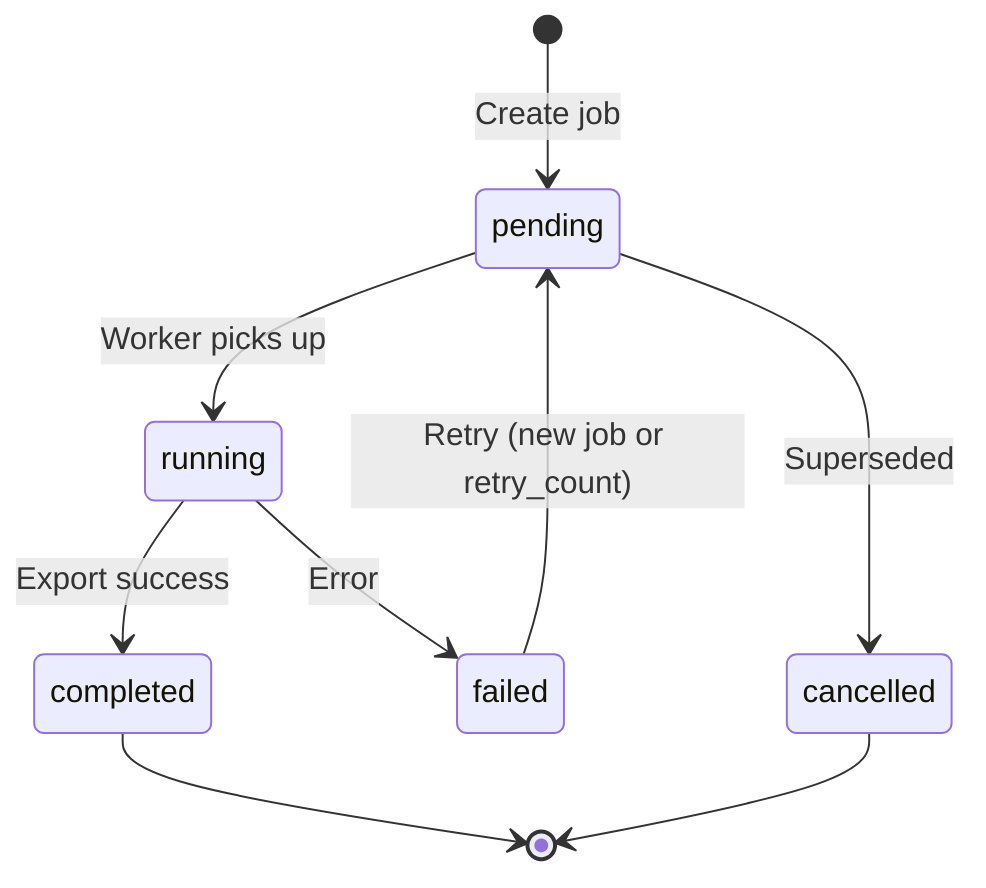
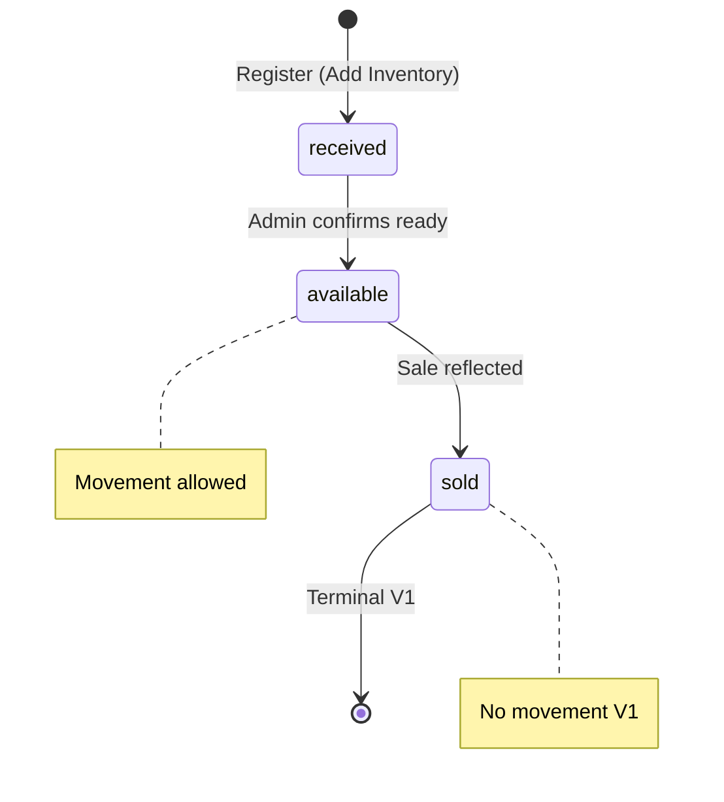

# WEBSTUDIO IMS — Database Design

| Attribute | Value |
|-----------|-------|
| **Document ID** | DB-001 |
| **Version** | 1.1 |
| **Status** | Active — logical model frozen for Version 1 implementation |
| **Governing Documents** | [PROJECT_BIBLE.md](../PROJECT_BIBLE.md), [PRODUCT_REQUIREMENTS.md](../product/PRODUCT_REQUIREMENTS.md), [TECH_STACK.md](../TECH_STACK.md), [SYSTEM_ARCHITECTURE.md](../SYSTEM_ARCHITECTURE.md) |
| **Purpose** | Authoritative logical data model for PostgreSQL implementation |
| **Scope** | Version 1 — laptop inventory only |

> **Authority:** This document defines the logical database design for WEBSTUDIO IMS. SQLAlchemy models, Alembic migrations, and repository implementations must conform to this design. Deviations require an ADR amendment.
>
> **This document does not contain SQL, ORM code, or migration scripts.**

---

## Version History

| Version | Date | Author | Summary |
|---------|------|--------|---------|
| 1.1 | 2026-06-27 | WEBSTUDIO IMS Team | Product Model Active/Archived lifecycle; mandatory `color` on inventory_item; expanded search indexes; excluded Purchase Date/Cost/Remarks from V1. |
| 1.0 | 2026-06-27 | WEBSTUDIO IMS Team | Initial logical data model. |

---

## Table of Contents

1. [Database Philosophy](#1-database-philosophy)
2. [Core Domain Model](#2-core-domain-model)
3. [Entity Relationships](#3-entity-relationships)
4. [Entity Definitions](#4-entity-definitions)
5. [Business Constraints](#5-business-constraints)
6. [Enumerations](#6-enumerations)
7. [Search & Indexing Strategy](#7-search--indexing-strategy)
8. [Transaction Design](#8-transaction-design)
9. [Audit Model](#9-audit-model)
10. [Synchronization Model](#10-synchronization-model)
11. [Naming Conventions](#11-naming-conventions)
12. [Data Lifecycle](#12-data-lifecycle)
13. [Performance Design](#13-performance-design)
14. [Future Expansion](#14-future-expansion)
15. [Open Decisions](#15-open-decisions)
16. [Database Readiness Assessment](#16-database-readiness-assessment)

---

## 1. Database Philosophy

### 1.1 Why PostgreSQL

PostgreSQL is mandated by the Project Bible as the **single authoritative datastore** for all inventory, users, audit, and configuration data (N1, BR-06). It provides:

- **ACID transactions** — inventory mutations and audit records commit atomically
- **Referential integrity** — foreign keys enforce location, brand, and model relationships
- **Advanced indexing** — B-tree for serial lookup; `pg_trgm` for configuration-aware search (FR-SRH-05/06)
- **Long-term viability** — 10+ year maintainability requirement (N14)
- **Operational maturity** — backup, restore, and on-premise Windows deployment are well understood

### 1.2 Why Normalized Design

Version 1 uses **Third Normal Form (3NF)** for core entities:

| Principle | Application |
|-----------|-------------|
| **No redundant master data** | Brand name stored once in `brand`; referenced by `product_model` and derived in queries |
| **One fact per place** | Current location on `inventory_item`; movement history in `inventory_movement` |
| **Derived data is computed** | Available unit counts per model group are query aggregates — not stored quantity columns |
| **Controlled denormalization** | None in V1; dashboard aggregates computed at query time |

Normalization prevents inventory drift when brands or locations are renamed and keeps audit semantics clear.

### 1.3 Why Serial Number Is the Primary Business Identity

Per PRD Section 10 and BR-01:

- **One `inventory_item` row = one physical laptop**
- **Serial number** is the globally unique business identifier for operations targeting a single machine (sale, movement, lookup)
- **Model number** identifies a product line shared by many machines — it is not unique

The database enforces serial uniqueness at the constraint level. All sale and movement records ultimately resolve to an `inventory_item` via serial number or internal ID.

### 1.4 Why Product Model Is a Separate Entity

`product_model` is a distinct entity — not merely a text field on `inventory_item`:

| Reason | Explanation |
|--------|-------------|
| **Grouping** | PRD PR-01–PR-08 require presentation grouped by Brand → Model Number |
| **Integrity** | Model numbers repeat across units; the repeatability rule (BR-02) applies to the model entity, not serial |
| **Referential stability** | Renaming display metadata affects one row, not thousands of inventory rows |
| **Future expansion** | Accessories may later use quantity-based models; laptops remain serial-linked to `product_model` |
| **Search performance** | Composite indexes on `(brand_id, model_number)` support model-first browsing |

Each `inventory_item` references exactly one `product_model`. **Configuration** (CPU, RAM, GPU, storage) and **Color** remain on the **unit** because two laptops of the same model may differ in specs and finish color.

### 1.5 Why the Database Is the Single Source of Truth

| System | Authority |
|--------|-----------|
| **PostgreSQL** | Authoritative for inventory state, users, audit, settings |
| **Tally ERP 9** | Authoritative for billing only — IMS stores references, not invoices |
| **Excel** | Non-authoritative synchronized export — never imported |

Only the Backend API writes to PostgreSQL (N2). The logical model reflects **one write path** and **complete auditability** for every mutation (N8, BR-09).

---

## 2. Core Domain Model

The Version 1 logical model comprises **four bounded areas**:

```
┌─────────────────────────────────────────────────────────────────┐
│  IDENTITY & ACCESS          │  REFERENCE DATA                   │
│  • User                     │  • Brand                          │
│  • RefreshToken             │  • ProductModel                   │
│  (Permission — app-level)   │  • Location                       │
├─────────────────────────────┼───────────────────────────────────┤
│  INVENTORY CORE             │  OPERATIONS & INTEGRATION         │
│  • InventoryItem            │  • InventoryMovement              │
│  • Sale                     │  • AuditLog                       │
│                             │  • SyncJob                        │
│                             │  • TallyIntegrationEvent          │
│                             │  • SystemSetting                  │
└─────────────────────────────────────────────────────────────────┘
```

### 2.1 Entity Responsibilities

| Entity | Responsibility |
|--------|----------------|
| **User** | Authenticated actor; role assignment; account lockout; session invalidation |
| **RefreshToken** | Server-side refresh token storage (hashed); rotation and revocation |
| **Permission** | *(Conceptual V1)* — mapped from role in application code; not persisted as table |
| **Brand** | Configurable laptop brand master data |
| **ProductModel** | Product SKU (model number) within a brand; **Active/Archived** lifecycle |
| **Location** | Physical store or warehouse area; current location of each unit |
| **InventoryItem** | One physical laptop; serial identity; current status and location |
| **InventoryMovement** | Immutable history of location transfers |
| **Sale** | Immutable record when a unit becomes Sold; links to Tally invoice reference |
| **AuditLog** | Append-only record of all material system actions |
| **SyncJob** | Excel export job queue and execution status |
| **TallyIntegrationEvent** | Log of every Tally poll/voucher processing attempt |
| **SystemSetting** | Admin-configurable key-value settings |

---

## 3. Entity Relationships

### 3.1 High-Level ER Diagram

```mermaid
erDiagram
    BRAND ||--o{ PRODUCT_MODEL : has
    PRODUCT_MODEL ||--o{ INVENTORY_ITEM : instances
    LOCATION ||--o{ INVENTORY_ITEM : holds
    INVENTORY_ITEM ||--o{ INVENTORY_MOVEMENT : history
    INVENTORY_ITEM ||--o| SALE : sold_as
    USER ||--o{ INVENTORY_ITEM : created
    USER ||--o{ INVENTORY_MOVEMENT : performed
    USER ||--o{ SALE : recorded
    USER ||--o{ AUDIT_LOG : actor
    USER ||--o{ SYNC_JOB : triggered
    USER ||--o{ REFRESH_TOKEN : owns
    SYNC_JOB ||--o{ TALLY_INTEGRATION_EVENT : may_include

    BRAND {
        bigint id PK
        string name UK
        boolean is_active
    }

    PRODUCT_MODEL {
        bigint id PK
        bigint brand_id FK
        string model_number
        enum status
    }

    LOCATION {
        bigint id PK
        string name UK
        boolean is_active
    }

    INVENTORY_ITEM {
        bigint id PK
        string serial_number UK
        bigint product_model_id FK
        bigint location_id FK
        string configuration
        string color
        enum status
        int row_version
    }

    INVENTORY_MOVEMENT {
        bigint id PK
        bigint inventory_item_id FK
        bigint from_location_id FK
        bigint to_location_id FK
        bigint performed_by_user_id FK
    }

    SALE {
        bigint id PK
        bigint inventory_item_id FK UK
        enum sale_source
        string tally_voucher_number
    }

    USER {
        bigint id PK
        string username UK
        enum role
        enum status
    }

    AUDIT_LOG {
        bigint id PK
        bigint actor_user_id FK
        string entity_type
        bigint entity_id
    }

    SYNC_JOB {
        bigint id PK
        enum job_type
        enum status
    }
```

### 3.2 Relationship Summary

| Relationship | Cardinality | Ownership | Notes |
|--------------|-------------|-----------|-------|
| Brand → ProductModel | 1:N | Brand owns models | Archive/delete rules per §12.7 |
| ProductModel → InventoryItem | 1:N | Model classifies units | **Archived** models hidden from new inventory; historical links retained |
| Location → InventoryItem | 1:N | Location holds units | Exactly one current location per item |
| InventoryItem → InventoryMovement | 1:N | Item owns movement history | Movements immutable |
| InventoryItem → Sale | 1:0..1 | Item has at most one sale V1 | Sold is terminal; sale row created once |
| User → InventoryItem | 1:N | User created item | `created_by_user_id` |
| User → AuditLog | 1:N | User is actor | Nullable for system/service accounts |
| User → RefreshToken | 1:N | User owns tokens | Revocable |
| SyncJob → TallyIntegrationEvent | 1:N | Optional link | Tally events may occur outside excel jobs |

### 3.3 Many-to-Many Assessment

**No many-to-many tables are required in Version 1.**

- User–Role: single `role` enum on `user` (three roles V1)
- Inventory–Location history: resolved via `inventory_movement` (not M:N on current state)
- Permission–Role: application-level mapping in `packages/auth/`

Future multi-role per user would introduce `user_role` junction table via ADR.

---

## 4. Entity Definitions

### 4.1 User

| Aspect | Definition |
|--------|------------|
| **Purpose** | Represents a person or service account that interacts with the system |
| **Business description** | Store staff and automated sync workers authenticate as users. Human users have roles (Main Admin, Admin, Salesperson). Service accounts (`svc-excel-sync`, `svc-tally-sync`) are users with restricted roles for API access. |

**Important attributes:**

| Attribute | Required | Mutable | Notes |
|-----------|----------|---------|-------|
| `id` | Yes (surrogate) | Immutable | Internal primary key |
| `username` | Yes | Immutable after create | Unique; login identifier |
| `password_hash` | Yes (human users) | Yes | bcrypt; null for service accounts |
| `role` | Yes | Yes (Main Admin only) | Enum: `main_admin`, `admin`, `salesperson`, `service_account` |
| `status` | Yes | Yes | `active`, `disabled` |
| `display_name` | Optional | Yes | Friendly name for UI |
| `must_change_password` | Yes | Yes | Force change on first login |
| `failed_login_count` | Yes | Yes | Lockout tracking |
| `locked_until` | Optional | Yes | Account lockout expiry |
| `token_version` | Yes | Yes | Increment to invalidate all sessions |
| `theme_preference` | Optional | Yes | `light`, `dark`, `system` |
| `created_at` | Yes | Immutable | |
| `updated_at` | Yes | Auto-updated | |

**Validation rules (business):**

- Username: unique; length 3–64; alphanumeric + underscore
- Password: minimum 10 characters (policy TBD); hashed never stored plain
- Disabled users cannot authenticate
- Service accounts cannot use password login from UI

**Lifecycle:** Created → Active → Disabled (soft; never hard-deleted if audit references exist)

---

### 4.2 RefreshToken

| Aspect | Definition |
|--------|------------|
| **Purpose** | Persist refresh tokens for JWT rotation and revocation |
| **Business description** | Each issued refresh token is stored hashed. Rotation creates new row; reuse detection revokes family. |

| Attribute | Required | Notes |
|-----------|----------|-------|
| `id` | Yes | Surrogate PK |
| `user_id` | Yes | FK → user |
| `token_hash` | Yes | Hashed refresh token — never plain text |
| `expires_at` | Yes | |
| `revoked_at` | Optional | Set on logout or admin invalidation |
| `replaced_by_id` | Optional | Rotation chain |
| `created_at` | Yes | |

---

### 4.3 Brand

| Aspect | Definition |
|--------|------------|
| **Purpose** | Master list of laptop brands |
| **Business description** | Configurable by Admin/Main Admin (FR-BRD-01). Required on every inventory item. |

| Attribute | Required | Mutable | Notes |
|-----------|----------|---------|-------|
| `id` | Yes | Immutable | |
| `name` | Yes | Yes | Unique; e.g., "ASUS", "Lenovo" |
| `is_active` | Yes | Yes | Cannot deactivate if active inventory references exist (FR-BRD-03) |
| `created_at` | Yes | Immutable | |
| `updated_at` | Yes | Auto | |

---

### 4.4 ProductModel

| Aspect | Definition |
|--------|------------|
| **Purpose** | Product SKU — model number within a brand |
| **Business description** | Groups inventory items for presentation and search. Model number may repeat across many `inventory_item` rows (BR-02). Lifecycle: **Active** or **Archived** (PRD §12.2). |

| Attribute | Required | Mutable | Notes |
|-----------|----------|---------|-------|
| `id` | Yes | Immutable | |
| `brand_id` | Yes | No* | FK → brand; *immutable after inventory linked |
| `model_number` | Yes | Yes | Unique per brand (composite uniqueness) |
| `display_name` | Optional | Yes | Optional friendly label |
| `status` | Yes | Yes | Enum: `active`, `archived` — see §6.10 |
| `created_at` | Yes | Immutable | |
| `updated_at` | Yes | Auto | |

**Composite uniqueness:** `(brand_id, model_number)` must be unique.

**Lifecycle rules:**

| Action | Condition |
|--------|-----------|
| **Archive** | Main Admin; sets `status = archived` |
| **Restore** | Main Admin; sets `status = active` |
| **Permanent delete** | Only if **no** `inventory_item`, **no** `sale`, and **no** `audit_log` references ever existed for this model |
| **New inventory** | Rejected when `status = archived` |

**Not stored on ProductModel:** Color (per-unit on `inventory_item`); Purchase Date, Purchase Cost, Remarks (excluded V1).

---

### 4.5 Location

| Aspect | Definition |
|--------|------------|
| **Purpose** | Physical inventory location within the building |
| **Business description** | Preconfigured: ASUS Exclusive Store, WEBSTUDIO Multi-brand Store, Warehouse/Godown (FR-LOC-01). Main Admin may add more. |

| Attribute | Required | Mutable | Notes |
|-----------|----------|---------|-------|
| `id` | Yes | Immutable | |
| `name` | Yes | Yes | Unique |
| `location_type` | Yes | Yes | Enum: `retail_floor`, `warehouse`, `other` |
| `is_active` | Yes | Yes | Cannot deactivate if inventory present (FR-LOC-03) |
| `sort_order` | Optional | Yes | Display ordering |
| `branch_id` | Optional | Future | Null V1; reserved for multi-branch |
| `created_at` | Yes | Immutable | |
| `updated_at` | Yes | Auto | |

---

### 4.6 InventoryItem

| Aspect | Definition |
|--------|------------|
| **Purpose** | **Core entity** — one physical laptop |
| **Business description** | The authoritative record of a single machine. Identified globally by `serial_number`. Tracks current lifecycle status and location. |

| Attribute | Required | Mutable | Notes |
|-----------|----------|---------|-------|
| `id` | Yes | Immutable | Internal surrogate key |
| `serial_number` | Yes | **Immutable** | Globally unique (BR-01); primary business identity |
| `product_model_id` | Yes | Yes* | FK → product_model; must reference **active** model on create |
| `configuration` | Yes | Yes | Free text V1 — CPU, GPU, RAM, storage, screen |
| `color` | Yes | Yes | **Mandatory** per-unit color — e.g., Black, Silver, Blue; not on product_model |
| `location_id` | Yes | Yes | FK → location; current location only |
| `status` | Yes | Yes | Enum: `received`, `available`, `sold` |
| `row_version` | Yes | Auto | Optimistic locking |
| `created_by_user_id` | Yes | Immutable | FK → user |
| `created_at` | Yes | Immutable | |
| `updated_at` | Yes | Auto | Status/location change timestamp |

**Immutable fields after create:** `serial_number`, `created_by_user_id`, `created_at`

**Validation rules:**

- Serial number: globally unique; trimmed; non-empty
- Color: required; non-empty; searchable (trimmed)
- Product model: must be `active` on create
- Status transitions: only allowed paths per §12.1
- Movement: only when `status = available` (LC-04 for sold)
- No hard delete (FR-INV-07) — status change only

**Excluded Version 1 fields (not columns):** `purchase_date`, `purchase_cost`, `remarks` — see §12.8.

---

### 4.7 InventoryMovement

| Aspect | Definition |
|--------|------------|
| **Purpose** | Immutable audit of location transfers |
| **Business description** | Every move records source, destination, actor, and time (BR-04, FR-MOV-02). Does not change lifecycle status (LC-03). |

| Attribute | Required | Notes |
|-----------|----------|-------|
| `id` | Yes | Surrogate PK |
| `inventory_item_id` | Yes | FK → inventory_item |
| `from_location_id` | Yes | FK → location |
| `to_location_id` | Yes | FK → location; must differ from `from` |
| `performed_by_user_id` | Yes | FK → user |
| `reason` | Optional | Free text |
| `moved_at` | Yes | Timestamp of movement |
| `created_at` | Yes | Record creation time |

**Immutable:** entire row — insert only, no updates or deletes.

---

### 4.8 Sale

| Aspect | Definition |
|--------|------------|
| **Purpose** | Immutable sales history record when inventory becomes Sold |
| **Business description** | Created when Tally reflects a sale or manual fallback is used (FR-SLS-01). Stores customer and invoice **references** — Tally remains billing authority (BR-15). |

| Attribute | Required | Notes |
|-----------|----------|-------|
| `id` | Yes | Surrogate PK |
| `inventory_item_id` | Yes | FK → inventory_item; **unique** (one sale per unit V1) |
| `sale_source` | Yes | Enum: `tally`, `manual` |
| `sold_at` | Yes | Sale date/time |
| `recorded_by_user_id` | Optional | FK → user; null for automated Tally |
| `customer_name` | Optional | Reference copy — not authoritative billing |
| `customer_contact` | Optional | Phone/email reference |
| `invoice_reference` | Optional | Tally voucher/invoice number reference |
| `tally_voucher_number` | Optional | For Tally idempotency; required when `sale_source = tally` |
| `notes` | Optional | Manual sale notes |
| `idempotency_key` | Optional | Client-provided key for manual sales |
| `created_at` | Yes | Immutable |

**Composite uniqueness (Tally idempotency):** `(tally_voucher_number, inventory_item_id)` unique where `sale_source = tally` and voucher not null.

**Immutable:** entire row after insert — no updates or deletes (FR-SLS, sale immutability).

---

### 4.9 AuditLog

| Aspect | Definition |
|--------|------------|
| **Purpose** | System-wide append-only audit trail |
| **Business description** | Records every inventory mutation, auth event, user management action, and settings change (FR-AUD-01–07). |

See [Section 9](#9-audit-model) for complete attribute list.

---

### 4.10 SyncJob

| Aspect | Definition |
|--------|------------|
| **Purpose** | Queue and track Excel export synchronization jobs |
| **Business description** | Created by scheduler or manual Main Admin trigger. Excel Sync worker picks up pending jobs. API never writes Excel — only creates and updates job records. |

| Attribute | Required | Notes |
|-----------|----------|-------|
| `id` | Yes | Surrogate PK |
| `job_type` | Yes | Enum: `excel_export` (V1) |
| `status` | Yes | Enum: see §6 |
| `triggered_by_user_id` | Optional | Null for scheduled jobs |
| `idempotency_key` | Optional | Unique if provided |
| `scheduled_at` | Optional | When job should run |
| `started_at` | Optional | |
| `completed_at` | Optional | |
| `record_count` | Optional | Rows exported |
| `output_file_path` | Optional | Path written by worker |
| `error_message` | Optional | Failure detail |
| `correlation_id` | Yes | Request/trace ID |
| `retry_count` | Yes | Default 0 |
| `created_at` | Yes | |
| `updated_at` | Yes | |

---

### 4.11 TallyIntegrationEvent

| Aspect | Definition |
|--------|------------|
| **Purpose** | Log every Tally poll and voucher processing attempt |
| **Business description** | Supports reconciliation, failure surfacing (FR-TLY-04/05), and operational diagnostics. Does not replace `sale` — successful processing also creates sale + inventory update via API. |

| Attribute | Required | Notes |
|-----------|----------|-------|
| `id` | Yes | |
| `event_type` | Yes | Enum: `poll`, `voucher_received`, `sale_applied`, `sale_skipped`, `error` |
| `tally_voucher_number` | Optional | |
| `serial_number` | Optional | As extracted from voucher |
| `inventory_item_id` | Optional | FK if matched |
| `outcome` | Yes | Enum: `success`, `skipped`, `failed` |
| `error_code` | Optional | |
| `error_message` | Optional | |
| `correlation_id` | Yes | |
| `payload_hash` | Optional | SHA-256 of raw XML — not full payload |
| `created_at` | Yes | Immutable |

---

### 4.12 SystemSetting

| Aspect | Definition |
|--------|------------|
| **Purpose** | Admin-configurable application settings |
| **Business description** | Key-value store for sync schedules, session timeout, lockout thresholds, barcode behaviour, display name (FR-SET-01–07). |

| Attribute | Required | Notes |
|-----------|----------|-------|
| `id` | Yes | |
| `setting_key` | Yes | Unique; snake_case |
| `setting_value` | Yes | Text or JSON string |
| `value_type` | Yes | Enum: `string`, `integer`, `boolean`, `json`, `cron` |
| `description` | Optional | Admin UI help text |
| `updated_by_user_id` | Optional | Last modifier |
| `updated_at` | Yes | |

**Known keys (non-exhaustive):** `excel_sync_cron`, `tally_poll_interval_seconds`, `session_timeout_minutes`, `lockout_threshold`, `lockout_duration_minutes`, `barcode_auto_submit`, `business_display_name`

---

### 4.13 Permission (Conceptual — Not Persisted V1)

| Aspect | Definition |
|--------|------------|
| **Purpose** | Authorization capability check |
| **V1 implementation** | Defined as constants in `packages/auth/permissions.py`; mapped from `user.role` in application code |
| **Future** | `permission` and `role_permission` tables if fine-grained RBAC required |

---

## 5. Business Constraints

### 5.1 Constraint Matrix

| Rule | Business Constraint | Database Constraint |
|------|---------------------|-------------------|
| **BR-01** Serial globally unique | Service rejects duplicate | `UNIQUE (serial_number)` on `inventory_item` |
| **BR-02** Model number repeats | Many items per product_model | Unique `(brand_id, model_number)` on product_model |
| **BR-22** Color per unit | Mandatory on inventory_item | `NOT NULL color` |
| **BR-24** Product Model lifecycle | Archive vs delete rules | `status` enum; service-layer delete guard |
| **BR-25** Excluded V1 fields | No purchase_date, purchase_cost, remarks | Not in schema |
| **BR-03** One location per item | Service enforces | `NOT NULL location_id` on inventory_item |
| **BR-04** Movements logged | Service creates movement row | `inventory_movement` insert-only |
| **BR-07** Excel not authoritative | No import path | No table reads from Excel |
| **BR-11** Sold cannot sell again | Service idempotency | `status = sold` terminal; unique sale per item |
| **BR-18** Lifecycle transitions | SaleService/InventoryService | Optional CHECK or service-only |
| **LC-04** Sold cannot move | MovementService | Service rejects; status check |
| **FR-INV-07** No delete | Soft lifecycle only | No DELETE grant on inventory_item for app user |
| **FR-AUD-06** Audit immutable | Append-only | INSERT only on audit_log |
| **Tally idempotency** | SaleService | UNIQUE `(tally_voucher_number, inventory_item_id)` on sale |

### 5.2 Business-Only Constraints (Not DB-Enforced)

| Constraint | Enforced By |
|------------|-------------|
| Received → Sold blocked | InventoryService |
| Only Available may move | MovementService |
| Archived product model on create | InventoryService |
| Product model permanent delete | ProductModelService |
| Role permission matrix | API RBAC |
| Tally voucher validation | SaleService + defusedxml |
| Excel one-way sync | Architecture — no import endpoint |
| Configuration search semantics | SearchService + pg_trgm |

### 5.3 User Constraints

| Constraint | Layer |
|------------|-------|
| Unique username | Database UNIQUE |
| Lockout after N failures | Service + `user.locked_until` |
| Main Admin cannot demote self if sole admin | Service rule |
| Service account restricted permissions | Role enum + API guards |

---

## 6. Enumerations

All enums stored as PostgreSQL `ENUM` types or `VARCHAR` with CHECK constraints — implementation choice in migration ADR.

### 6.1 InventoryStatus

| Value | Meaning |
|-------|---------|
| `received` | Registered; not yet sellable |
| `available` | Sellable and movable |
| `sold` | Billed; terminal V1 |

### 6.2 UserRole

| Value | Meaning |
|-------|---------|
| `main_admin` | Full system access |
| `admin` | Inventory and operational management |
| `salesperson` | Search, view, manual sale fallback |
| `service_account` | Automated sync workers only |

### 6.3 UserStatus

| Value | Meaning |
|-------|---------|
| `active` | May authenticate |
| `disabled` | Cannot authenticate |

### 6.4 LocationType

| Value | Meaning |
|-------|---------|
| `retail_floor` | Customer-facing store area |
| `warehouse` | Godown / storage |
| `other` | Additional locations |

### 6.5 SaleSource

| Value | Meaning |
|-------|---------|
| `tally` | Automated from Tally integration |
| `manual` | Staff manual fallback |

### 6.6 SyncJobType

| Value | Meaning |
|-------|---------|
| `excel_export` | Excel workbook export V1 |

### 6.7 SyncJobStatus

| Value | Meaning |
|-------|---------|
| `pending` | Queued; awaiting worker |
| `running` | Worker processing |
| `completed` | Success |
| `failed` | Error; see `error_message` |
| `cancelled` | Superseded or admin cancelled |

### 6.8 AuditAction

| Value | Examples |
|-------|----------|
| `inventory.create` | New unit registered |
| `inventory.update` | Attribute change |
| `inventory.transition` | Status change |
| `inventory.move` | Location change |
| `sale.reflect` | Sale recorded |
| `user.create` | User management |
| `user.update` | |
| `user.disable` | |
| `setting.update` | Configuration change |
| `auth.login_success` | |
| `auth.login_failure` | |
| `auth.logout` | |
| `sync.job_created` | |
| `sync.job_completed` | |
| `product_model.create` | Product model management |
| `product_model.archive` | |
| `product_model.restore` | |
| `product_model.delete` | Permanent delete (no history only) |
| `permission.denied` | |

### 6.9 TallyEventType / TallyEventOutcome

See §4.11 — `poll`, `voucher_received`, `sale_applied`, `sale_skipped`, `error` / `success`, `skipped`, `failed`.

### 6.10 ProductModelStatus

| Value | Meaning |
|-------|---------|
| `active` | Available for new inventory; visible in default views |
| `archived` | Hidden from inventory creation and Salesperson default views; historical data retained |

### 6.11 ClientPlatform

| Value | Used In |
|-------|---------|
| `windows_desktop` | Audit enrichment |
| `macos_desktop` | |
| `android` | |
| `excel_sync` | Service account |
| `tally_sync` | Service account |
| `system` | Internal/scheduled |

---

## 7. Search & Indexing Strategy

### 7.1 Primary Indexes (Conceptual)

| Table | Index | Purpose |
|-------|-------|---------|
| `inventory_item` | UNIQUE `(serial_number)` | Exact serial lookup — highest priority |
| `inventory_item` | `(status)` | Dashboard counts |
| `inventory_item` | `(location_id, status)` | Location summary |
| `inventory_item` | `(product_model_id)` | Model group expansion |
| `inventory_item` | `(color)` | Color filter and search |
| `inventory_item` | `(updated_at DESC)` | Recently updated list |
| `product_model` | UNIQUE `(brand_id, model_number)` | Model identity |
| `product_model` | `(brand_id)` | Brand grouping |
| `product_model` | `(status)` | Filter active models for inventory creation |
| `inventory_movement` | `(inventory_item_id, moved_at DESC)` | Movement history |
| `sale` | `(sold_at DESC)` | Sales reports |
| `sale` | `(inventory_item_id)` UNIQUE | One sale per unit |
| `audit_log` | `(created_at DESC)` | Audit search |
| `audit_log` | `(entity_type, entity_id)` | Entity history |
| `sync_job` | `(status, scheduled_at)` | Worker job pickup |
| `tally_integration_event` | `(created_at DESC)` | Reconciliation UI |

### 7.2 Configuration and Color Search

| Index | Purpose |
|-------|---------|
| GIN `(configuration gin_trgm_ops)` on `inventory_item` | Partial match: `4060`, `i7`, `16GB` (FR-SRH-06) |
| GIN `(color gin_trgm_ops)` on `inventory_item` (optional) | Partial color match at scale |
| B-tree `(color)` on `inventory_item` | Exact and prefix color filter |

**Prerequisite:** `pg_trgm` extension enabled in first migration (per SYSTEM_ARCHITECTURE §10.8).

### 7.3 Serial Prefix Search

| Index | Purpose |
|-------|---------|
| B-tree on `serial_number` with `varchar_pattern_ops` (optional) | Prefix scan for partial serial entry |

### 7.4 Pagination Strategy

| Query Type | Strategy |
|------------|----------|
| Search results | Offset or keyset pagination; default page size 50 |
| Model-grouped browse | Paginate model groups; expand loads serials for one model |
| Audit log | Keyset on `(created_at, id)` for stable paging |
| Excel export | Cursor-based API pagination by `inventory_item.id` |

### 7.5 Search Query Routing (Logical)

| Input Pattern | Primary Access Path |
|---------------|---------------------|
| Exact serial | UNIQUE index on `serial_number` |
| Serial prefix | B-tree prefix scan |
| Model / brand | Join `product_model` → `brand` |
| Configuration term (CPU/GPU/RAM/Storage) | `pg_trgm` on `configuration` |
| Color exact / partial | B-tree or `ILIKE` on `color`; GIN trigram optional |
| Location / status filter | Composite `(location_id, status)` |

Formal query parsing: `docs/specs/search-query-spec.md` (**TBD**).

---

## 8. Transaction Design

### 8.1 Rollback Philosophy

- **All inventory mutations are atomic** — inventory change + audit in one transaction
- **On any failure, full rollback** — no partial state
- **Audit insert in same transaction** — if audit fails, mutation fails (SYSTEM_ARCHITECTURE §10.2)

### 8.2 Transaction Boundaries

| Operation | Tables Touched | Transaction Scope |
|-----------|----------------|-------------------|
| **Inventory addition** | `inventory_item` INSERT, `audit_log` INSERT | Single transaction |
| **Status transition** (Received→Available) | `inventory_item` UPDATE, `audit_log` INSERT | Single transaction |
| **Inventory movement** | `inventory_item` UPDATE `location_id`, `inventory_movement` INSERT, `audit_log` INSERT | Single transaction |
| **Sale reflection** | `inventory_item` UPDATE `status=sold`, `sale` INSERT, `audit_log` INSERT | Single transaction |
| **Attribute update** | `inventory_item` UPDATE, `audit_log` INSERT | Single transaction |
| **User creation** | `user` INSERT, `audit_log` INSERT | Single transaction |
| **Permission/role update** | `user` UPDATE `role`/`token_version`, `audit_log` INSERT | Single transaction; may bump `token_version` |
| **Product model archive** | `product_model` UPDATE `status`, `audit_log` INSERT | Single transaction |
| **Product model delete** | `product_model` DELETE (guard), `audit_log` INSERT | Single transaction; only if no references |
| **Sync job create** | `sync_job` INSERT, `audit_log` INSERT | Single transaction |
| **Sync job complete** | `sync_job` UPDATE, `audit_log` INSERT | Single transaction |
| **Tally sale (via API)** | Same as sale reflection + `tally_integration_event` INSERT | Single transaction |
| **Excel export (worker)** | No inventory mutation; `sync_job` UPDATE only | Short transaction |

### 8.3 Isolation

- Default PostgreSQL `READ COMMITTED` sufficient for V1 concurrency
- Optimistic locking on `inventory_item.row_version` prevents lost updates
- Sale idempotency checked within transaction before insert

### 8.4 Excel & Tally Sync

- **Excel:** Read-only inventory access via API — no database transaction spans export file write
- **Tally:** Each voucher processed in independent API transaction — one failure does not roll back others

---

## 9. Audit Model

### 9.1 AuditLog Attributes

| Field | Required | Description |
|-------|----------|-------------|
| `id` | Yes | Surrogate PK |
| `audit_action` | Yes | Enum — §6.8 |
| `actor_user_id` | Optional | FK → user; null for unauthenticated failures |
| `actor_service` | Optional | `excel_sync`, `tally_sync` when service account |
| `entity_type` | Yes | e.g., `inventory_item`, `user`, `sync_job` |
| `entity_id` | Yes | Primary key of affected entity |
| `entity_identifier` | Optional | Human-readable — e.g., serial number |
| `before_state` | Optional | JSON snapshot of changed fields |
| `after_state` | Optional | JSON snapshot of changed fields |
| `reason` | Optional | Movement reason, manual sale note |
| `request_id` | Yes | `X-Request-ID` correlation |
| `correlation_id` | Optional | Cross-service trace |
| `client_platform` | Optional | Enum — §6.10 |
| `client_ip_address` | Optional | Source IP |
| `client_user_agent` | Optional | Device/browser information |
| `client_app_version` | Optional | Desktop/Android version |
| `created_at` | Yes | UTC timestamp — immutable |

### 9.2 Immutability

| Rule | Rationale |
|------|-----------|
| **INSERT only** | FR-AUD-06; forensic integrity |
| **No UPDATE or DELETE** for application user | Prevents tampering |
| **Retention** | Minimum 2 years recommended; archival future (§14) |

Audit records are the legal and operational evidence of who changed inventory and when. Immutability is non-negotiable.

### 9.3 Relationship to Domain Events

Inventory status changes are captured in `audit_log` with `before_state`/`after_state`. A separate `inventory_status_history` table is **not required V1** — audit provides sufficient traceability. Add only if reporting performance requires it (future).

---

## 10. Synchronization Model

### 10.1 Excel Sync Jobs



| Concern | Design |
|---------|--------|
| **Creation** | Scheduler or `POST /sync/excel/trigger` creates `sync_job` with `status=pending` |
| **Execution** | Excel worker claims job, sets `running`, paginates API export, writes file |
| **Completion** | Updates `completed`, `record_count`, `output_file_path` |
| **Idempotency** | `idempotency_key` unique — duplicate trigger returns existing job |
| **Retry** | Increment `retry_count`; re-queue or create new job after backoff |
| **Failure** | `failed` status + `error_message`; alert Main Admin |
| **Recovery** | Manual re-trigger creates new job; last-known-good Excel preserved |

**Export columns (V1):** Brand, Model, Serial, **Color**, Configuration, Location, Status — per FR-XLS-03. No Purchase Date, Purchase Cost, or Remarks.

### 10.2 Tally Integration Events

Tally does not use `sync_job` for each voucher — continuous polling model:

| Concern | Design |
|---------|--------|
| **Logging** | Every poll and voucher attempt → `tally_integration_event` |
| **Success** | `sale_applied` event + `sale` row + inventory `status=sold` in one API transaction |
| **Idempotency** | `SaleService` checks existing sale by `(tally_voucher_number, inventory_item_id)` |
| **Unknown serial** | `sale_skipped` event; no inventory mutation |
| **Duplicate voucher** | No-op; `sale_skipped` with reason `already_processed` |
| **Reconciliation** | Main Admin queries failed/skipped events |

### 10.3 Status Tracking

| Integration | Primary Status Store |
|-------------|---------------------|
| Excel | `sync_job.status` + latest completed job timestamp |
| Tally | Latest `tally_integration_event` + last successful `sale_applied` timestamp |

Dashboard settings (FR-SET-06) read from these tables via API.

---

## 11. Naming Conventions

Aligned with SYSTEM_ARCHITECTURE §22.5 and `webstudio` schema.

### 11.1 General Rules

| Rule | Standard |
|------|----------|
| Schema | `webstudio` |
| Language | English |
| Case | `snake_case` for all database identifiers |
| Plurality | Table names plural: `inventory_items`, `product_models` |
| Length | Max 63 characters (PostgreSQL limit) |

### 11.2 Tables

| Pattern | Example |
|---------|---------|
| `{entity_plural}` | `inventory_items`, `audit_logs` |
| Junction (future) | `user_roles` |

### 11.3 Columns

| Pattern | Example |
|---------|---------|
| Primary key | `id` (BIGINT identity) |
| Foreign key | `{entity_singular}_id` → `product_model_id` |
| Boolean | `is_{adjective}` → `is_active` |
| Timestamps | `created_at`, `updated_at`, `{action}_at` |
| Enums | `{noun}` or `{noun}_type` → `status`, `sale_source` |
| Free text | Descriptive noun → `configuration`, `reason` |

### 11.4 Constraints

| Type | Pattern | Example |
|------|---------|---------|
| Primary key | `pk_{table}` | `pk_inventory_items` |
| Foreign key | `fk_{table}_{referenced}` | `fk_inventory_items_product_model` |
| Unique | `uq_{table}_{column(s)}` | `uq_inventory_items_serial_number` |
| Check | `ck_{table}_{rule}` | `ck_inventory_movement_different_locations` |

### 11.5 Indexes

| Type | Pattern | Example |
|------|---------|---------|
| B-tree | `ix_{table}_{column(s)}` | `ix_inventory_items_location_id_status` |
| Unique | `uq_{table}_{column(s)}` | (may coincide with constraint) |
| GIN trigram | `ix_{table}_{column}_trgm` | `ix_inventory_items_configuration_trgm` |

### 11.6 Enums (PostgreSQL TYPE)

| Pattern | Example |
|---------|---------|
| `{domain}_{property}` | `inventory_status`, `user_role`, `sync_job_status` |

### 11.7 Views (Future)

| Pattern | Example |
|---------|---------|
| `v_{purpose}` | `v_available_stock_by_model` |

### 11.8 Functions (Future)

| Pattern | Example |
|---------|---------|
| `fn_{verb}_{noun}` | `fn_archive_audit_logs` |

---

## 12. Data Lifecycle

### 12.1 Inventory Item



| Phase | Data Behaviour |
|-------|----------------|
| **Register** | INSERT `inventory_item`; initial status `received` or `available` (**open decision**) |
| **Confirm** | UPDATE `status` → `available`; audit |
| **Move** | UPDATE `location_id`; INSERT `inventory_movement` |
| **Sell** | UPDATE `status` → `sold`; INSERT `sale` |
| **Archive (future)** | New status `archived` — not V1 |

**No hard delete** — records persist for audit and sales history.

### 12.2 User

```
Created → Active → Disabled → (permanent record retained)
```

Disabled users retain all historical audit references.

### 12.3 Sale

```
Created → Immutable forever
```

No updates or deletes. Corrections require operational procedure (future returns ADR).

### 12.4 Audit Log

```
Created → Immutable forever
```

### 12.5 Sync Job

```
pending → running → completed | failed | cancelled
```

Completed jobs retained for operational history (retention policy TBD).

### 12.6 Brand / Location

```
Created → Active → Deactivated (is_active=false)
```

Deactivation blocked when dependent active inventory exists.

### 12.7 ProductModel

```
active ⇄ archived
active → [permanent delete]  (only if no inventory, sales, or audit references ever)
archived → [permanent delete]  (same precondition)
```

Archived models remain referenced by historical `inventory_item`, `sale`, and `audit_log` rows.

### 12.8 Version 1 Excluded Fields

The following are **not** columns in any Version 1 table:

- `purchase_date`
- `purchase_cost`
- `remarks`

May be added in a future migration with ADR.

---

## 13. Performance Design

### 13.1 Expected Scale (Version 1)

| Dimension | Estimate |
|-----------|----------|
| Inventory items | 500 – 5,000 laptops |
| Sales per year | 500 – 2,000 |
| Movements per year | 1,000 – 5,000 |
| Concurrent users | 5 – 20 |
| Audit rows per year | ~10,000 – 50,000 |
| Search queries per day | High during business hours |

### 13.2 Search Performance

| Operation | Target (server-side) |
|-----------|---------------------|
| Serial exact lookup | < 10 ms |
| Configuration trigram search | < 200 ms at 5K items |
| Color filter / partial match | < 100 ms at 5K items |
| Dashboard aggregates | < 500 ms |

### 13.3 Concurrent Users

- Row-level locking + optimistic `row_version` sufficient
- Connection pool 10–20 connections
- No read replicas required V1

### 13.4 Export Performance

- Paginated export by `inventory_item.id` cursor — 500 rows per page
- Worker assembles Excel in memory or streaming — target < 60 seconds for 5K rows

### 13.5 Growth Strategy

| Threshold | Response |
|-----------|----------|
| > 10K items | Review query plans; partial indexes on `status = available` |
| > 100K audit rows | Table partitioning by `created_at` **future** |
| > 50 concurrent users | Connection pool tuning; read replica **future** |

---

## 14. Future Expansion

### 14.1 Extension Principles

| Principle | Application |
|-----------|-------------|
| **Additive migrations** | New tables and nullable FK columns — no breaking changes |
| **Reserved columns** | `location.branch_id` nullable for multi-branch |
| **Enum extension** | New `inventory_status` values via migration + ADR |
| **No parallel inventory stores** | Accessories use same `inventory_item` pattern or new category table linked to `product_model` |

### 14.2 Module Expansion Map

| Future Module | Schema Approach |
|---------------|-----------------|
| **Accessories** | `product_model.category` enum (`laptop`, `accessory`); quantity field or serial — **ADR required** |
| **Printers** | Same pattern as accessories |
| **Warranty** | `warranty_registration` table FK → `inventory_item` |
| **Service center** | `service_ticket` table; status `under_service` in enum |
| **Returns** | `return` table; transition `sold` → `available` via ADR |
| **Multi-branch** | `branch` table; `location.branch_id` populated |
| **Cloud** | Same schema; connection string change only |

### 14.3 Entities Explicitly Not in V1

Accessories, printers, warranty, repairs, CRM, accounting, customers (beyond sale reference fields), chart of accounts, invoices.

---

## 15. Open Decisions

Items **not guessed** — require explicit resolution before or during implementation.

### 15.1 Business Decisions

| ID | Decision | Impact | Owner |
|----|----------|--------|-------|
| BD-01 | **Default status on add:** `received` vs `available` | Initial INSERT value | Business + Product |
| BD-02 | **Configuration structure:** free text vs structured JSON fields | `inventory_item.configuration` shape; search parsing | Product |
| BD-03 | **Customer/invoice field list** on sale | `sale` column set | Business |
| BD-04 | **Sold units in model group UI** — show in group vs separate view (PR-06) | Query filters only | Business |
| BD-05 | **Salesperson movement permission** (PRD matrix TBD) | API authorization only | Business |
| BD-06 | **Audit retention period** | Archival policy | Business + Operations |

### 15.2 Architecture Decisions

| ID | Decision | Impact | Owner |
|----|----------|--------|-------|
| AD-01 | Surrogate key type: `BIGINT IDENTITY` vs `UUID` | All tables | Engineering — recommend BIGINT V1 |
| AD-02 | PostgreSQL native ENUM vs VARCHAR+CHECK | Migration flexibility | Engineering |
| AD-03 | Separate `inventory_status_history` table | Reporting performance | Engineering — defer V1 |

### 15.3 Tally POC Dependencies

| ID | Decision | Impact | Owner |
|----|----------|--------|-------|
| TP-01 | Serial number field in Tally voucher | `tally_integration_event` mapping | Engineering + POC |
| TP-02 | Voucher type filter | Query criteria | POC |
| TP-03 | `tally_voucher_number` format and uniqueness | `sale` idempotency key | POC |

**Gate:** `sale` and `tally_integration_event` schemas are designed; Tally Sync implementation blocked until POC passes (SYSTEM_ARCHITECTURE §14.3.1).

### 15.4 Deployment Decisions

| ID | Decision | Impact | Owner |
|----|----------|--------|-------|
| DP-01 | Audit log export for long-term archival | Cold storage | Operations — future |

---

## 16. Database Readiness Assessment

### 16.1 Readiness Verdict

| Phase | Ready? | Notes |
|-------|--------|-------|
| **Alembic migration authoring** | **Yes** | Include `color`, `product_model.status`; no excluded V1 fields |
| **SQLAlchemy ORM models** | **Yes** | Follow §7.11 domain mapping in architecture |
| **Repository implementation** | **Yes** | One repository per aggregate |
| **OpenAPI / API design** | **Yes** | DTOs map from entities in §4 |
| **Tally integration persistence** | **Conditional** | Schema ready; implementation blocked on POC |
| **Seed data scripts** | **Yes** | Brands, locations, Main Admin, default settings |

**Recommendation:** The logical model is **ready for implementation**. Proceed with Alembic migrations and ORM models in parallel with OpenAPI specification.

### 16.2 Database Quality Score

| Dimension | Score | Notes |
|-----------|-------|-------|
| **Normalization** | 9/10 | Clean 3NF; no premature denormalization |
| **Integrity** | 9/10 | Strong FK and unique constraints |
| **Auditability** | 10/10 | Comprehensive immutable audit |
| **Search support** | 9/10 | Indexes aligned to PRD; parser spec TBD |
| **Simplicity** | 9/10 | 12 tables V1 — appropriate scope |
| **Future extensibility** | 9/10 | Reserved patterns without over-engineering |
| **Overall** | **9.2 / 10** | Production-grade logical model |

### 16.3 Remaining Risks

| Risk | Severity | Mitigation |
|------|----------|------------|
| Configuration free-text search quality | Medium | BD-02 decision; trigram helps but not perfect |
| Tally voucher mapping unknown | High | POC before Tally service |
| Audit table unbounded growth | Low | Retention policy BD-06; partition future |
| Default status on add undecided | Low | BD-01 — does not block schema |

### 16.4 Outstanding Decisions

See [Section 15](#15-open-decisions). **None block schema creation.** BD-01 affects seed data and create-inventory default only.

### 16.5 Implementation Order (Recommended)

1. Migration `0001`: extensions, enums, `users`, `refresh_tokens`
2. Migration `0002`: `brands`, `product_models`, `locations`
3. Migration `0003`: `inventory_items`, `inventory_movements`
4. Migration `0004`: `sales`, `audit_logs`
5. Migration `0005`: `sync_jobs`, `tally_integration_events`, `system_settings`
6. Seed: three locations, default settings, Main Admin user

---

## References

| Document | Path |
|----------|------|
| Project Bible | [docs/PROJECT_BIBLE.md](../PROJECT_BIBLE.md) |
| Product Requirements | [docs/product/PRODUCT_REQUIREMENTS.md](../product/PRODUCT_REQUIREMENTS.md) |
| Technology Stack | [docs/TECH_STACK.md](../TECH_STACK.md) |
| System Architecture | [docs/SYSTEM_ARCHITECTURE.md](../SYSTEM_ARCHITECTURE.md) |
| Migrations (implementation) | [database/migrations/](../../database/migrations/) |
| Naming Conventions (implementation) | [docs/database/naming-conventions.md](naming-conventions.md) |

---

> **Document Authority:** This logical model is binding for WEBSTUDIO IMS Version 1 database implementation. Schema changes require updating this document and an Alembic migration. Deviations require an ADR.

*WEBSTUDIO IMS Team — 2026*
