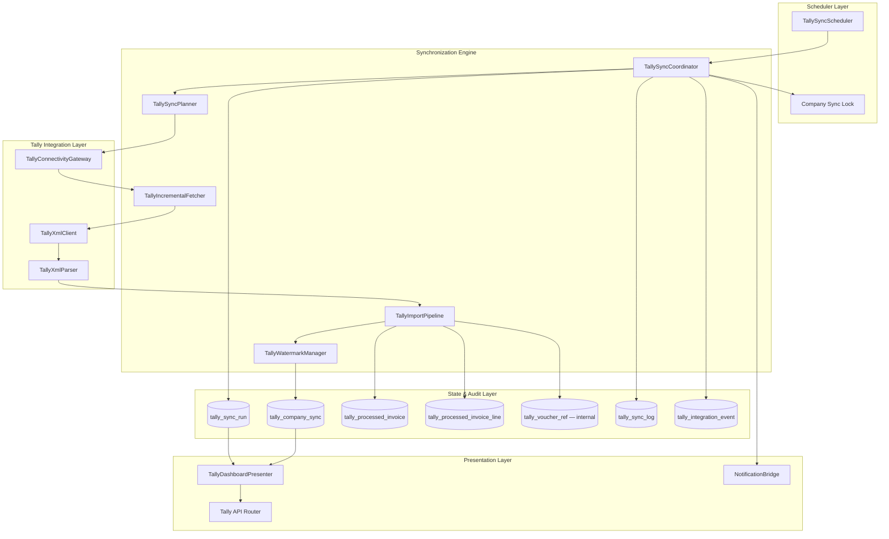
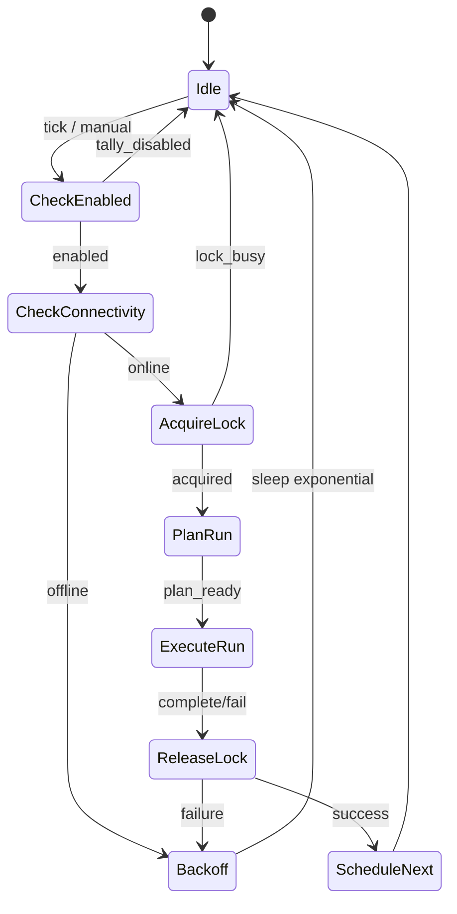
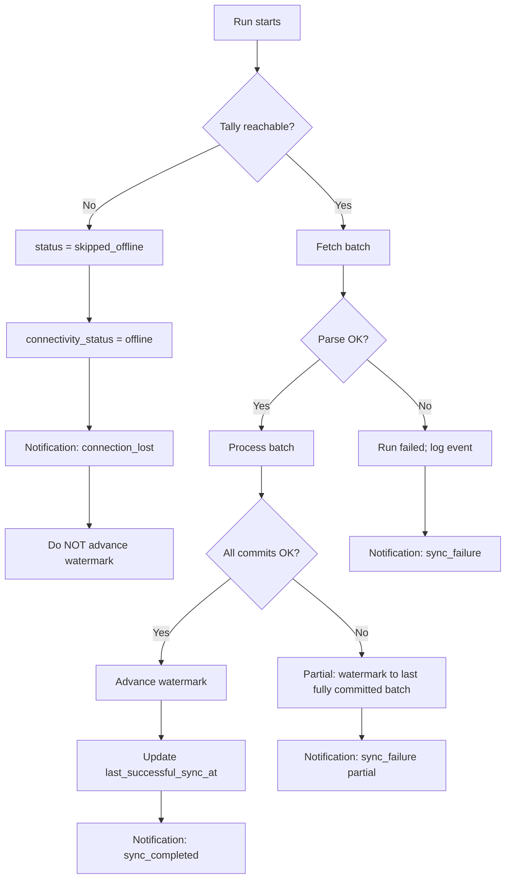

# Enterprise Tally Synchronization Architecture

**Status: PROPOSED — DO NOT IMPLEMENT UNTIL APPROVED**

This document replaces the current “fetch all XML every sync” approach with a professional ERP-style synchronization engine. It is the result of a full review of existing services, schema, XML pipeline, dashboard, notifications, settings, and scheduler.

---

## Executive Summary

### Problem with the current engine

The existing `TallySyncService` re-exports **all vouchers in a date window** on every run (`SVFROMDATE` / `SVTODATE` per monitored voucher type), then relies on database deduplication. This does not scale for large invoice history, wastes LAN bandwidth, increases Tally workstation load, and makes sync duration unpredictable.

Additional gaps:

| Gap | Impact |
|-----|--------|
| No **AlterID** watermark | Cannot do true incremental fetch |
| `last_processed_guid` skips only one GUID | Fragile cursor semantics |
| `last_processed_master_id` stored but unused | Dead metadata |
| Monolithic in-process sync | Diverges from ADR-0011 worker model |
| No `tally_sync_run` header table | Run metrics scattered across log rows |
| GUID exposed in Sales UI | Violates ERP UX expectations |
| `idempotency_key` not enforced at DB | Duplicate sales possible under race |
| `tally_alerts_enabled` not wired | Settings ignored |

### Target outcome

A **Synchronization Engine** that behaves like a professional ERP connector:

- **Incremental** by default (AlterID watermark)
- **Resumable** after network failure or Tally offline
- **Idempotent** at invoice and line level
- **Horizontally safe** for large history (chunked bootstrap + steady-state delta)
- **Network-aware** (dynamic hostname resolution, no stale IP cache)
- **User-facing metrics only** — internal identifiers never shown in UI

---

## Current State Assessment (As-Is)

### Services reviewed

| Component | Path | Current role |
|-----------|------|--------------|
| Sync orchestrator | `services/tally_sync_service.py` | Fetch → parse → process; global `asyncio.Lock` |
| Connectivity | `services/tally_connectivity_service.py` | Staged probe; persists health |
| XML client | `integrations/tally/xml_client.py` | Date-range export per voucher type |
| XML parser | `integrations/tally/xml_parser.py` | Extracts GUID, MASTERID (not ALTERID) |
| Dashboard | `services/tally_dashboard_service.py` | Aggregates status + stats |
| Scheduler | `app.py` → `_tally_scheduler_loop` | Opt-in; min 300s interval |
| Settings | `settings_registry.py`, `settings_service.py` | Host, port, interval, enable flag |
| Notifications | `notification_service.py` | Tally events; alerts flag unused |
| API | `api/routers/tally.py` | Dashboard, trigger, health, test |

### Database reviewed

| Table | Purpose today |
|-------|---------------|
| `tally_company_sync` | Per-company cursor (`last_processed_guid`, date watermark) |
| `tally_processed_invoice` | Invoice idempotency (GUID unique per company) |
| `tally_processed_invoice_line` | Line-level retry state |
| `tally_sync_log` | Per-voucher attempt rows grouped by `sync_run_id` |
| `sales` | Tally traceability columns (GUID, MasterID stored) |
| `notifications` | Operator alerts |

**Missing vs ADR/docs:** `tally_integration_event`, `tally_sync_run` header, AlterID columns, recommended partial indexes.

### Import pipeline (unchanged business rules)

Matching rules remain governed by **frozen** `sync-strategy.md`:

1. Serial number is authoritative for marking sold
2. Product model verification is informational (mismatch notification after sale)
3. Duplicate sale → notification, no mutation
4. Missing serial / model → notifications per rules
5. Non-inventory lines → silent ignore

The new engine **changes how vouchers are fetched and cursor-advanced**, not these business rules.

### UI reviewed

| Surface | Exposed today | Must change |
|---------|---------------|-------------|
| Tally dashboard / readiness | Connection, last sync, counts | ✅ Keep; enrich user metrics |
| Settings | Host, port, interval | ✅ Keep |
| Sales detail | **GUID visible** | ❌ Remove from UI |
| Notifications | Sync run UUID | ⚠️ Replace with human labels |
| Dashboard API types | `last_processed_guid` in types | ❌ Never send to clients |

---

## 1. Complete Synchronization Architecture

### 1.1 Layered design



### 1.2 Component responsibilities

| Component | Responsibility |
|-----------|----------------|
| **TallySyncScheduler** | Wakes on interval + manual trigger; respects `tally_enabled`; per-company scheduling |
| **TallySyncCoordinator** | One run lifecycle: plan → fetch batches → import → commit watermarks → finalize run |
| **TallySyncPlanner** | Chooses mode: `bootstrap`, `incremental`, `catch_up`, `reconciliation` |
| **TallyIncrementalFetcher** | Builds AlterID-filtered XML requests; paginates large responses |
| **TallyImportPipeline** | Existing line matching logic; invoice/line state machine |
| **TallyWatermarkManager** | Advances cursors **only after** successful batch commit |
| **TallyConnectivityGateway** | Wraps `TallyConnectivityService`; short-circuit when offline |
| **TallyDashboardPresenter** | Maps internal state → **user-safe DTO** (no GUID/MasterID/AlterID) |
| **NotificationBridge** | Honors `tally_alerts_enabled`; human-readable messages |

### 1.3 Sync modes

| Mode | When | Fetch strategy |
|------|------|----------------|
| **Bootstrap** | First sync or `alter_id_watermark` null | Date chunks (e.g. 30-day windows) oldest→newest; record max AlterID per chunk |
| **Incremental** | Normal operation | Vouchers with `ALTERID > watermark` for monitored types |
| **Catch-up** | After offline &gt; N hours | Incremental + optional narrow date filter as safety net |
| **Reconciliation** | Scheduled weekly (configurable) | Small rolling date window (e.g. 7 days) to heal missed deltas |

### 1.4 Incremental fetch (replaces fetch-all)

**Primary watermark: `alter_id_watermark`** (integer, per company, per Tally company books).

Tally XML export request adds filter variables (implementation detail — TDL/collection filter):

```xml
<!-- Conceptual — exact TDL finalized during implementation -->
<STATICVARIABLES>
  <SVEXPORTFORMAT>$$SysName:XML</SVEXPORTFORMAT>
  <SVFROMDATE>...</SVFROMDATE>   <!-- safety bound only in catch-up/reconciliation -->
  <SVTODATE>...</SVTODATE>
  <SVVOUCHERTYPE>Sales</SVVOUCHERTYPE>
  <SVAlterIDFilter>{watermark + 1}</SVAlterIDFilter>
</STATICVARIABLES>
```

Parser **must** extract and persist:

- `GUID` → internal only
- `MASTERID` → internal only  
- `ALTERID` → watermark input

**Date window** becomes a **safety bound**, not the primary cursor:

- Incremental: optional `from_date = last_successful_sync_at - 1 day` (clock skew guard)
- Not: re-export entire history daily

### 1.5 Batch processing

Each sync run processes vouchers in **batches** (default 100 vouchers):

1. Fetch batch from Tally
2. Sort by `(alter_id, voucher_date)` monotonic
3. Process each voucher through import pipeline
4. Commit transaction
5. Advance `alter_id_watermark` to **max AlterID successfully committed** in batch
6. Repeat until empty response or `max_batches_per_run` (default 50)

This caps run duration and prevents blocking the API for hours during bootstrap.

### 1.6 Multi-company

Each active row in `tally_company_sync` syncs **independently**:

- Independent watermarks
- Independent connectivity state
- Failure in company A does not block company B
- Scheduler iterates companies sequentially (V1); parallel per company deferred to worker split (V2)

### 1.7 ADR alignment path

| ADR-0011 intent | Phase 1 (this design) | Phase 2 (future) |
|-----------------|----------------------|------------------|
| Separate Tally worker | In-process engine with clean boundaries | Extract fetcher/importer to Windows Service |
| Worker calls REST APIs | Direct DB (current) | Refactor importer to `POST .../process-line` |
| defusedxml | Adopt in parser | — |

Phase 1 keeps in-process deployment but **modularizes** so extraction is mechanical.

---

## 2. Database Changes Required

### 2.1 Extend `tally_company_sync`

| Column | Type | Purpose |
|--------|------|---------|
| `alter_id_watermark` | BIGINT | Primary incremental cursor |
| `bootstrap_completed_at` | TIMESTAMPTZ | Bootstrap finished |
| `bootstrap_from_date` | DATE | Historical range start |
| `sync_phase` | VARCHAR(32) | `idle`, `running`, `bootstrap`, `incremental`, `failed` |
| `consecutive_failures` | INT DEFAULT 0 | Backoff input |
| `last_error_at` | TIMESTAMPTZ | User-facing error timestamp |
| `last_sync_duration_ms` | INT | Last run duration |
| `last_invoices_imported_count` | INT | Last run success count |
| `last_invoice_display_number` | VARCHAR(128) | **User-visible** “last invoice imported” (printed invoice #) |
| `next_scheduled_sync_at` | TIMESTAMPTZ | Computed and stored for dashboard |
| `reconciliation_due_at` | TIMESTAMPTZ | Weekly reconciliation schedule |

**Deprecate (keep for migration, stop writing):**

- `last_processed_guid` as cursor — migrate to `alter_id_watermark`
- `last_processed_master_id` — move to internal ref table

**Rename (doc alignment):**

- `is_active` → document as `is_enabled` (or add view alias)

### 2.2 New table: `tally_sync_run`

Header record per synchronization attempt (replaces scattered `sync_run_id` only in logs).

| Column | Type | Purpose |
|--------|------|---------|
| `id` | UUID PK | `sync_run_id` |
| `tally_company_sync_id` | BIGINT FK | Company |
| `trigger_source` | VARCHAR(32) | `scheduler`, `manual`, `retry`, `reconciliation` |
| `sync_mode` | VARCHAR(32) | `bootstrap`, `incremental`, `catch_up`, `reconciliation` |
| `started_at` | TIMESTAMPTZ | |
| `completed_at` | TIMESTAMPTZ | |
| `duration_ms` | INT | |
| `status` | VARCHAR(32) | `running`, `success`, `partial_success`, `failed`, `cancelled`, `skipped_offline` |
| `vouchers_fetched` | INT | |
| `vouchers_imported` | INT | |
| `vouchers_skipped` | INT | |
| `lines_applied` | INT | |
| `error_summary` | TEXT | User-safe message |
| `correlation_id` | VARCHAR(64) | Internal tracing |

### 2.3 New table: `tally_voucher_ref` (internal — never exposed via API)

Stores hidden identifiers for idempotency and audit.

| Column | Type | Purpose |
|--------|------|---------|
| `id` | BIGINT PK | |
| `tally_company_sync_id` | BIGINT FK | |
| `tally_voucher_guid` | VARCHAR(64) NOT NULL | Internal |
| `tally_master_id` | VARCHAR(64) | Internal |
| `tally_alter_id` | BIGINT NOT NULL | Watermark source |
| `printed_invoice_number` | VARCHAR(128) | Bridges to user display |
| `tally_voucher_number` | VARCHAR(128) | Internal voucher name |
| `voucher_type` | VARCHAR(64) | |
| `voucher_date` | DATE | |
| `first_seen_at` | TIMESTAMPTZ | |
| `last_seen_at` | TIMESTAMPTZ | |

**Constraints:**

- `UNIQUE (tally_company_sync_id, tally_voucher_guid)`
- `UNIQUE (tally_company_sync_id, tally_alter_id)` — prevents duplicate watermark entries
- Index `(tally_company_sync_id, tally_alter_id DESC)`

### 2.4 New table: `tally_integration_event`

Per ADR-0011 and API spec — append-only event stream for diagnostics (admin-only API, no raw GUID in list default).

| Column | Type |
|--------|------|
| `id` | BIGINT PK |
| `sync_run_id` | UUID FK → `tally_sync_run` |
| `event_type` | VARCHAR(64) |
| `severity` | VARCHAR(16) |
| `message` | TEXT (user-safe) |
| `internal_ref_id` | BIGINT FK → `tally_voucher_ref` NULL |
| `created_at` | TIMESTAMPTZ |

### 2.5 Schema hardening (existing tables)

| Change | Table | Reason |
|--------|-------|--------|
| `UNIQUE (idempotency_key)` partial WHERE NOT NULL | `sales` | Race-safe duplicate prevention |
| Index `(tally_processed_invoice_id, line_status)` | `tally_processed_invoice_line` | Partial retry queries |
| Index `(tally_processed_invoice_id, sync_started_at DESC)` | `tally_sync_log` | Run history |
| Add `tally_alter_id` | `tally_processed_invoice`, `tally_sync_log` | Internal traceability |
| FK `tally_sync_log.sync_run_id` → `tally_sync_run.id` | `tally_sync_log` | Referential integrity |

### 2.6 Migration strategy (data)

1. Backfill `tally_voucher_ref` from existing `tally_processed_invoice` + `sales`
2. Set `alter_id_watermark = MAX(tally_alter_id)` where known; else trigger bootstrap
3. Preserve `tally_processed_invoice` rows — no re-import required
4. One-time reconciliation run after migration

---

## 3. Hidden Metadata Required

### 3.1 Internal-only identifiers

| Identifier | Source | Stored in | Used for | **Never in UI/API dashboard DTO** |
|------------|--------|-----------|----------|-----------------------------------|
| **GUID** | Tally XML | `tally_voucher_ref`, `tally_processed_invoice` | Idempotency, audit join | ✅ |
| **MasterID** | Tally XML | `tally_voucher_ref` | Secondary dedup, Tally edits | ✅ |
| **AlterID** | Tally XML | `tally_voucher_ref`, watermark | Incremental fetch | ✅ |
| Sync run UUID | Engine | `tally_sync_run`, events | Tracing | ✅ (admin diagnostic API only) |
| Correlation ID | Engine | logs, events | Support | ✅ |

### 3.2 User-visible fields (only these in dashboard/status DTO)

| Field | Source |
|-------|--------|
| **Last successful sync time** | `tally_company_sync.last_successful_sync_at` |
| **Last invoice imported** | `last_invoice_display_number` (printed invoice / customer reference) |
| **Number of invoices imported** | Last run `vouchers_imported` or rolling counter |
| **Sync duration** | `last_sync_duration_ms` → formatted |
| **Next scheduled sync** | `next_scheduled_sync_at` |
| **Current sync status** | Derived: `online/offline/syncing/error/idle/bootstrap` |

Optional (still user-safe):

- Connection health label
- Pending notification count
- Last error message (sanitized, no stack traces)

### 3.3 API DTO contract (`TallyDashboardPublic`)

```typescript
// Conceptual — implementation generates from presenter
interface TallyDashboardPublic {
  connectionStatus: 'connected' | 'offline' | 'error' | 'unknown';
  syncStatus: 'idle' | 'syncing' | 'bootstrap' | 'error';
  companies: Array<{
    displayName: string;           // "WEBSTUDIO", "ASUS Exclusive Store"
    lastSuccessfulSyncAt: string | null;
    lastInvoiceImported: string | null;  // printed invoice number
    invoicesImportedLastRun: number;
    syncDurationMs: number | null;
    nextScheduledSyncAt: string | null;
    pendingIssues: number;
  }>;
  aggregate: {
    lastSuccessfulSyncAt: string | null;
    nextScheduledSyncAt: string | null;
    pendingIssues: number;
  };
}
```

**Explicitly excluded:** `guid`, `masterId`, `alterId`, `last_processed_*`, `sync_run_id` in default responses.

### 3.4 UI remediation (design requirement)

| Location | Change |
|----------|--------|
| `SalesDetailDrawer` | Remove GUID row; show “Tally invoice” (printed number) only |
| Notifications | Replace “Sync run ID” with “Sync started at {time}” |
| TypeScript types | Split `TallyDashboardInternal` vs `TallyDashboardPublic` |

---

## 4. Scheduler Workflow



### 4.1 Scheduler rules

| Rule | Value |
|------|-------|
| Default interval | 1800s (30 min), configurable, minimum 300s |
| Enable flag | `WEBSTUDIO_TALLY_SCHEDULER=1` + `tally_enabled` |
| Multi-company | Loop `tally_company_sync WHERE is_active` |
| Overlap | Skip if `sync_phase = running` or lock held |
| Manual trigger | Same engine path; `trigger_source = manual` |
| Next sync display | `last_successful_sync_at + interval` stored on completion |

### 4.2 Backoff on failure

| Consecutive failures | Sleep before retry |
|---------------------|-------------------|
| 1 | interval (normal) |
| 2 | min(interval, 600s) |
| 3+ | min(interval × 2, 3600s) |

Reset `consecutive_failures` on successful run.

---

## 5. Retry Workflow

### 5.1 Retry scopes

| Scope | Trigger | Behaviour |
|-------|---------|-----------|
| **Run retry** | User “Retry sync” / failed run | New `tally_sync_run`; incremental from current watermark |
| **Invoice retry** | `processing_status = failed` | Re-fetch single voucher by GUID (internal lookup); reprocess lines |
| **Line retry** | `line_status = failed` | Re-execute matching for that line only |
| **Partial success** | Some lines failed | Do not advance watermark past failed voucher; retry failed lines next run |

### 5.2 Retry vs trigger today

Current `POST /sync/retry` aliases trigger — **replace** with:

- `POST /sync/retry` → retry failed invoices/lines from last run
- `POST /sync/trigger` → force incremental run now
- `POST /sync/reconcile` → admin-only reconciliation mode

### 5.3 Idempotency during retry

Order of checks (unchanged logic, formalized):

1. `tally_voucher_ref` exists + invoice `success` → skip voucher
2. Line `completed` → skip line
3. Inventory `SOLD` → duplicate notification
4. Else → apply sale

---

## 6. Failure Recovery Workflow



### 6.1 Failure categories

| Category | Watermark | User status | Recovery |
|----------|-----------|-------------|----------|
| Tally offline | Unchanged | “Tally offline” | Auto retry on interval |
| Network blip mid-fetch | Unchanged | “Sync interrupted” | Retry run |
| Parse error (malformed XML) | Unchanged | “Sync error — contact support” | Manual retry; event logged |
| Line processing error | Partial | “Partial sync” | Line retry |
| IMS DB error | Unchanged | “System error” | Alert ops; no cursor advance |

### 6.2 Connection restored

When connectivity transitions offline → online:

- Emit `connection_restored` notification (existing)
- Next scheduler tick runs **catch-up** mode (incremental + 1-day date safety)

---

## 7. Duplicate Prevention Workflow

### 7.1 Layers (defense in depth)

| Layer | Mechanism |
|-------|-----------|
| **L1 — AlterID uniqueness** | `UNIQUE (company, alter_id)` in `tally_voucher_ref` |
| **L2 — GUID uniqueness** | `UNIQUE (company, guid)` in `tally_processed_invoice` |
| **L3 — MasterID lookup** | Secondary match in `get_or_create_pending` |
| **L4 — Voucher number** | Tertiary match for legacy duplicates |
| **L5 — Line index** | `UNIQUE (invoice_id, line_index)` |
| **L6 — Inventory state** | Only `AVAILABLE` eligible; `SOLD` → duplicate notification |
| **L7 — Sale idempotency** | `UNIQUE (idempotency_key)` on `sales` |
| **L8 — Inventory unique sale** | `UNIQUE (inventory_item_id)` on `sales` |

### 7.2 Race conditions

All sale creation for a line occurs inside a **single DB transaction** with:

```sql
SELECT ... FROM inventory_items WHERE serial = ? FOR UPDATE;
```

Prevents double-sell under concurrent runs (future worker split).

### 7.3 Re-import of same invoice

Tally may re-export unchanged vouchers during reconciliation:

- Invoice already `success` → `SKIPPED` (increment counter, no work)
- AlterID unchanged → fetch filter excludes it

---

## 8. Performance Considerations

### 8.1 Steady-state targets

| Metric | Target |
|--------|--------|
| Incremental run (0 new vouchers) | &lt; 5s |
| Incremental run (10 vouchers) | &lt; 30s |
| Bootstrap backfill | Background; batch capped |
| Tally XML response size | Paginate; max 100 vouchers/request |
| DB writes per voucher | 1 invoice + N lines + 1 ref row (batched commit) |

### 8.2 Large invoice history

| Strategy | Detail |
|----------|--------|
| Bootstrap | Monthly date chunks; progress bar via `bootstrap_completed_at` |
| Steady state | AlterID delta only |
| Indexing | `(company, alter_id DESC)`, invoice status indexes |
| Log retention | Archive `tally_sync_log` &gt; 90 days to cold storage (future) |
| Aggregation | Dashboard stats from `tally_sync_run` headers, not full log scan |

### 8.3 Tally workstation load

- Incremental requests are small vs full daybook export
- Rate limit: max 1 concurrent connection per company
- Timeout: 60s fetch, 120s bootstrap batch

### 8.4 Backend load

- Module-level lock → one run per process (V1)
- `max_batches_per_run` prevents hour-long transactions
- Async HTTP to Tally; sync DB session per batch

---

## 9. Network Interruption Handling

Builds on Milestone 12 connectivity hardening (`TallyConnectivityService`).

| Scenario | Handling |
|----------|----------|
| **Laptop on WiFi → different AP,same subnet** | Hostname resolution each run; no permanent IP cache |
| **Laptop gets new DHCP IP** | `.local` or DNS hostname in settings; resolved at runtime |
| **Tally service stopped** | TCP/XML probe fails → offline; no fetch |
| **Mid-batch HTTP timeout** | Batch abort; watermark unchanged; retry |
| **Backend restart mid-run** | `sync_phase` reset to `idle` on startup; stale run marked `cancelled` |
| **Server cannot reach Tally VLAN** | Same as offline; dashboard shows connectivity error |

### 9.1 Settings interaction

| Setting | Role |
|---------|------|
| `tally_host` | Hostname preferred over IP |
| `last_resolved_ip` | Diagnostic only; **never** used for XML client without re-resolve |
| `connectivity_status` | Drives scheduler skip |

---

## 10. Future Compatibility

### 10.1 Phase 2 — Worker extraction

- Move `TallyIncrementalFetcher` to Windows Service (`apps/server` worker)
- Importer calls `POST /api/v1/integrations/tally/invoices/process` and `.../lines/process`
- Service account auth per ADR-0010

### 10.2 Phase 3 — Scale

| Feature | Approach |
|---------|----------|
| Multiple Tally workstations | Company → host mapping table |
| Parallel company sync | Worker pool with per-company locks |
| Tally Prime / Tally.ERP | XML envelope versioning in `TallyXmlClient` |
| Returns / credit notes | New voucher types + ADR amendment |
| Metrics | Prometheus counters from `tally_sync_run` |

### 10.3 Compatibility guarantees

- Watermark schema version column on `tally_company_sync`
- Feature flag `tally_sync_engine_version = 2`
- Rollback: fall back to date-window mode if AlterID filter unsupported (detected at connectivity test)

### 10.4 OpenAPI / contract

- Fill `docs/api/openapi/webstudio-ims-api-v1.yaml` § Tally with public DTOs only
- Admin diagnostic endpoint (optional): `GET /sync/runs/{id}/events` — requires `tally:view_diagnostics`

---

## Implementation Phases (Post-Approval)

| Phase | Scope | Risk |
|-------|-------|------|
| **P0** | Migration + `tally_voucher_ref` + watermark columns | Low |
| **P1** | Parser AlterID + incremental fetcher | Medium — validate against live Tally |
| **P2** | Engine refactor (coordinator, batches, run header) | Medium |
| **P3** | Dashboard presenter + UI GUID removal | Low |
| **P4** | Retry/reconcile endpoints + scheduler backoff | Low |
| **P5** | Bootstrap backfill tool + reconciliation job | Medium |

**Estimated touch surface:** ~15 backend files, 4 migrations, 3 desktop files, 0 mobile (unless Tally dashboard added later).

---

## Approval Checklist

Before implementation, confirm:

- [ ] AlterID-based incremental export validated against **production Tally build** in office
- [ ] Bootstrap chunk size (30-day vs 7-day) approved by ops
- [ ] User-visible “last invoice imported” uses **printed invoice number** (REFERENCE) not internal voucher
- [ ] GUID removal from Sales UI approved by product
- [ ] Frozen matching rules in `sync-strategy.md` remain unchanged
- [ ] Phase 1 in-process engine acceptable vs immediate worker split
- [ ] Reconciliation weekly schedule acceptable
- [ ] ADR-0011 amendment required? (recommended: ADR-0011-A1 for AlterID cursor)

---

## Appendix A — File Impact Map (Implementation Reference)

| Area | Files to modify/create |
|------|------------------------|
| Engine | `tally_sync_service.py` → split into `tally_sync/` package |
| Fetch | `xml_client.py`, new `incremental_fetcher.py` |
| Parse | `xml_parser.py` (+ ALTERID) |
| State | New repositories for `tally_sync_run`, `tally_voucher_ref` |
| API | `tally.py`, new response schemas |
| Dashboard | `tally_dashboard_service.py` → presenter pattern |
| Desktop | `TallyService.ts`, `SalesDetailDrawer.tsx`, types |
| Migrations | `0034_tally_sync_engine.py` (proposed) |
| Docs | `sync-strategy.md` § incremental, `data-mapping.md` fill-in |
| Tests | `tests/tally/test_incremental_sync.py`, watermark tests |

---

## Appendix B — Comparison: Current vs Proposed

| Aspect | Current | Proposed |
|--------|---------|----------|
| Fetch | Full date window every run | AlterID delta (+ reconciliation) |
| Cursor | `last_processed_guid` (broken) | `alter_id_watermark` |
| Run tracking | UUID in log rows only | `tally_sync_run` header |
| Hidden IDs | In sales UI (GUID) | Internal tables only |
| Offline Tally | Attempts fetch; fails | Skip fetch; preserve cursor |
| Large history | Re-processes all | Bootstrap once + delta |
| Retry | Retriggers full sync | Scoped invoice/line retry |
| Alerts setting | Ignored | Honored |

---

**End of document — awaiting stakeholder approval before any code changes.**
