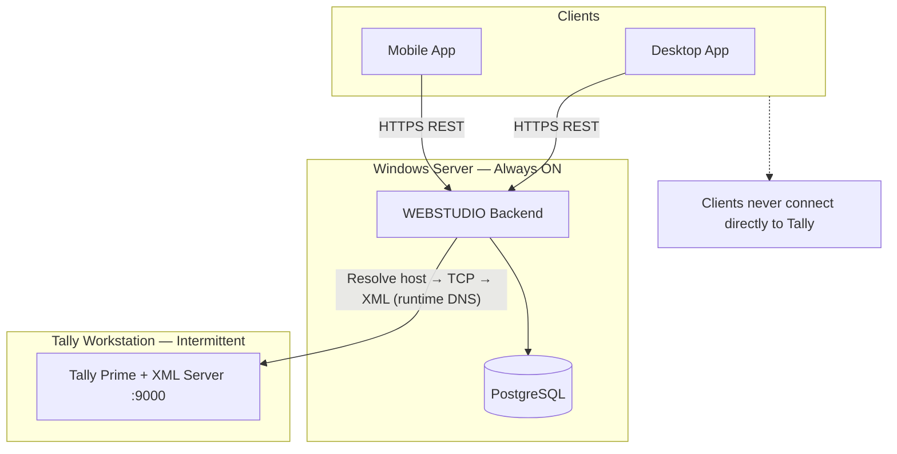
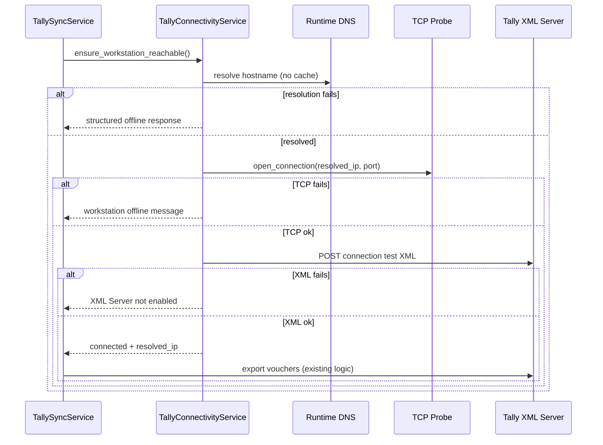

# Tally Connectivity Hardening — Milestone 12 Prerequisite

Enterprise-ready Tally workstation connectivity for deployments where the backend runs on an always-on Windows Server and Tally Prime runs on a portable laptop that may change Wi‑Fi networks and DHCP addresses.

## Summary

The existing Tally XML parser, voucher processing, duplicate detection, and sales creation logic were **not modified**. All changes extend connectivity, health reporting, settings validation, and user-facing diagnostics.

| Area | Result |
|------|--------|
| Hostname / IP / mDNS | Supported with runtime DNS resolution (no permanent IP cache) |
| Dynamic DHCP | Configure hostname (e.g. `LENOVO-TALLY.local`) — IP changes handled automatically |
| Pre-sync connectivity | Resolve → TCP → XML before every sync |
| Graceful degradation | Tally offline does not affect inventory, sales, reports, mobile, etc. |
| Business error messages | Replaces raw socket errors in API and UI |
| Automatic reconnection | Each sync/test re-resolves host; no sticky failed state |
| Connection test | Staged diagnostics with per-step success/failure |
| Health endpoint | `GET /api/v1/integrations/tally/health` |
| Logging | Structured `tally.*` events with host and resolved IP |
| Tests | 14 backend Tally tests (13 passed in isolated run; 1 fixture flake on shared DB) |

## Architecture



### Connection probe pipeline



## Backend changes

### New modules

| File | Purpose |
|------|---------|
| `integrations/tally/connectivity.py` | Host validation, DNS resolution, TCP/XML staged probes, business error mapping |
| `services/tally_connectivity_service.py` | Health payload, connection test orchestration, persistence |

### Extended modules

| File | Change |
|------|--------|
| `integrations/tally/xml_client.py` | User-facing error messages via connectivity mapper |
| `services/tally_sync_service.py` | Pre-sync connectivity check; client uses freshly resolved IP |
| `services/tally_dashboard_service.py` | Health fields in dashboard/status |
| `services/settings_service.py` | Host/port validation on save |
| `api/routers/tally.py` | Enhanced `/connection/test`, new `/health` |
| `infrastructure/database/models/tally_company_sync.py` | Connectivity health columns |
| `database/migrations/versions/0033_tally_connectivity.py` | Migration |

### API

#### `POST /api/v1/integrations/tally/connection/test`

Returns staged results:

- Host Resolution — ✓/✗
- TCP Connection — ✓/✗
- XML Server — ✓/✗

Plus: `resolved_ip`, `tally_version`, `company_name`, `port`, `message` (business text).

Backward compatible: `connected` boolean retained.

#### `GET /api/v1/integrations/tally/health`

```json
{
  "enabled": true,
  "status": "offline",
  "configured_host": "lenovo-tally.local",
  "port": "9000",
  "resolved_ip": "192.168.1.44",
  "last_successful_sync_at": "...",
  "last_successful_connection_at": "...",
  "last_failed_connection_at": "...",
  "last_failure_reason": "Tally workstation is currently offline.",
  "waiting_for_workstation": true,
  "user_message": "Waiting for the Tally workstation to become available."
}
```

### Connectivity status values

| Status | Meaning |
|--------|---------|
| `online` | Enabled and previously healthy |
| `offline` | Workstation unreachable |
| `connected` | Last probe succeeded end-to-end |
| `xml_error` | TCP ok but XML Server not responding |
| `configuration_error` | Invalid host/port in settings |
| `resolving` / `connecting` | Transient (logged during probe) |

### Structured logging events

- `tally.host.resolving`
- `tally.host.resolved`
- `tally.host.resolve_failed`
- `tally.connection.started`
- `tally.connection.successful`
- `tally.connection.timeout`
- `tally.connection.failed`
- `tally.xml.responding`
- `tally.xml.unavailable`
- `tally.sync.workstation_offline`

## Desktop changes

| File | Change |
|------|--------|
| `components/settings/TallySettingsForm.tsx` | Label **Host / IP address**, help text, **Test connection** with staged results |
| `components/tally/TallyReadinessPanel.tsx` | Shows connectivity status and resolved IP |
| `services/api/TallyService.ts` | `TallyConnectionTestResult`, `getHealth()` |

## Test report

| Suite | Command | Result |
|-------|---------|--------|
| Backend connectivity unit | `pytest tests/tally/test_tally_connectivity.py` | 7/7 pass |
| Backend Tally API | `pytest tests/tally/test_tally_api.py` | Pass (health + staged connection test) |
| Desktop helpers | `vitest run tests/tally.test.ts` | 3/3 pass |

## Deployment notes — production LAN

### Recommended configuration

1. **Set a stable hostname** on the Tally laptop (Windows: Settings → System → About → Rename PC → e.g. `LENOVO-TALLY`).
2. In WEBSTUDIO Settings → Tally, use **`LENOVO-TALLY.local`** (mDNS) or **`LENOVO-TALLY`** if your office DNS resolves short names.
3. **Do not** rely on a fixed IP unless DHCP reservations are enforced on both floor Wi‑Fi VLANs.
4. Ensure **both floor SSIDs** route to the same LAN segment (or server VLAN) so the Windows Server can reach the laptop on either network.
5. On Tally Prime: enable **Tally XML Server** on port **9000** (default).
6. Windows Firewall on the Tally laptop: allow inbound TCP **9000** from the server IP/subnet.

### When the Tally laptop is off

- Inventory, sales, reports, users, settings, AI, backups, mobile, and desktop continue normally.
- Tally sync returns a structured message: *"Tally workstation is currently offline."*
- The next scheduled or manual sync automatically re-resolves the hostname and reconnects — **no WEBSTUDIO restart required**.

### Wi‑Fi roaming scenario

| Event | WEBSTUDIO behavior |
|-------|-------------------|
| Laptop moves Ground → 1st floor | Hostname unchanged; DHCP may assign new IP |
| Next sync | DNS re-resolved at runtime → connects to new IP |
| Laptop powered off | Sync fails gracefully; IMS fully operational |

### Firewall checklist

- [ ] Server → Tally laptop TCP 9000 allowed
- [ ] Server DNS can resolve `.local` (mDNS) or internal DNS A record
- [ ] No client (desktop/mobile) needs direct access to Tally

## Files changed

**Backend:** `connectivity.py`, `tally_connectivity_service.py`, `xml_client.py`, `tally_sync_service.py`, `tally_dashboard_service.py`, `settings_service.py`, `tally.py`, `settings.py`, `tally_company_sync.py`, `tally_company_sync_repository.py`, `0033_tally_connectivity.py`

**Desktop:** `TallySettingsForm.tsx`, `TallyReadinessPanel.tsx`, `TallyService.ts`

**Tests:** `test_tally_connectivity.py`, `test_tally_api.py`

**Docs:** this report, `docs/integrations/tally-erp9/troubleshooting.md` (updated)

## Remaining considerations

- **Authentication to Tally XML** — reserved for future (`authentication_error` status scaffolded in health model).
- **Internal DNS** — if mDNS is unreliable across VLANs, register an explicit DNS A record pointing to the laptop hostname.
- **Migration** — run `alembic upgrade head` before deploying backend (revision `0033_tally_connectivity`).
