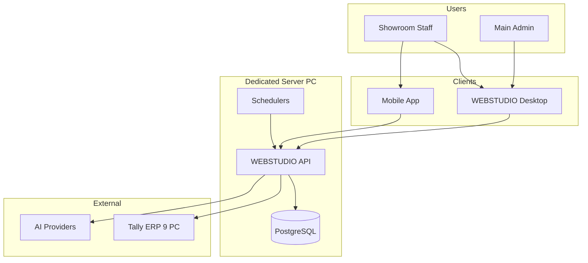
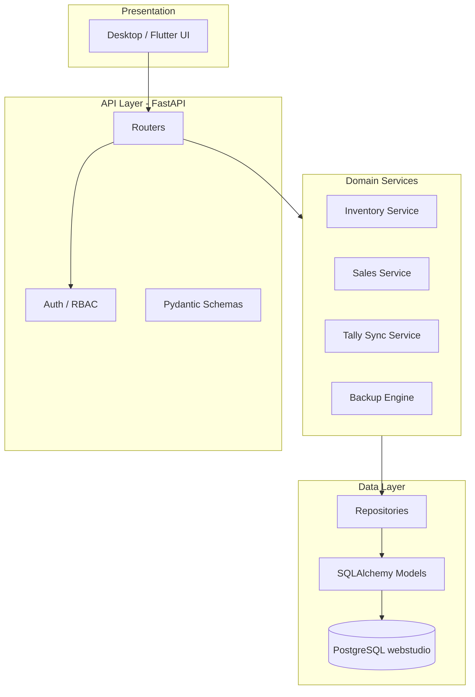
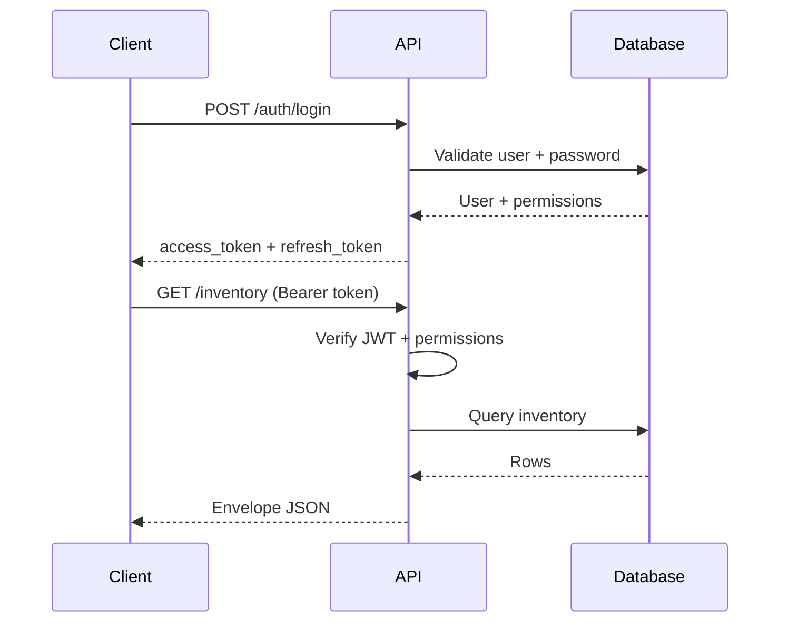
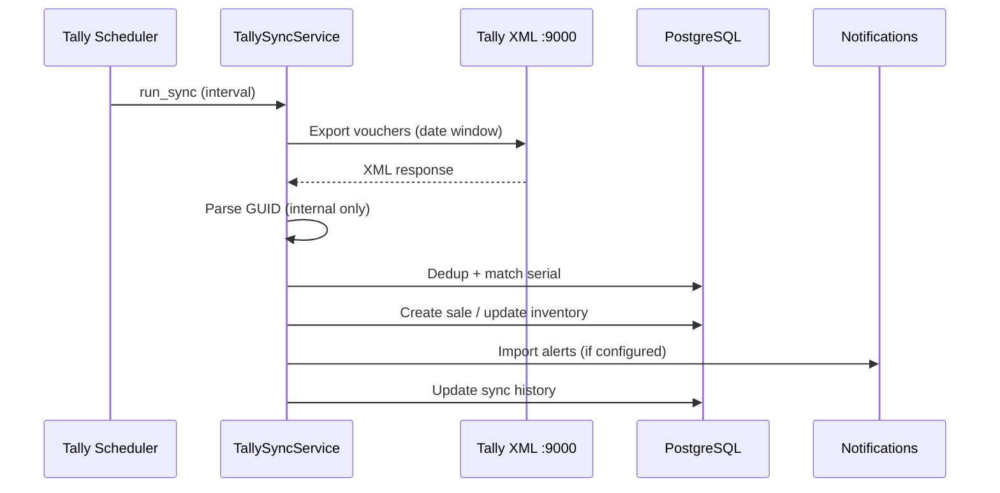
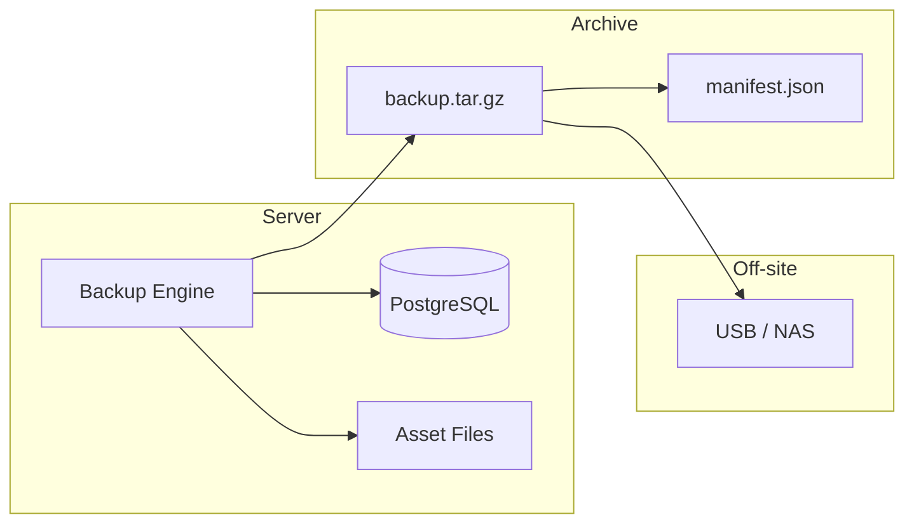
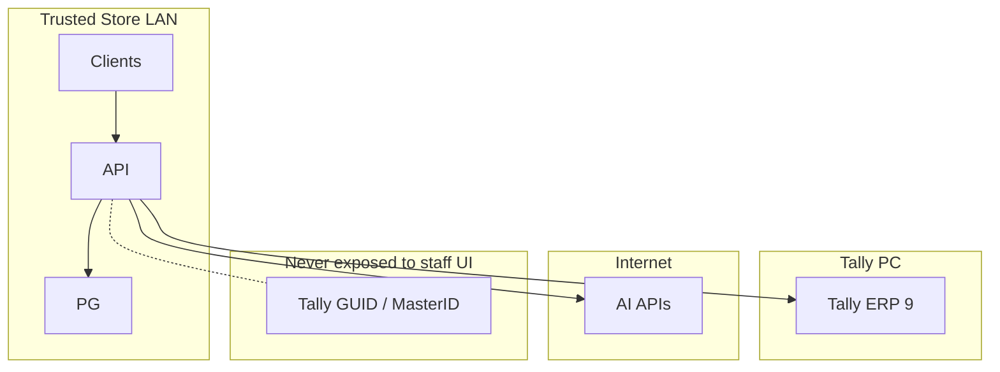

# Architecture Diagrams

High-level system architecture for WEBSTUDIO IMS production. Detail: [ARCH-001](../../SYSTEM_ARCHITECTURE.md).

---

## 1. System context

---

## 2. Layered architecture

---

## 3. Authentication flow

---

## 4. Tally sync data flow

---

## 5. Backup architecture

---

## 6. Component responsibilities

| Component | Responsibility |
|-----------|----------------|
| FastAPI | HTTP API, validation, auth |
| PostgreSQL | Single source of truth |
| Electron / Flutter | UX, local cache, discovery |
| TallySyncService | Import vouchers, idempotency |
| BackupEngine | Enterprise archives |
| Schedulers | Timers with persistent state |
| mDNS | Optional LAN discovery |

---

## 7. Security boundaries

