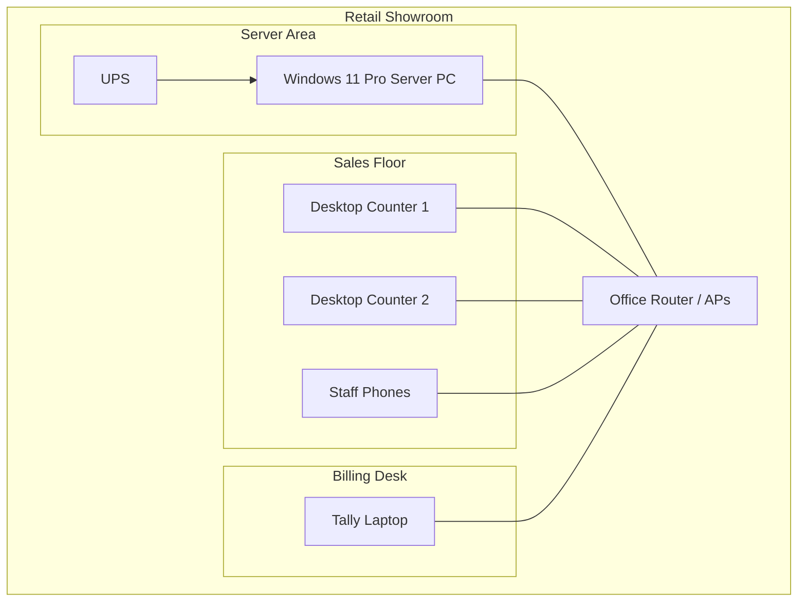
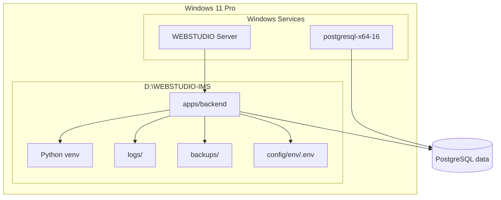
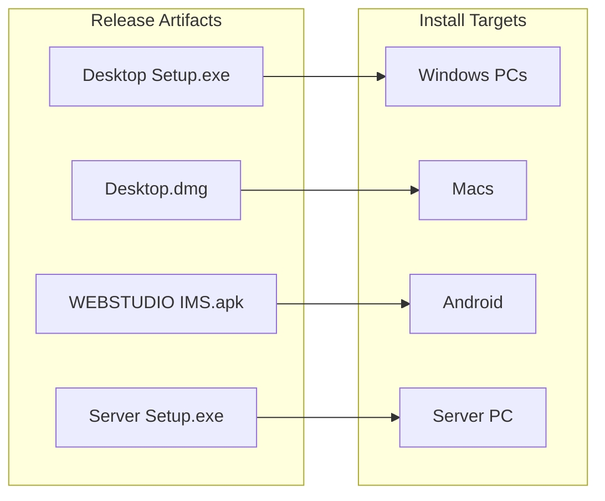
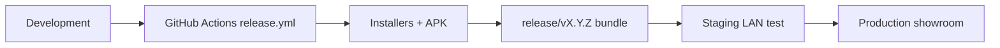
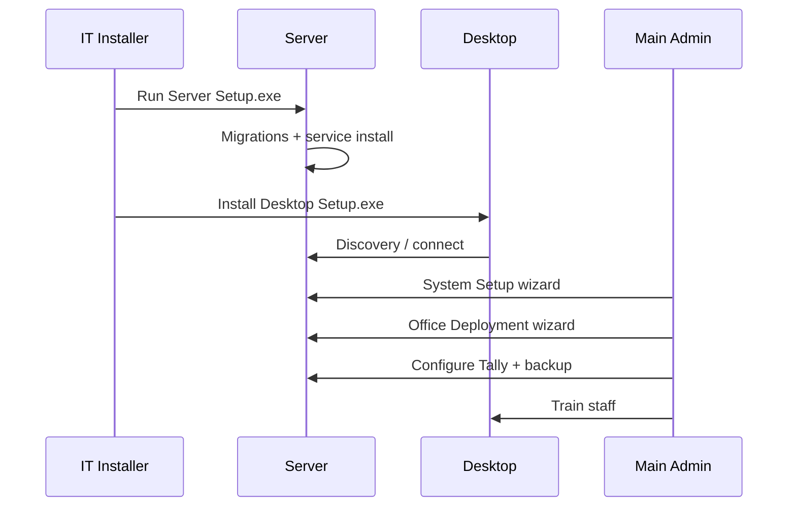
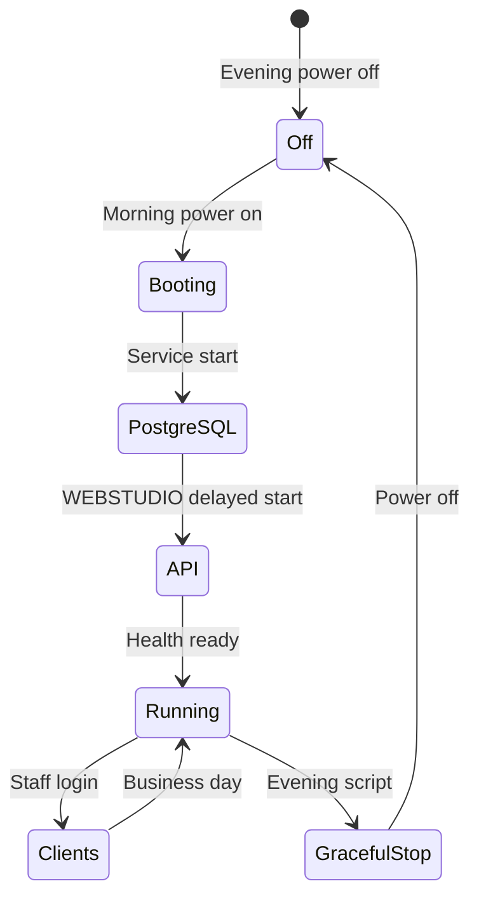

# Deployment Diagrams

Physical and logical deployment views for production showrooms.

---

## 1. Physical deployment

---

## 2. Software deployment on server

---

## 3. Client deployment

---

## 4. Release deployment pipeline

---

## 5. First-time deployment sequence

---

## 6. Business hours power cycle

---

## 7. Environment deployment matrix

| Environment | Server | Clients | Tally | Backups |
|-------------|--------|---------|-------|---------|
| Development | localhost | dev build | optional mock | local folder |
| Testing | CI runner | automated tests | mocked | ephemeral |
| Staging | pilot LAN PC | pilot users | real Tally | daily |
| Production | dedicated PC | all staff | billing PC | scheduled + off-site |

Profiles: `config/env/.env.{development,testing,staging,production}`

---

## 8. Related

- [Deployment Guide](../DEPLOYMENT_GUIDE.md)
- [Installation Guide](../INSTALLATION_GUIDE.md)
- [M12G Release Engineering](../../m12g/RELEASE_ENGINEERING_REPORT.md)
