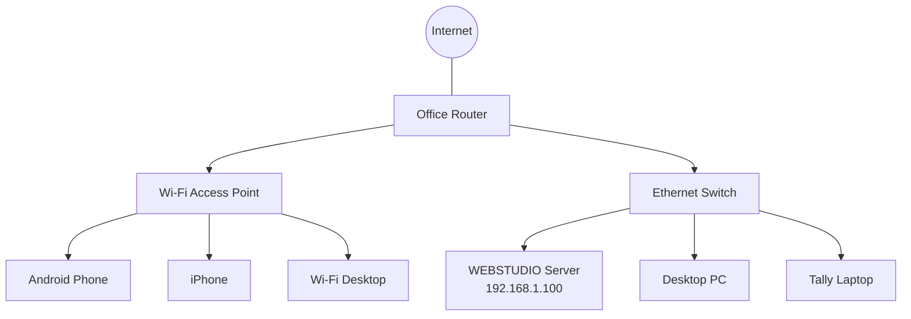
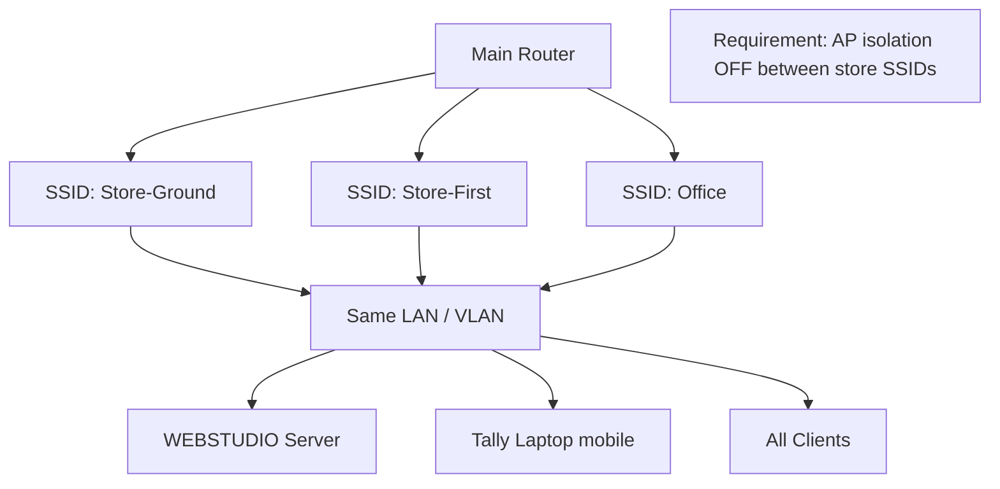
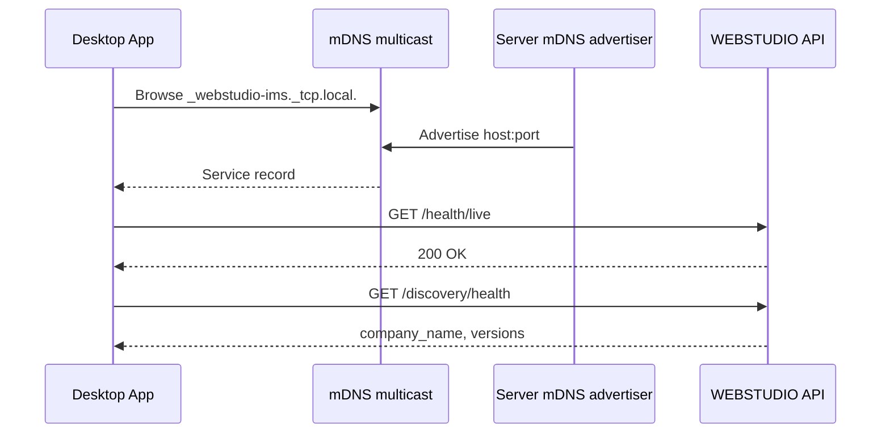
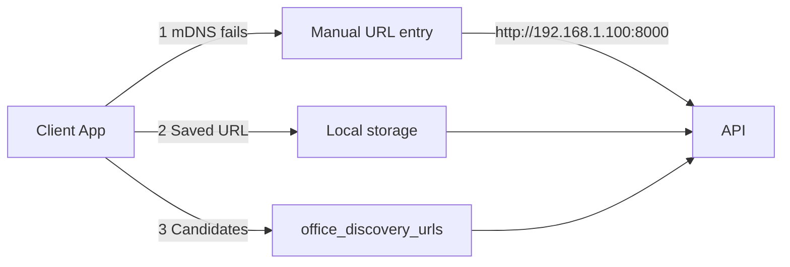
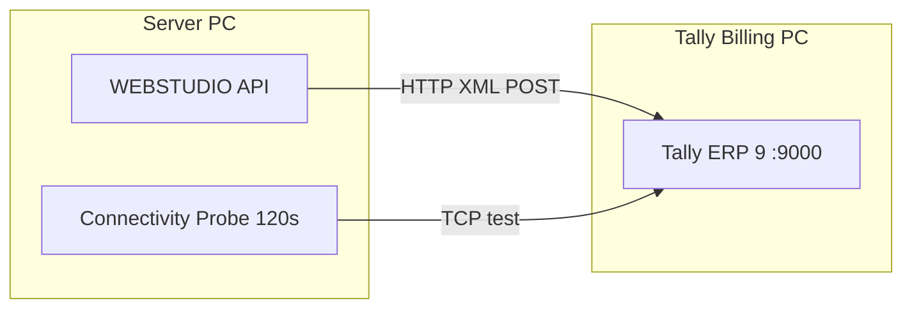
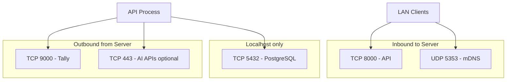
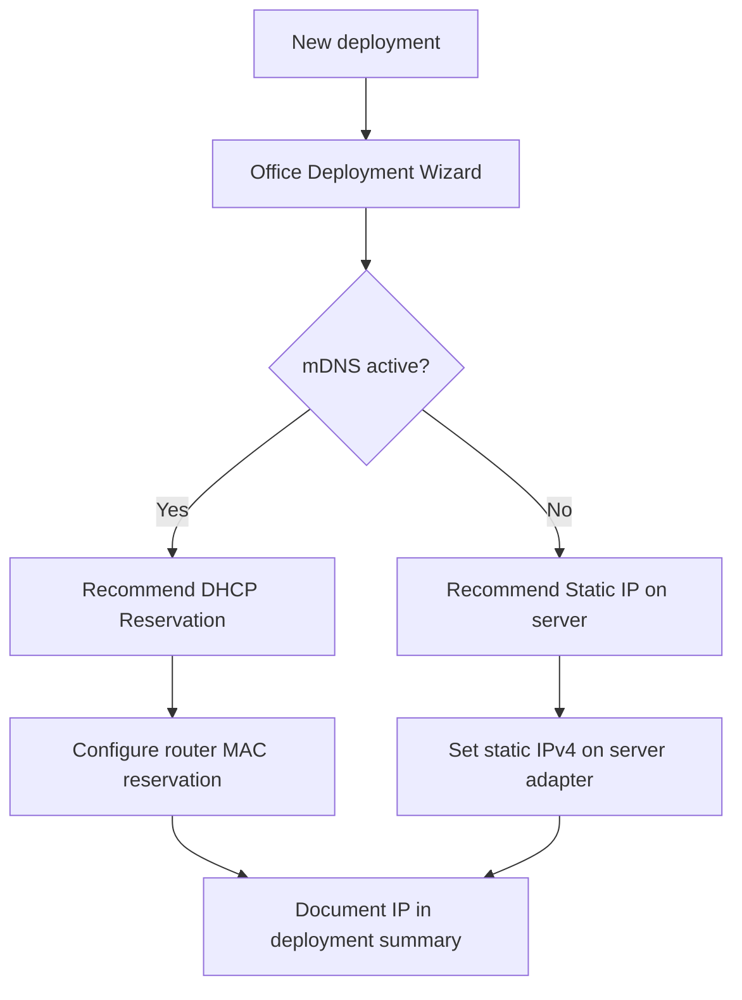
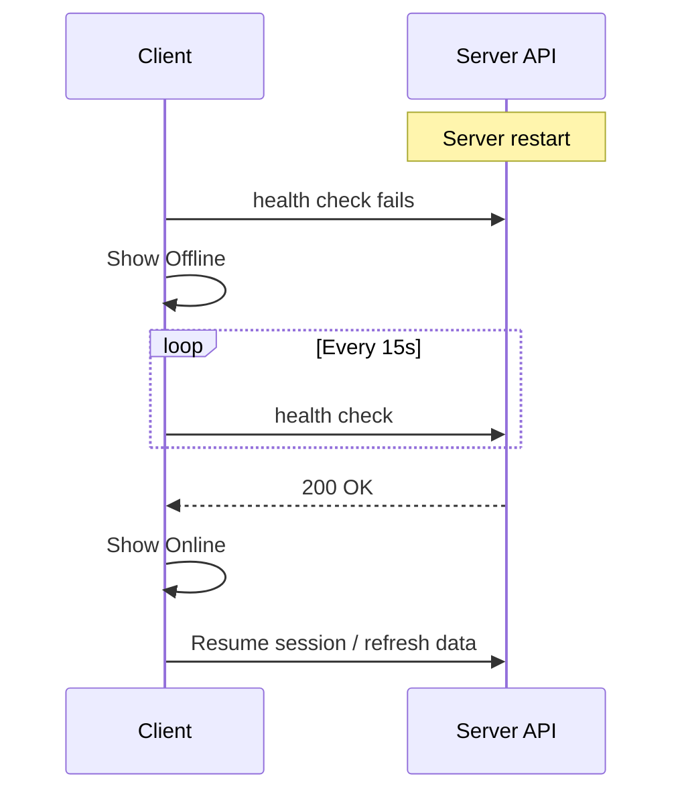

# Networking Diagrams

LAN topology, discovery, and Tally connectivity for production showrooms.

---

## 1. Single-floor topology

---

## 2. Multi-floor / multi-SSID

---

## 3. mDNS discovery flow

---

## 4. Manual URL fallback

---

## 5. Tally network path

**Firewall:** Server outbound to Tally:9000; Tally inbound from server IP.

---

## 6. Port and firewall map

---

## 7. IP addressing strategy

---

## 8. Client reconnect after outage

---

## 9. Related

- [Networking Guide](../NETWORKING_GUIDE.md)
- [M12D Network Report](../../m12d/NETWORK_REPORT.md)
- [docs/network/NETWORK_DISCOVERY_ARCHITECTURE.md](../../network/NETWORK_DISCOVERY_ARCHITECTURE.md)
