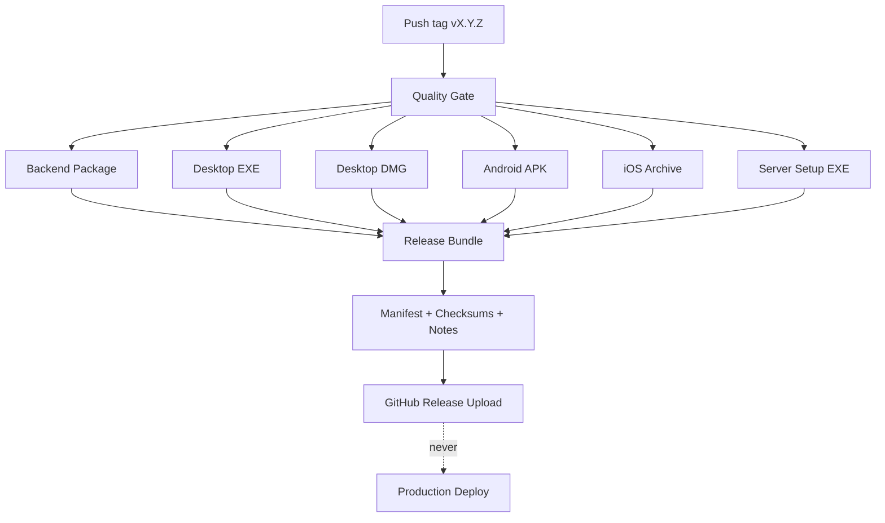

# CI/CD Pipeline Report — Milestone 13G (Enterprise GitHub Actions)

**Completion date:** 2026-07-02  
**Workflow:** `.github/workflows/release.yml` (`Enterprise Release`)  
**Overall verdict:** **COMPLETE** — Tag-triggered quality gate, multi-platform builds, manifest generation, GitHub Release upload. **No auto-deploy.**

---

## Executive summary

Milestone 13G delivers **Enterprise GitHub Actions** for release tags (`v*.*.*`). Every tagged release runs a full quality gate (backend, desktop, Flutter tests; lint; typecheck), builds all platform artifacts, generates SHA256 checksums, release manifest, release notes, and compatibility matrix, then uploads everything to a **GitHub Release**.

**WEBSTUDIO Server never auto-deploys** from CI. The server polls GitHub (M13B) and requires administrator approval (M13C) before deployment.

---

## Pipeline architecture



---

## Requirements traceability

| Requirement | Status | Implementation |
|-------------|--------|----------------|
| Trigger on release tag | ✅ | `on.push.tags: v*.*.*` |
| Backend tests | ✅ | `pytest apps/backend/tests` in quality-gate |
| Desktop tests | ✅ | `pnpm --filter @webstudio/desktop test` |
| Flutter tests | ✅ | `flutter test` + `flutter analyze` |
| Typecheck | ✅ | `pnpm typecheck` |
| Lint | ✅ | Ruff, Black, ESLint, Prettier, Flutter analyze |
| Build Backend Package | ✅ | `scripts/release/package-backend.sh` |
| Build Desktop EXE | ✅ | `pnpm desktop:package:win` |
| Build Desktop DMG | ✅ | `pnpm desktop:package:mac` |
| Build Android APK | ✅ | `build-android-apk.sh` |
| Build iOS Archive | ✅ | `build-ios-ipa.sh` + xcarchive zip |
| SHA256 checksums | ✅ | `generate-checksums.sh` |
| Release manifest | ✅ | `generate_manifest.py` (schema 2.0.0) |
| Release notes | ✅ | `generate-release-notes.sh` from CHANGELOG |
| Compatibility matrix | ✅ | Embedded in `version-manifest.json` |
| Upload to GitHub Release | ✅ | `softprops/action-gh-release@v2` |
| Do not deploy | ✅ | No deploy steps; explicit confirmation job |
| CI/CD Pipeline Report | ✅ | This document |

---

## Workflow jobs

| Job | Runner | Output |
|-----|--------|--------|
| `quality-gate` | ubuntu-latest | Blocks builds on failure |
| `backend-package` | ubuntu-latest | `webstudio-backend-{version}.tar.gz` |
| `desktop-windows` | windows-latest | `WEBSTUDIO Desktop Setup.exe` |
| `desktop-macos` | macos-latest | `WEBSTUDIO Desktop.dmg` |
| `mobile-android` | ubuntu-latest | `WEBSTUDIO IMS.apk` |
| `mobile-ios` | macos-latest | `WEBSTUDIO-IMS.xcarchive.zip` |
| `server-windows` | windows-latest | `WEBSTUDIO Server Setup.exe` |
| `release-bundle` | ubuntu-latest | Full `release/v{version}/` + bundle ZIP |
| `publish-github-release` | ubuntu-latest | GitHub Release assets (tag only) |

---

## Generated release bundle

`release/v{VERSION}/` contains:

| File | Generator |
|------|-----------|
| `version-manifest.json` | `scripts/release/lib/generate_manifest.py` |
| `checksums.sha256` | `scripts/release/generate-checksums.sh` |
| `RELEASE_NOTES.md` | `scripts/release/generate-release-notes.sh` |
| `migrations/` | `package-migrations.sh` |
| `env/` | Environment profiles |
| Platform installers | Staged from CI artifacts |

### Manifest highlights (schema 2.0.0)

- `components.*` — desktop, mobile, backend versions  
- `compatibility_matrix` — min/latest per platform  
- `database.alembic_head` — required migration revision  
- `artifacts` — installer filenames including iOS archive and backend package  

---

## Supporting CI workflows

| Workflow | Trigger | Purpose |
|----------|---------|---------|
| `ci.yml` | PR / main | Combined backend + frontend checks |
| `ci-backend.yml` | Path filter | Backend-only PR validation |
| `ci-desktop.yml` | Path filter | Desktop lint/typecheck/test |
| `ci-mobile.yml` | Path filter | Flutter analyze/test |

Reusable action: `.github/actions/setup-build-env`

---

## Operator workflow

```bash
# 1. Bump version and changelog locally
bash scripts/release/bump-version.sh 0.2.0 2

# 2. Commit and tag
git tag v0.2.0
git push origin v0.2.0

# 3. GitHub Actions runs Enterprise Release pipeline
# 4. Download artifacts from GitHub Release page
# 5. Server syncs via M13B — administrator deploys via M13C (manual)
```

---

## Security and deployment boundary

| Action | CI | Server |
|--------|-----|--------|
| Build artifacts | ✅ | — |
| Upload GitHub Release | ✅ | — |
| Poll GitHub | — | ✅ M13B |
| Download to `Updates/` | — | ✅ M13B |
| Deploy / rollback | — | ✅ M13C/D/F (admin approval) |

---

## Scripts added (M13G)

| Script | Purpose |
|--------|---------|
| `sync-version-from-tag.sh` | Set `VERSION` from `vX.Y.Z` tag in CI |
| `package-backend.sh` | Backend tarball for server distribution |
| `stage-ci-artifacts.sh` | Merge downloaded CI artifacts before bundle |

---

## Known limitations

1. **iOS codesign** — Archive builds with `CODE_SIGNING_ALLOWED=NO` in CI; App Store export requires operator certificates.
2. **iOS SwiftPM** — Flutter SPM is disabled for this app; `build-ios-ipa.sh` uses CocoaPods to avoid intermittent GitHub Actions failures writing `manifest.swift` under `TemporaryDirectory.*`.
3. **Windows/macOS signing** — Optional `WIN_CSC_*` / platform secrets; unsigned builds may trigger SmartScreen (M12C documented).
4. **workflow_dispatch** — Manual **Enterprise Release** runs build all artifacts but skip GitHub Release publish (tag required).
5. **Integration tests** — Flutter integration tests excluded from quality-gate (unit/widget only on ubuntu).

---

## Server-only pipeline

**Workflow:** `.github/workflows/release-server.yml` (`Server Release`)

Use this when only the Windows server / backend needs upgrading (no desktop/mobile rebuild).

| Trigger | Behaviour |
|---------|-----------|
| Actions → **Server Release** → Run workflow | Backend quality gate → `webstudio-backend-*.tar.gz` + `WEBSTUDIO Server Setup.exe` artifacts |
| Optional `tag_name` (e.g. `v1.7.6`) | Same builds, then attach those two assets to that GitHub Release |

Does **not** build Desktop EXE/DMG, Android APK, or iOS archive.

---

**STOP — M13G complete.**
