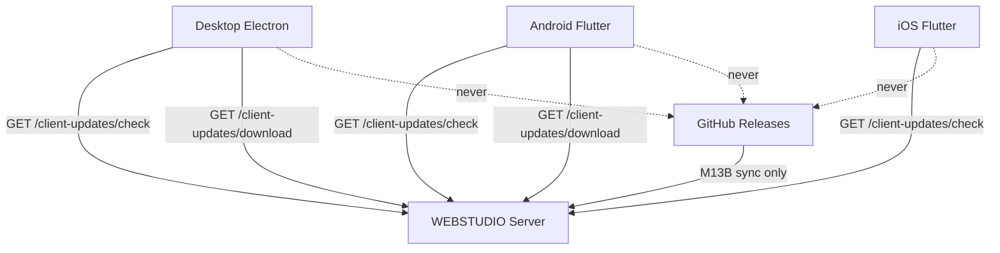

# Client Update Platform Report — Milestone 13E

**Completion date:** 2026-07-02  
**Alembic head:** `0040_deployment_engine` (no new migration)  
**Overall verdict:** **COMPLETE** — Enterprise client update platform across Desktop, Android, and iOS notification architecture

---

## Executive summary

Milestone 13E delivers the **Enterprise Client Update Platform**. All clients check **WEBSTUDIO Server** for updates — never GitHub. The backend remains the update authority (M13A–D); this milestone adds client consumption, artifact download, checksum verification, and platform-specific install flows.

| Platform | Flow |
|----------|------|
| **Desktop** | Periodic backend check → notify → download EXE/DMG from server → SHA256 verify → install → restart → auto-reconnect |
| **Android** | Backend check → download APK from server → SHA256 verify → prompt installation → reconnect |
| **iOS** | Version notification only → App Store architecture → **no direct IPA installation** |

---

## Architecture



**Rule:** Desktop and mobile clients consume release metadata and artifacts from WEBSTUDIO Server only.

---

## Requirements traceability

| Requirement | Status | Implementation |
|-------------|--------|----------------|
| Desktop checks backend periodically | ✅ | `UpdateCheckLifecycle.ts` — 6h interval when workspace active |
| Backend checks GitHub | ✅ | M13B `ReleaseSyncScheduler` (unchanged) |
| Desktop never contacts GitHub | ✅ | `ClientUpdateService.ts` → `/api/v1/client-updates/*` |
| Notify user | ✅ | `UpdateService.promptAndApplyUpdate()` dialog |
| Download EXE from backend | ✅ | Electron IPC `update:downloadArtifact` |
| Verify checksum | ✅ | SHA256 in main process before install |
| Install + restart | ✅ | `update:installAndRestart` — Windows `/S`, macOS open DMG |
| Reconnect automatically | ✅ | Existing `ConnectionReconnectService` (15s health poll) |
| Android: backend hosts APK | ✅ | `GET /client-updates/download` streams bundle artifact |
| Android: verify checksum | ✅ | `ClientUpdateInstaller` + `crypto` SHA256 |
| Android: prompt installation | ✅ | `open_file` launches system installer |
| iOS: notification only | ✅ | `distribution_mode: app_store_notification` |
| iOS: App Store architecture | ✅ | `app_store_url` from manifest/settings — no IPA download |
| Client Update Platform Report | ✅ | This document |

---

## Backend API

| Method | Endpoint | Auth | Purpose |
|--------|----------|------|---------|
| GET | `/api/v1/client-updates/check` | Public | Compare installed vs catalog; return artifact metadata |
| GET | `/api/v1/client-updates/download` | Public | Stream platform artifact with `X-Artifact-SHA256` header |

### Check response highlights

- `update_available`, `mandatory`, `latest_version`, `min_supported_version`
- `distribution_mode`: `installer` | `apk_sideload` | `app_store_notification`
- `artifact`: `{ name, sha256, size_bytes, download_url }` (null for iOS)
- `github_contact_prohibited: true`

### Deploy integration

On server deploy (`EnterpriseDeploymentEngine._mark_catalog_current`), `ClientUpdateService.sync_platform_settings_from_release()` updates:

- `mobile_latest_version`, `mobile_apk_download_url`
- `desktop_latest_version`, `desktop_windows_download_url`
- `mobile_ios_app_store_url` (when configured in manifest `ios.app_store_url`)

`/api/v1/version` now returns enriched `desktop` and `mobile.ios_*` blocks via `build_enriched_version_payload()`.

---

## Client implementations

### Desktop (`apps/desktop/`)

| File | Role |
|------|------|
| `src/services/api/ClientUpdateService.ts` | API client for check endpoint |
| `src/services/UpdateService.ts` | Notify → download → verify → install orchestration |
| `src/services/UpdateCheckLifecycle.ts` | Periodic polling (6h) |
| `electron/main.ts` | IPC download + SHA256 + installer spawn |
| `electron/preload.ts` | `window.update` bridge |

### Android / iOS (`apps/mobile_flutter/`)

| File | Role |
|------|------|
| `lib/core/version/version_repository.dart` | Polls `/client-updates/check` every 24h |
| `lib/core/version/client_update_installer.dart` | APK download + SHA256 + `OpenFile` install |
| `lib/core/version/version_check_controller.dart` | Platform-specific dialogs (APK vs App Store) |

---

## iOS App Store distribution architecture

iOS clients receive **version notifications only**:

1. `GET /client-updates/check?platform=mobile_ios` returns `distribution_mode: app_store_notification`.
2. No `artifact` or IPA download URL is exposed.
3. Optional `app_store_url` from release manifest (`ios.app_store_url`) or system setting `mobile_ios_app_store_url`.
4. UI directs users to the App Store — compliant with Apple distribution policy.
5. Direct IPA sideloading is explicitly **not implemented**.

---

## Tests

```bash
cd apps/backend && pytest tests/releases/test_client_updates_api.py -q
```

| Test | Coverage |
|------|----------|
| `test_client_update_check_public` | Android update available from catalog |
| `test_ios_check_is_notification_only` | iOS App Store mode, no artifact |
| `test_client_update_check_up_to_date` | No update when versions match |

---

## OpenAPI

`docs/api/openapi/client-updates-v1.yaml`

---

## Constraints honored

- Extends M13; no desktop/mobile UI redesign (reuses existing dialogs and settings patterns)
- No production deployment executed
- Clients never contact GitHub
- No IPA direct installation on iOS

---

**STOP — M13E complete.**
