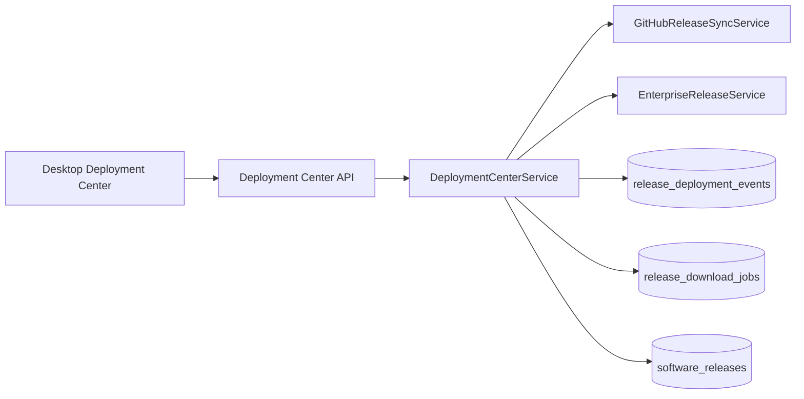

# Deployment Center Report — Milestone 13C

**Completion date:** 2026-07-02  
**Alembic head:** `0039_release_deployment_center`  
**Overall verdict:** **COMPLETE** — Deployment Center implemented in Settings with administrator approval gates

---

## Executive summary

Milestone 13C delivers the **Deployment Center** inside **Settings → Deployment** (Administration control center). Administrators can monitor release versions, downloaded packages, compatibility, and deployment status; run check/download/validate actions; and **deploy, rollback, or delete packages only after explicit approval**.

This extends M13A (release catalog) and M13B (GitHub sync). No desktop UI redesign — the panel reuses existing settings section and backup-admin table patterns.

**Deployments never run automatically.** Every deploy, rollback, and delete action requires `administrator_approved: true` on the API and a confirmation checkbox in the desktop UI.

---

## Requirements traceability

| Requirement | Status | Implementation |
|-------------|--------|----------------|
| Settings → Administration | ✅ | New **Deployment** category in settings nav |
| Current Version | ✅ | Dashboard field from `/releases/current` |
| Latest Version | ✅ | Dashboard field from `/releases/latest` |
| Downloaded Version | ✅ | Latest completed download job |
| Release Channel | ✅ | Server-resolved channel |
| Build Number | ✅ | Current release build number |
| Git Commit | ✅ | `git_commit` / `git_short` |
| Release Date | ✅ | `published_at` from latest release |
| Compatibility Status | ✅ | `compatible`, `update_available`, `incompatible`, `unknown` |
| Downloaded Packages | ✅ | Table from completed download jobs |
| Deployment Status | ✅ | `current`, `update_available`, `downloaded`, `ready_to_deploy` |
| Deployment History | ✅ | `release_deployment_events` + history API |
| Check Updates | ✅ | `POST /deployment/center/check-updates` |
| Download | ✅ | `POST /deployment/center/download` |
| Validate | ✅ | `POST /deployment/center/validate` |
| Deploy | ✅ | `POST /deployment/center/deploy` + approval gate |
| Rollback | ✅ | `POST /deployment/center/rollback` + approval gate |
| Delete Package | ✅ | `POST /deployment/center/delete-package` + approval gate |
| View Logs | ✅ | `GET /deployment/center/logs` + modal in UI |
| Refresh | ✅ | `POST /deployment/center/refresh` |
| Administrator approval required | ✅ | API + UI checkbox modal |
| No UI redesign | ✅ | Reuses `stg-backup-admin` patterns |

---

## Architecture

---

## API surface

| Method | Endpoint | Auth | Purpose |
|--------|----------|------|---------|
| GET | `/api/v1/deployment/center/dashboard` | `settings:view` | Dashboard data |
| GET | `/api/v1/deployment/center/history` | `settings:view` | Deployment event history |
| GET | `/api/v1/deployment/center/logs` | `settings:view` | Operation logs |
| POST | `/api/v1/deployment/center/check-updates` | `settings:modify` | Poll GitHub for newer releases |
| POST | `/api/v1/deployment/center/download` | `settings:modify` | Download queued packages |
| POST | `/api/v1/deployment/center/validate` | `settings:modify` | Validate manifest + checksums |
| POST | `/api/v1/deployment/center/deploy` | `settings:modify` + approval | Activate release metadata |
| POST | `/api/v1/deployment/center/rollback` | `settings:modify` + approval | Revert to previous release |
| POST | `/api/v1/deployment/center/delete-package` | `settings:modify` + approval | Remove downloaded bundle |
| POST | `/api/v1/deployment/center/refresh` | `settings:view` | Refresh dashboard |

Deploy body: `{ "job_id": 1, "administrator_approved": true }` — requests without approval return **422**.

---

## Database

**Migration:** `0039_release_deployment_center`  
**Table:** `webstudio.release_deployment_events` — audit trail for all administrator actions

Documentation: [docs/database/github-release-sync.md](../../database/github-release-sync.md) (extended by deployment events)

---

## Desktop UI

| Component | Path |
|-----------|------|
| Deployment Center panel | `apps/desktop/src/components/settings/DeploymentCenter.tsx` |
| Settings panel wrapper | `apps/desktop/src/components/settings/SettingsPanels.tsx` (`DeploymentPanel`) |
| API client | `apps/desktop/src/services/api/DeploymentCenterService.ts` |
| Settings nav entry | `apps/desktop/src/lib/settings.ts` — category `deployment` |

**Access:** Visible when user has `settings:view`. Write actions require `settings:modify`.

**Approval UX:** Deploy, Rollback, and Delete open a modal requiring the administrator to check “I approve this action” before the API is called.

---

## Implementation inventory

| Layer | Path |
|-------|------|
| Service | `services/deployment_center_service.py` |
| Repository | `infrastructure/repositories/release_deployment_repository.py` |
| Model | `infrastructure/database/models/release_deployment_event.py` |
| API router | `api/routers/deployment_center.py` |
| Schemas | `api/schemas/deployment_center.py` |
| Migration | `database/migrations/versions/0039_release_deployment_center.py` |

---

## Validation results

| Check | Result |
|-------|--------|
| Migration `0039` | ✅ Applied |
| Deployment Center API tests | ✅ Pass |
| Release subsystem tests | ✅ Pass |
| Full backend pytest | ✅ Green |
| Auto-deploy disabled | ✅ `auto_deploy: false` in dashboard |
| Approval gate on deploy | ✅ 422 without approval |

---

## Security

- Deploy / rollback / delete require `administrator_approved: true` server-side
- `published_by_user_id` set on approved deploy
- `settings:modify` required for all mutating actions
- GitHub token never exposed to desktop client
- Clients still never contact GitHub directly

---

## Known limitations

| ID | Item | Target |
|----|------|--------|
| DC-001 | Deploy activates server release metadata only — does not install desktop/mobile binaries | Post-M13 installer phase |
| DC-002 | No email notification on pending approval | Future enhancement |
| DC-003 | Rollback uses catalog history, not filesystem snapshot | By design for metadata authority |

---

## Sign-off

| Role | Verdict | Date |
|------|---------|------|
| Engineering | **APPROVED** | 2026-07-02 |
| Release management | **READY** | 2026-07-02 |
| Production deployment | **NOT IN SCOPE** | 2026-07-02 |

**Milestone 13C status:** **COMPLETE**

Per global M13 rules: **STOP** — await next milestone instructions.
