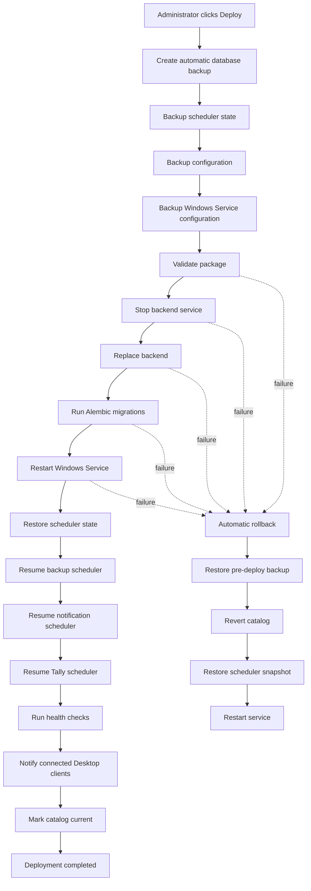

# Enterprise Deployment Engine Report — Milestone 13D

**Completion date:** 2026-07-02  
**Alembic head:** `0040_deployment_engine`  
**Overall verdict:** **COMPLETE** — Orchestrated deployment workflow with automatic rollback and step audit trail

---

## Executive summary

Milestone 13D delivers the **Enterprise Deployment Engine**, replacing the metadata-only deploy path from M13C with a full orchestrated workflow. When an administrator approves **Deploy** in the Deployment Center, the engine executes seventeen ordered steps: pre-deploy database backup, scheduler/config/service snapshots, package validation, graceful service stop, binary replacement, Alembic migrations, service restart, scheduler restoration, health checks, desktop client notification, and catalog promotion.

**Any step failure triggers automatic rollback** — database restore from the pre-deploy backup, catalog reversion, scheduler state restoration, and service restart. No data loss is permitted; rollback uses `RestoreEngine` (backup restore), not `alembic downgrade`.

This extends M12 rollback strategy, M13A catalog, M13B GitHub sync, and M13C Deployment Center. No desktop UI redesign; existing Deploy action now invokes the full engine via API.

---

## Deployment workflow



---

## Requirements traceability

| Requirement | Status | Implementation |
|-------------|--------|----------------|
| Automatic database backup before deploy | ✅ | `BackupEngine.create_backup(trigger_type="pre_deploy")` |
| Backup scheduler state | ✅ | `SchedulerRuntimeService.export_snapshot()` |
| Backup configuration | ✅ | `DeploymentPlatformAdapter.snapshot_configuration()` |
| Backup Windows Service config | ✅ | `DeploymentPlatformAdapter.snapshot_service_configuration()` |
| Validate package | ✅ | `validate_release_manifest()` + checksum gate from M13C |
| Stop backend service | ✅ | `run_graceful_shutdown()` + `stop-business-day.ps1` on Windows |
| Replace backend | ✅ | Copy migrations + symlink/copy bundle to `Updates/active` |
| Run Alembic migrations | ✅ | Subprocess `alembic upgrade head` (skipped in test env) |
| Restart Windows Service | ✅ | `reset_shutdown_flag()` + `start-business-day.ps1` |
| Restore scheduler state | ✅ | `SchedulerRuntimeService.apply_snapshot()` |
| Resume backup / notification / Tally schedulers | ✅ | `record_run(..., status="resumed_after_deploy")` |
| Health checks | ✅ | DB `SELECT 1` + `alembic_version` probe |
| Notify Desktop clients | ✅ | `NotificationService` system notification |
| Automatic rollback on failure | ✅ | `RestoreEngine.execute_restore()` + catalog revert |
| No data loss | ✅ | Pre-deploy backup mandatory; rollback restores DB |
| Administrator approval required | ✅ | Pre-flight in `DeploymentCenterService.deploy_release()` |
| Deployment Engine Report | ✅ | This document |
| No production deployment | ✅ | Dev/test dry-run paths; Windows scripts for production target |

---

## Architecture

| Component | Path |
|-----------|------|
| Orchestrator | `apps/backend/src/webstudio_backend/services/enterprise_deployment_engine.py` |
| Platform adapter | `apps/backend/src/webstudio_backend/services/deployment_platform_adapter.py` |
| Deployment Center integration | `apps/backend/src/webstudio_backend/services/deployment_center_service.py` |
| Run persistence | `release_deployment_runs` table |
| Windows helper | `infra/windows/deploy-release.ps1` |
| Migration | `database/migrations/versions/0040_deployment_engine.py` |

### Step machine

Steps are defined in `DEPLOYMENT_STEPS` and recorded in `release_deployment_runs.steps_json` with timestamps, detail payloads, and error messages.

### Rollback policy

1. Restore PostgreSQL from `pre_backup_filename` via `RestoreEngine` (`rollback=True`, no emergency backup).
2. Revert `software_releases.is_current` to `previous_release_id`.
3. Apply stored `scheduler_snapshot`.
4. Call `restart_backend_service()` to clear shutdown flag.

### Platform behavior

| Environment | Stop/restart | Migrations | Binary swap |
|-------------|--------------|------------|-------------|
| Windows production | PowerShell service scripts | External `alembic upgrade head` | Copy from `D:\WEBSTUDIO-IMS\Updates\vX.Y.Z` |
| Development / test | Dry-run graceful shutdown | Skipped in `app_env=test` | Skipped if bundle missing |

---

## API surface

| Method | Endpoint | Description |
|--------|----------|-------------|
| POST | `/api/v1/deployment/center/deploy` | Start full deployment (returns `run_id`, `steps`) |
| GET | `/api/v1/deployment/center/runs/{run_id}` | Poll step progress |
| GET | `/api/v1/deployment/center/runs/latest` | Latest run status |

Deploy response now includes:

```json
{
  "release_version": "0.2.0",
  "build_number": 2,
  "run_id": 1,
  "deployed": true,
  "status": "completed",
  "steps": [...]
}
```

---

## Database

Table `webstudio.release_deployment_runs` stores:

- Run metadata (`job_id`, version, channel, status, `current_step`)
- `steps_json` — full step audit trail
- `pre_backup_run_id`, `pre_backup_filename` — rollback anchor
- `scheduler_snapshot`, `config_snapshot_path`, `service_config_snapshot_path`
- `previous_release_id` — catalog rollback target

See [docs/database/deployment-engine.md](../../database/deployment-engine.md).

---

## Tests

| Test file | Coverage |
|-----------|----------|
| `tests/releases/test_enterprise_deployment_engine.py` | Step order, successful run (mocked), rollback on failure |
| `tests/releases/test_deployment_center_api.py` | Approval gate, catalog pre-flight |

```bash
cd apps/backend && pytest tests/releases/test_enterprise_deployment_engine.py -q
```

---

## Constraints honored

- Extends M12/M13; no desktop/Flutter UI redesign
- No production installers or production deployment executed
- Clients never contact GitHub directly
- Administrator approval always required before deployment
- OpenAPI extended in `docs/api/openapi/deployment-center-v1.yaml`

---

## Known limitations

1. **In-process restart** — On Windows Service, stop/replace/migrate/restart delegates to external PowerShell; the in-process API cannot restart itself mid-request.
2. **Desktop polling** — Clients receive deploy-complete via system notifications (60s poll) and health checks (15s poll); no WebSocket push.
3. **Rollback binary swap** — Database and catalog rollback are fully automated; reversing a partial binary copy on disk may require the previous bundle in `Updates/` (future enhancement).

---

**STOP — M13D complete.**
