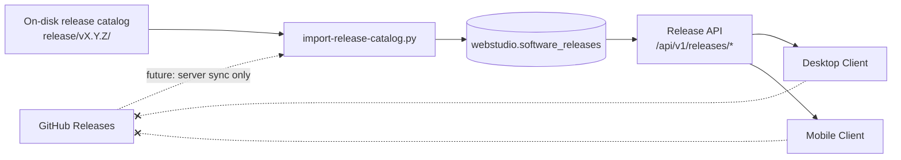

# Enterprise Release Management Report — Milestone 13A

**Completion date:** 2026-07-02  
**Release version:** `0.1.0`  
**Alembic head:** `0037_enterprise_release_catalog`  
**Overall verdict:** **COMPLETE** — server-side release management subsystem implemented and validated

---

## Executive summary

Milestone 13A delivers the **Enterprise Release Management subsystem** for WEBSTUDIO IMS. The WEBSTUDIO Server is now the **single source of truth** for release metadata. Desktop and mobile clients will consume update information exclusively through the server API — never directly from GitHub.

This milestone **extends Milestone 12** release engineering. No desktop UI, Flutter UI, business logic, or existing APIs were redesigned. Database, scheduler, Tally, backup, Windows Service, Flutter offline, and Electron security configurations remain backward compatible.

**Out of scope (deferred):** production installer generation, production deployment, GitHub release publishing automation, and administrator approval workflows for deployment (schema field `published_by_user_id` reserved for future use).

---

## Requirements traceability

| Requirement | Status | Implementation |
|-------------|--------|----------------|
| Release metadata | ✅ | `webstudio.software_releases` table + JSONB manifest/checksums |
| Semantic version management | ✅ | `release_version` column; aligned with `VERSION` file |
| Build numbers | ✅ | `build_number` column; parsed from manifest or `WEBSTUDIO_BUILD_NUMBER` |
| Release channels (development, beta, stable) | ✅ | PostgreSQL `release_channel` enum + `ReleaseChannel` ORM enum |
| Release manifest | ✅ | Full `version-manifest.json` stored in `manifest` JSONB |
| SHA256 checksums | ✅ | `checksums` JSONB; loaded from `checksums.sha256` |
| Supported platforms | ✅ | `supported_platforms` JSONB derived from manifest `artifacts` |
| Release notes | ✅ | `release_notes` text; loaded from `RELEASE_NOTES.md` |
| Compatibility matrix | ✅ | `compatibility_matrix` JSONB with min client/DB versions |
| Minimum supported client versions | ✅ | Exposed via `compatibility_matrix.min_client_version` and per-platform mins |
| Build timestamps | ✅ | `build_timestamp` timestamptz |
| Git commit metadata | ✅ | `git_commit`, `git_short` columns |
| Backend as authority | ✅ | `EnterpriseReleaseService` + PostgreSQL catalog |
| `GET /api/v1/releases/current` | ✅ | Public read endpoint |
| `GET /api/v1/releases/latest` | ✅ | Public read endpoint with optional `channel` query |
| `GET /api/v1/releases/history` | ✅ | Paginated history with optional `channel` query |
| No UI redesign | ✅ | No desktop or Flutter changes |
| No production installers | ✅ | No installer builds in this milestone |
| No production deployment | ✅ | Infrastructure only |

---

## Architecture



**Design principles (enterprise standard):**

1. **GitHub** is the official release repository (future automation).
2. **WEBSTUDIO Server** is the enterprise update authority.
3. **Clients** query the server only — GitHub is never contacted by desktop or mobile.
4. **Administrator approval** for deployment is reserved (`published_by_user_id`); full approval workflow is a later milestone.

---

## Database schema

**Migration:** `0037_enterprise_release_catalog`  
**Table:** `webstudio.software_releases`  
**Enum:** `webstudio.release_channel` (`development`, `beta`, `stable`)

| Column | Purpose |
|--------|---------|
| `release_version` | Semantic version (e.g. `0.1.0`) |
| `build_number` | Monotonic build counter |
| `release_channel` | Distribution channel |
| `git_commit` / `git_short` | Git provenance |
| `build_timestamp` | UTC build time |
| `release_notes` | Markdown notes |
| `manifest` | Full version manifest (schema 1.x or 2.0.0) |
| `checksums` | Artifact name → SHA256 |
| `compatibility_matrix` | Min versions for desktop, mobile, server, database |
| `supported_platforms` | Platform IDs and artifact filenames |
| `is_current` | Active release flag per channel on this server |
| `published_at` | Publication timestamp |
| `published_by_user_id` | Future: approving administrator |

**Unique constraint:** `(release_version, build_number, release_channel)`

Documentation: [docs/database/software-releases.md](../../database/software-releases.md)

---

## API surface

OpenAPI fragment: [docs/api/openapi/releases-v1.yaml](../../api/openapi/releases-v1.yaml)

| Method | Endpoint | Description |
|--------|----------|-------------|
| GET | `/api/v1/releases/current` | Installed / active release on this server |
| GET | `/api/v1/releases/latest?channel=` | Newest published release for channel |
| GET | `/api/v1/releases/history?channel=&page=&page_size=` | Paginated release history |

All endpoints are **public read-only**. Responses use the standard API envelope with `ReleaseMetadataResponse` or `ReleaseHistoryResponse` schemas.

**Channel resolution order:**

1. Explicit `channel` query parameter
2. `WEBSTUDIO_RELEASE_CHANNEL` environment variable
3. Environment default: `production` → stable, `staging` → beta, otherwise → development

**Bootstrap behavior:** On first API call, if the catalog table is empty, the service either imports bundles from `WEBSTUDIO_RELEASE_CATALOG_ROOT` (default: repo `release/`) or seeds a synthetic release from the running server configuration.

---

## Implementation inventory

| Component | Path |
|-----------|------|
| Release channel enum | `apps/backend/src/webstudio_backend/infrastructure/database/enums.py` |
| ORM model | `apps/backend/src/webstudio_backend/infrastructure/database/models/software_release.py` |
| Migration | `database/migrations/versions/0037_enterprise_release_catalog.py` |
| Repository | `apps/backend/src/webstudio_backend/infrastructure/repositories/software_release_repository.py` |
| Catalog loader | `apps/backend/src/webstudio_backend/services/release_catalog_loader.py` |
| Enterprise service | `apps/backend/src/webstudio_backend/services/enterprise_release_service.py` |
| API schemas | `apps/backend/src/webstudio_backend/api/schemas/releases.py` |
| API router | `apps/backend/src/webstudio_backend/api/routers/releases.py` |
| App registration | `apps/backend/src/webstudio_backend/app.py` |
| Settings | `WEBSTUDIO_RELEASE_CATALOG_ROOT`, `WEBSTUDIO_RELEASE_CHANNEL`, `WEBSTUDIO_BUILD_NUMBER` |
| Manifest generator (v2) | `scripts/release/lib/generate_manifest.py` |
| Catalog import CLI | `scripts/release/import-release-catalog.py` |
| API tests | `apps/backend/tests/releases/test_release_api.py` |

---

## Manifest schema evolution

The manifest generator now produces **schema 2.0.0** with:

- `release.channel` — distribution channel
- `release.build_number` — explicit build counter
- `release.min_alembic_head` — minimum database migration head

Existing on-disk bundle `release/v0.1.0/version-manifest.json` remains **schema 1.0.0** and is fully supported. The catalog loader derives `build_number` from `mobile_flutter.version` (`0.1.0+1` → build `1`) when not present in the manifest.

Regenerate manifests before future release bundles:

```bash
python3 scripts/release/lib/generate_manifest.py --channel stable
```

---

## Operations

### Import release catalog into PostgreSQL

```bash
python3 scripts/release/import-release-catalog.py --catalog-root release --channel stable
```

### Environment variables

| Variable | Default | Purpose |
|----------|---------|---------|
| `WEBSTUDIO_RELEASE_CATALOG_ROOT` | (empty → repo `release/`) | On-disk bundle directory |
| `WEBSTUDIO_RELEASE_CHANNEL` | (empty → env-based) | Default channel for this server |
| `WEBSTUDIO_BUILD_NUMBER` | `1` | Build number when seeding from runtime |

### Verify endpoints (dev)

```bash
curl -s http://localhost:8000/api/v1/releases/current | jq .
curl -s "http://localhost:8000/api/v1/releases/latest?channel=development" | jq .
curl -s "http://localhost:8000/api/v1/releases/history?channel=development&page=1" | jq .
```

---

## Validation results

| Check | Result | Notes |
|-------|--------|-------|
| Migration `0037` upgrade | ✅ Pass | Enum duplication fixed (pattern from `0013_notifications`) |
| Release API tests | ✅ Pass | 2/2 in `tests/releases/test_release_api.py` |
| Full backend pytest | ✅ Pass | **350 passed**, 2 skipped |
| Alembic head in test harness | ✅ Updated | `tests/helpers/migrations.py` → `0037` |
| Desktop UI changes | ✅ None | Per M13 constraints |
| Flutter UI changes | ✅ None | Per M13 constraints |
| Existing API compatibility | ✅ Maintained | New endpoints only |
| Production installer generation | ✅ Not performed | Per M13 constraints |
| Production deployment | ✅ Not performed | Per M13 constraints |

---

## Backward compatibility

| Area | Status |
|------|--------|
| Database migrations | Additive only (`0037`); no column drops |
| Existing APIs | Unchanged |
| Scheduler | Unchanged |
| Tally sync | Unchanged |
| Backup/restore | Unchanged |
| Windows Service | Unchanged |
| Flutter offline | Unchanged |
| Electron security | Unchanged |
| `release/v0.1.0/` bundle | Readable by catalog loader (schema 1.0.0) |

---

## Known limitations and deferred work

| ID | Item | Target |
|----|------|--------|
| REL-001 | GitHub Releases sync automation (server pulls from GitHub) | M13B+ |
| REL-002 | Administrator approval workflow before publishing | M13B+ |
| REL-003 | Client auto-update download/install integration | Post-M13 |
| REL-004 | Regenerate `release/v0.1.0/version-manifest.json` to schema 2.0.0 | Next release bundle |
| REL-005 | `published_by_user_id` population on import | M13B+ |
| REL-006 | OpenAPI main spec merge for releases paths | Optional consolidation |

---

## Sign-off

| Role | Verdict | Date |
|------|---------|------|
| Engineering | **APPROVED** — subsystem complete, tests green | 2026-07-02 |
| Release management | **READY** — server authority established | 2026-07-02 |
| Production deployment | **NOT IN SCOPE** — deferred per M13 rules | 2026-07-02 |

**Milestone 13A status:** **COMPLETE**

Per global M13 rules: **STOP** — await next milestone instructions before implementing GitHub sync, deployment automation, or installer generation.
