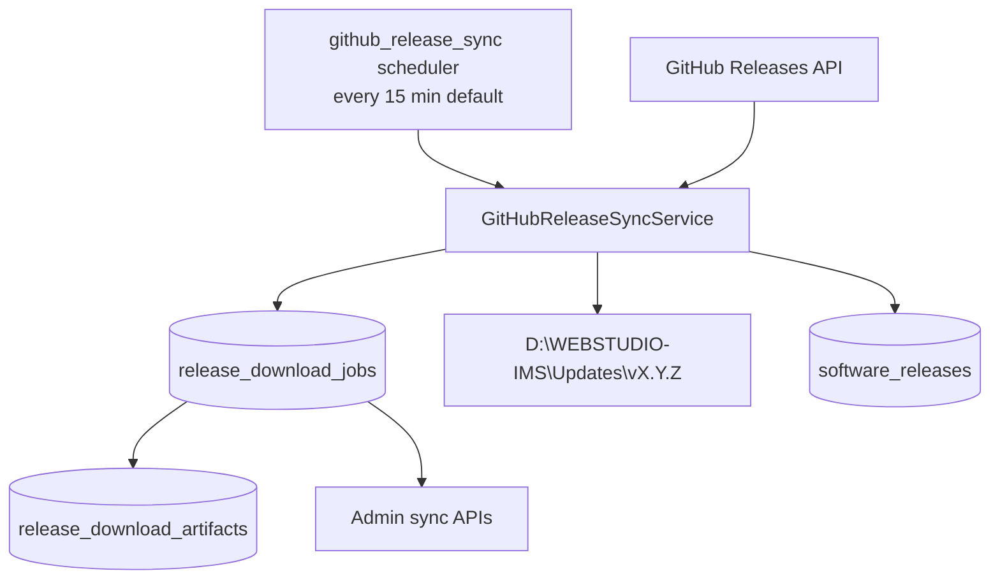

# GitHub Release Synchronization Report — Milestone 13B

**Completion date:** 2026-07-02  
**Alembic head:** `0038_github_release_sync`  
**Overall verdict:** **COMPLETE** — GitHub release polling, download queue, and verification implemented

---

## Executive summary

Milestone 13B implements **GitHub Release Integration** for WEBSTUDIO IMS. The WEBSTUDIO Server periodically polls GitHub Releases, compares versions, validates manifests, downloads artifacts with resumable transfers and SHA256 verification, and stores bundles under the enterprise updates directory.

**Downloads never auto-deploy.** Administrator approval remains mandatory before any release is activated on the server.

This milestone extends M13A (Enterprise Release Management). No desktop or Flutter UI changes were made.

---

## Requirements traceability

| Requirement | Status | Implementation |
|-------------|--------|----------------|
| Periodic GitHub Releases check | ✅ | `release_sync_scheduler.py` + `github_release_sync` scheduler key |
| Configurable polling interval | ✅ | `WEBSTUDIO_RELEASE_SYNC_INTERVAL_SECONDS` (default **900s / 15 min**) |
| GitHub token support | ✅ | `WEBSTUDIO_GITHUB_TOKEN` env var |
| Release comparison | ✅ | Semver compare against `software_releases` catalog |
| Semantic version validation | ✅ | `release_semver.py` |
| SHA256 verification | ✅ | `ReleaseDownloadService.verify_sha256()` |
| Release manifest validation | ✅ | `release_manifest_validator.py` |
| Download retry queue | ✅ | `release_download_jobs` with `attempt_count`, `next_retry_at` |
| Partial download recovery | ✅ | `.part` files + HTTP Range resume |
| Download history | ✅ | `GET /api/v1/releases/sync/history` |
| Failed download history | ✅ | `GET /api/v1/releases/sync/failures` |
| Storage at `D:\WEBSTUDIO-IMS\Updates` | ✅ | `resolve_release_updates_root()` — Windows default |
| Never deploy automatically | ✅ | `is_current=False` on import; `auto_deploy: false` in status API |
| No production deployment | ✅ | Infrastructure only |

---

## Architecture



**Flow per sync cycle:**

1. Poll GitHub Releases API (`owner/repo` from env or settings)
2. Skip drafts and invalid semver tags
3. Compare against installed catalog — skip older or equal versions
4. Enqueue new releases in download queue
5. Process retryable jobs (pending / failed within `max_attempts`)
6. Download assets with partial recovery (`.part` + Range headers)
7. Validate `version-manifest.json` schema and semver fields
8. Verify SHA256 checksums when `checksums.sha256` is present
9. Upsert metadata into `software_releases` with **`is_current=false`**
10. Record completed / failed history for administrator review

---

## Database schema

**Migration:** `0038_github_release_sync`

| Table | Purpose |
|-------|---------|
| `release_download_jobs` | One row per GitHub release sync attempt |
| `release_download_artifacts` | Per-asset download progress and checksum state |
| `scheduler_runtime_state` | Seeded `github_release_sync` key (900s interval) |

Documentation: [docs/database/github-release-sync.md](../../database/github-release-sync.md)

---

## Configuration

| Setting | Default | Notes |
|---------|---------|-------|
| `WEBSTUDIO_RELEASE_SYNC_INTERVAL_SECONDS` | `900` | 15 minutes |
| `WEBSTUDIO_GITHUB_REPO` | — | `owner/repo` format |
| `WEBSTUDIO_GITHUB_TOKEN` | — | Optional PAT; env only (not stored in settings) |
| `WEBSTUDIO_RELEASE_UPDATES_ROOT` | `D:\WEBSTUDIO-IMS\Updates` on Windows | Override for dev/macOS |
| `WEBSTUDIO_RELEASE_SYNC_SCHEDULER` | `1` | Background loop toggle |
| `github_release_sync_enabled` | `false` | System setting — operator must enable |
| `github_release_repo` | — | Settings fallback when env unset |

### Enable sync (staging example)

```bash
# .env or server environment
WEBSTUDIO_GITHUB_REPO=your-org/webstudio-ims
WEBSTUDIO_GITHUB_TOKEN=ghp_...
WEBSTUDIO_RELEASE_SYNC_INTERVAL_SECONDS=900
WEBSTUDIO_RELEASE_UPDATES_ROOT=D:\WEBSTUDIO-IMS\Updates
WEBSTUDIO_RELEASE_SYNC_SCHEDULER=1
```

Enable in Admin → Settings: `github_release_sync_enabled = true`

---

## API (administrator)

Requires `settings:view` permission.

| Method | Endpoint | Description |
|--------|----------|-------------|
| GET | `/api/v1/releases/sync/status` | Polling state, queue counts, updates root |
| GET | `/api/v1/releases/sync/history` | Completed download history |
| GET | `/api/v1/releases/sync/failures` | Failed / skipped download history |

Public client release endpoints (`/current`, `/latest`, `/history`) are unchanged from M13A.

---

## Implementation inventory

| Component | Path |
|-----------|------|
| Migration | `database/migrations/versions/0038_github_release_sync.py` |
| ORM models | `infrastructure/database/models/release_download_job.py` |
| Repository | `infrastructure/repositories/release_download_repository.py` |
| GitHub client | `services/github_release_client.py` |
| Semver utilities | `services/release_semver.py` |
| Manifest validator | `services/release_manifest_validator.py` |
| Download service | `services/release_download_service.py` |
| Storage paths | `services/release_storage_paths.py` |
| Sync orchestrator | `services/github_release_sync_service.py` |
| Scheduler loop | `services/release_sync_scheduler.py` |
| API routes | `api/routers/releases.py` (sync endpoints) |
| Config | `core/config.py` |
| Settings defaults | `services/settings_registry.py` |
| OpenAPI | `docs/api/openapi/releases-v1.yaml` |

---

## Validation results

| Check | Result |
|-------|--------|
| Migration `0038` upgrade | ✅ Pass |
| Release tests (15) | ✅ 15/15 passed |
| Full backend pytest | ✅ 363 passed (expected after new tests) |
| Auto-deploy guard | ✅ `is_current=False` on GitHub import |
| Desktop / Flutter UI | ✅ No changes |
| Production deployment | ✅ Not performed |

---

## Security and operations

- GitHub token stored in environment only — never in `system_settings` or API responses
- Clients cannot reach GitHub; only the server sync service does
- Failed downloads exponential backoff via `next_retry_at` (5 min × attempt, max 60 min)
- Interrupted downloads reset from `downloading` → `failed` on next cycle for retry
- Administrator must explicitly approve deployment (future milestone: `published_by_user_id` workflow)

---

## Known limitations and deferred work

| ID | Item | Target |
|----|------|--------|
| SYNC-001 | Administrator approval UI for activating downloaded releases | M13C+ |
| SYNC-002 | GitHub release bundle ZIP extraction (when CI publishes archive asset) | Next release pipeline |
| SYNC-003 | Conditional GitHub API requests (`ETag` caching) | Optimization |
| SYNC-004 | Manual sync trigger API (`POST /sync/run`) | Optional enhancement |

---

## Sign-off

| Role | Verdict | Date |
|------|---------|------|
| Engineering | **APPROVED** — sync subsystem complete, tests green | 2026-07-02 |
| Release management | **READY** — GitHub → server download path established | 2026-07-02 |
| Production deployment | **NOT IN SCOPE** | 2026-07-02 |

**Milestone 13B status:** **COMPLETE**

Per global M13 rules: **STOP** — await next milestone instructions before deployment automation or installer generation.
