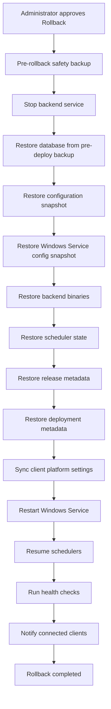

# Enterprise Rollback Platform Report — Milestone 13F

**Completion date:** 2026-07-02  
**Alembic head:** `0041_enterprise_rollback`  
**Overall verdict:** **COMPLETE** — Full-stack enterprise rollback with permanent audit history

---

## Executive summary

Milestone 13F delivers the **Enterprise Rollback Platform**, replacing the metadata-only rollback path from M13C with a fifteen-step orchestrated workflow. Administrator-approved rollback restores backend binaries, database, configuration, Windows Service snapshots, scheduler state, deployment metadata, release catalog, and health status.

**Rollback history is preserved permanently** in `enterprise_rollback_runs` — no delete API, no archival purge.

Connected Desktop and Mobile clients reconnect automatically via existing health polling (15s desktop, Flutter connectivity) plus a system notification on rollback completion.

This extends M12 rollback strategy, M13D deployment engine snapshots, and M13C Deployment Center.

---

## Rollback workflow



---

## Requirements traceability

| Requirement | Status | Implementation |
|-------------|--------|----------------|
| Restore backend | ✅ | `DeploymentPlatformAdapter.replace_backend()` from target bundle |
| Restore database | ✅ | `RestoreEngine.execute_restore()` from pre-deploy backup |
| Restore configuration | ✅ | `restore_configuration()` from deployment snapshot |
| Restore Windows Service | ✅ | `restore_service_configuration()` + service restart |
| Restore scheduler | ✅ | `SchedulerRuntimeService.apply_snapshot()` |
| Restore deployment metadata | ✅ | Deployment run marked `rolled_back`; event linked |
| Restore release metadata | ✅ | Previous release `is_current=true` in catalog |
| Restore health status | ✅ | DB + migrations probe stored in `health_status` JSONB |
| Desktop/Mobile auto-reconnect | ✅ | System notification + existing reconnect polling |
| Permanent rollback history | ✅ | `enterprise_rollback_runs` — no delete endpoint |
| Rollback Report | ✅ | This document |

---

## Architecture

| Component | Path |
|-----------|------|
| Orchestrator | `services/enterprise_rollback_engine.py` |
| Permanent history | `enterprise_rollback_runs` table |
| Platform adapter extensions | `restore_configuration()`, `restore_service_configuration()` |
| Deployment Center integration | `deployment_center_service.rollback_release()` |
| Migration | `0041_enterprise_rollback.py` |

### Rollback anchor resolution

1. **Target release** — previous catalog entry for channel  
2. **Database backup** — `pre_backup_filename` from latest deployment run for current release, else latest `pre_deploy` backup  
3. **Snapshots** — scheduler/config/service paths from deployment run  
4. **Backend bundle** — completed download job or `release/v{version}/` catalog  

### Permanent history policy

- Every rollback creates an `enterprise_rollback_runs` record with full `steps_json` audit trail  
- Records are **never deleted** by application code  
- `GET /deployment/center/rollback/history` returns `permanent_history: true`  

---

## API surface

| Method | Endpoint | Purpose |
|--------|----------|---------|
| POST | `/api/v1/deployment/center/rollback` | Execute full rollback (approval required) |
| GET | `/api/v1/deployment/center/rollback/history` | Permanent rollback audit history |
| GET | `/api/v1/deployment/center/rollback/runs/{run_id}` | Single rollback run detail |

Rollback response now includes `run_id`, `steps`, and `health_status`.

---

## Database

Table `webstudio.enterprise_rollback_runs` — see [docs/database/enterprise-rollback.md](../../database/enterprise-rollback.md).

---

## Tests

```bash
cd apps/backend && pytest tests/releases/test_enterprise_rollback_engine.py -q
```

| Test | Coverage |
|------|----------|
| `test_rollback_steps_order` | Fifteen-step workflow definition |
| `test_execute_rollback_completes_in_test_mode` | End-to-end with mocked steps |
| `test_rollback_history_is_permanent` | History persisted with permanent flag |

---

## Constraints honored

- Database rollback via backup restore — not `alembic downgrade` (M12 policy)  
- Administrator approval required (M13C gate)  
- No desktop UI redesign — existing Rollback button in Deployment Center  
- Extends M13D deployment snapshots for config/service/scheduler restore  

---

## Relationship to deployment engine auto-rollback

| Trigger | Engine | History table |
|---------|--------|---------------|
| Deploy step failure | `EnterpriseDeploymentEngine._rollback()` | `release_deployment_runs` |
| Administrator rollback | `EnterpriseRollbackEngine` | `enterprise_rollback_runs` (permanent) |

---

**STOP — M13F complete.**
