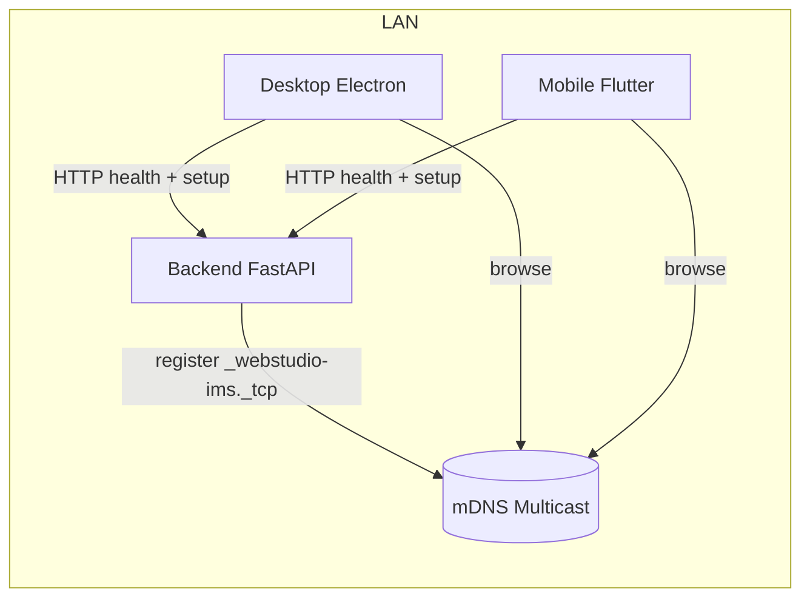

# Network Discovery Architecture — Milestone 11X

## Overview

WEBSTUDIO IMS uses **Zeroconf / mDNS (Bonjour)** for zero-configuration LAN discovery. The backend **advertises** itself; Desktop (Electron) and Mobile (Flutter) **browse** for services. Manual IP/hostname entry remains fully supported.

## Service Type

| Property | Value |
|----------|-------|
| Bonjour type | `_webstudio-ims._tcp` |
| Full domain | `_webstudio-ims._tcp.local.` |
| Transport | TCP (HTTP API port) |

## Advertised TXT Metadata (Backend)

Published at startup — **no secrets**:

| Key | Description |
|-----|-------------|
| `server_name` | Host / friendly server name |
| `company_name` | From `system_settings.company_name` |
| `backend_version` | Application version |
| `api_version` | API contract version |
| `backend_port` | HTTP port (default 8000) |
| `environment` | `development` / `staging` / `production` |
| `build_version` | CI/build identifier |
| `protocol_version` | Discovery protocol version (`1`) |

**Never published:** JWT secrets, API keys, database credentials, recovery keys, user data.

## Component Map

## Backend

| Module | Role |
|--------|------|
| `services/mdns_advertisement_service.py` | Zeroconf registration on lifespan start |
| `services/discovery_health_service.py` | Discovery metadata payload |
| `api/routers/discovery.py` | `GET /api/v1/discovery/health`, `GET /api/v1/discovery/validate-host` |
| `core/network/host_validation.py` | IPv4 / hostname / `.local` validation |

Environment variables:

- `WEBSTUDIO_SERVER_NAME` → `mdns_server_name` (optional friendly name)
- `WEBSTUDIO_MDNS_ENABLED=0` → disable advertisement

## Desktop

| Module | Role |
|--------|------|
| `electron/mdns-discovery.ts` | Bonjour browser in main process |
| IPC `network:*` | Renderer ↔ main discovery bridge |
| `NetworkDiscoveryService.ts` | 4.5s browse window |
| `ConnectionDiagnosticsService.ts` | Staged connection test |
| `SavedServerStore.ts` | Persisted servers with hostname/IP refresh |

## Mobile

| Module | Role |
|--------|------|
| `core/network/mdns_discovery_service.dart` | Bonsoir browse |
| `core/network/connection_diagnostics.dart` | Staged connection test |
| `core/network/host_validation.dart` | URL normalization |
| Extended `SavedServer` model | Company, hostname, IP, versions |

## Connection Diagnostics Stages

Both clients run the same ordered checks:

1. **Host Resolution** — DNS / mDNS name → IPv4
2. **Reachability** — HTTP response from server
3. **HTTP Connection** — `GET /health/live` OK
4. **Backend Health** — `GET /health/ready` (database check)
5. **API Compatibility** — `GET /api/v1/version`
6. **Authentication Endpoint** — `GET /api/v1/setup/status`

Failed stage is surfaced in the UI; earlier stages remain marked ✓.

## Tally Compatibility

Desktop and Mobile **never** connect to Tally directly. Tally hostname resolution remains **backend-only** (`integrations/tally/connectivity.py`). mDNS discovery is independent of Tally sync.

## Backward Compatibility

- Static candidate URLs (`127.0.0.1`, saved servers) still probed when mDNS finds nothing
- Manual URL entry unchanged; hostname and `.local` names supported
- Legacy saved-server JSON (url + label only) migrates automatically

## Future Linux

Backend uses Python `zeroconf` (cross-platform). Desktop Electron + `bonjour-service` supports Windows/macOS today; Linux desktop builds can reuse the same IPC pattern. Mobile Bonsoir supports Linux for future desktop-class Flutter targets.
